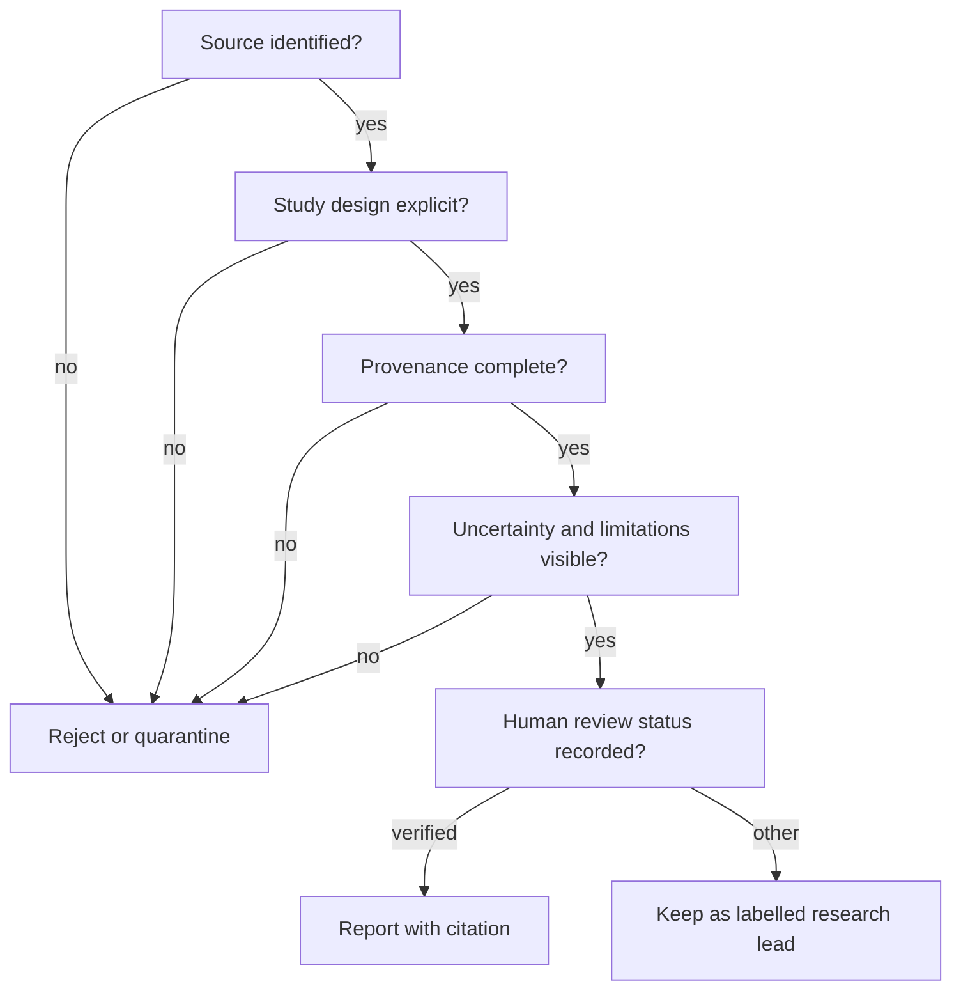

# The OpenLongevity Academic Manifesto

## A statement of scientific intent

OpenLongevity exists to make aging research more traceable, reproducible, and open to examination. It does not exist to promise immortality or to turn a correlation into a treatment claim. Its unit of trust is a source-linked observation that another researcher can inspect and recompute.

## Ten commitments

1. **Evidence before hype.** A headline is never a substitute for a study design, endpoint, cohort, and source identifier.
2. **Reproducibility before publicity.** Code, parameters, fixtures, and versions accompany computational outputs.
3. **Provenance before convenience.** Every normalized record carries where it came from, when it was retrieved, and how it was transformed.
4. **Uncertainty is first-class.** Missingness, confidence, censoring, disagreement, and retraction state remain visible.
5. **Translation is earned.** Cellular and animal observations are not silently promoted to human efficacy.
6. **Correlation is not causation.** Scores and graph edges organize hypotheses; they do not establish mechanisms.
7. **Human review matters.** Machine extraction is labelled and cannot become a verified finding without accountable review.
8. **Open methods require responsible licensing.** Public code does not grant permission to redistribute restricted full text or personal data.
9. **Correction is a feature.** Retractions and corrections remain discoverable, and historical transformations are auditable.
10. **Scientific humility is a system property.** The interface must make limitations easier to see than unsupported certainty.

## What the project can responsibly claim

OpenLongevity can claim that it provides typed data contracts, read-only source adapters, deterministic navigation heuristics, and reproducible computational utilities. It can report how records were selected, normalized, scored, and displayed. It can expose a research gap for further review.

It cannot claim that a biomarker measures “true biological age” in every tissue, that a graph relation is causal, that an intervention extends human lifespan, or that an AI-generated interpretation is independently verified.

## A reviewer's checklist

## Responsible AI and data ethics

The project treats AI as an assistive parser and interface component. Source passages, extracted fields, model versions, and reviewer decisions remain distinguishable. Sensitive data is outside the default deployment boundary. Any future cohort integration must document consent, de-identification, access control, retention, and the risk of re-identification.

## Invitation to the scientific community

Researchers, clinicians, engineers, statisticians, and affected communities are invited to challenge the assumptions, add licensed sources, contribute benchmark datasets, and report errors. A strong contribution includes a test, provenance behavior, a limitation statement, and a reproducible example.

OpenLongevity measures progress by the quality of questions it helps people ask and the ease with which they can verify an answer.
