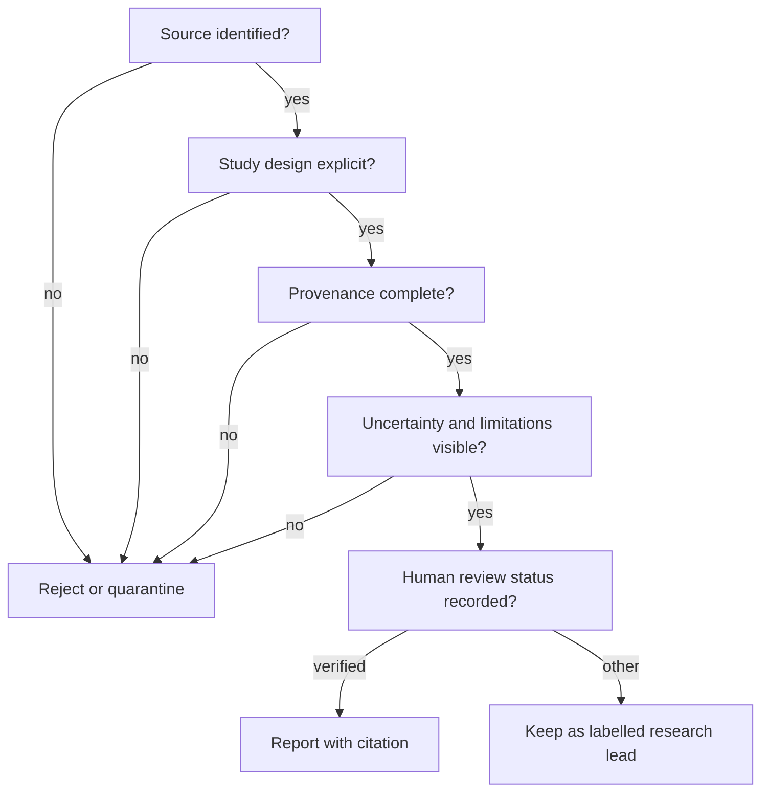

# The OpenLongevity Academic Manifesto

## A statement of scientific intent

OpenLongevity exists to make aging research more traceable, reproducible, and open to examination. It does not exist to promise immortality or to turn a correlation into a treatment claim. Its unit of trust is a source-linked observation that another researcher can inspect and recompute.

## Ten commitments

1. **Evidence before hype.** A headline is never a substitute for a study design, endpoint, cohort, and source identifier.
2. **Reproducibility before publicity.** Code, parameters, fixtures, and versions accompany computational outputs.
3. **Provenance before convenience.** Every normalized record carries where it came from, when it was retrieved, and how it was transformed.
4. **Uncertainty is first-class.** Missingness, confidence, censoring, disagreement, and retraction state remain visible.
5. **Translation is earned.** Cellular and animal observations are not silently promoted to human efficacy.
6. **Correlation is not causation.** Scores and graph edges organize hypotheses; they do not establish mechanisms.
7. **Human review matters.** Machine extraction is labelled and cannot become a verified finding without accountable review.
8. **Open methods require responsible licensing.** Public code does not grant permission to redistribute restricted full text or personal data.
9. **Correction is a feature.** Retractions and corrections remain discoverable, and historical transformations are auditable.
10. **Scientific humility is a system property.** The interface must make limitations easier to see than unsupported certainty.

## What the project can responsibly claim

At the audited baseline, OpenLongevity contains typed data contracts, read-only metadata adapters, navigation heuristics, publication persistence, and experimental computational utilities. Their presence is an implementation observation, not a general validation claim. Evidence and gap routes remain synthetic demonstrations. Date-sensitive scores additionally depend on execution time. A complete explanation of selection, transformation, storage, and display remains an acceptance requirement for each scientific workflow.

It cannot claim that a biomarker measures “true biological age” in every tissue, that a graph relation is causal, that an intervention extends human lifespan, or that an AI-generated interpretation is independently verified.

## A reviewer's checklist

## Responsible AI and data ethics

The project treats AI as an assistive parser and interface component. Source passages, extracted fields, model versions, and reviewer decisions remain distinguishable. Sensitive data is outside the default deployment boundary. Any future cohort integration must document consent, de-identification, access control, retention, and the risk of re-identification.

## The burden of a public scientific claim

A project statement should be specific enough that an independent reader can identify what would make it false. Saying that a platform is reproducible is too broad unless the statement identifies an input, transformation, environment, and output. Saying that a parser preserves correction notices can be tested against a documented set of source records. Saying that a research model improves prediction requires a defined outcome, comparison method, evaluation cohort, and uncertainty estimate. The manifesto commits the project to the narrower and more inspectable form of assertion.

This discipline applies equally to negative statements. A failed search does not demonstrate the absence of research. A null result does not establish that an intervention has no possible effect under every condition. A missing metadata field does not establish that the underlying study omitted the measurement. Documentation and interfaces should identify the level at which absence was observed. This prevents infrastructure limitations from becoming unintended scientific conclusions.

Claims about product maturity require their own evidence. A type checker establishes a property of source code under a particular configuration. It does not establish browser usability, successful deployment, or correct interpretation of a biological outcome. A passing parser fixture does not establish accuracy over a provider's entire corpus. The project should keep these layers of evidence distinct and publish the command, version, and observed outcome supporting a claim of successful verification.

## Accountability without invented authority

OpenLongevity is authored and maintained by Ciprian Ștefan Pleșca, an independent Romanian researcher. That attribution identifies project responsibility. It is not a claim of institutional affiliation, academic appointment, formal accreditation, or endorsement by organizations cited in the documentation. A document can aspire to the rigor expected in demanding research environments without borrowing their names as evidence of quality.

An independent project benefits from making its decision process unusually visible. Important methodological changes should explain the problem, alternatives, chosen approach, and remaining uncertainty. Disagreement should be attached to an identifiable claim or implementation decision rather than treated as a challenge to the author's identity. The author retains responsibility for project direction while allowing contributors and readers to contest the evidence supporting a decision.

Machine assistance does not dissolve that responsibility. Generated text may help organize an argument or draft an example, but a named author should review the resulting claims, citations, and code. A model's fluent explanation is not a source. If an automated system proposes extracted evidence, retain the distinction between its output and an accountable review decision. The current repository represents review states in data but does not thereby establish an operational reviewer authorization service.

## Correction as a research operation

A correction should preserve enough history for a reader to understand what changed and whether previous outputs are affected. For a parsing error, identify the source pattern, affected parser versions, normalized fields, and replay procedure. For a mathematical error, provide the failing example, corrected computation, and consequences for downstream results. For an overstated documentation claim, replace the claim and explain the actual boundary rather than merely adding a general disclaimer elsewhere.

The revision mechanism for stored publications is useful but limited. A database revision is not automatically a record of scientific adjudication, and database history is not inherently immutable. Published artifacts should identify their input revision and transformation version so that later corrections can be related to earlier reports. If a correction invalidates a result, preserving its historical existence should not be confused with continuing to endorse it.

Correction notices also deserve proportional visibility. A minor spelling repair and a source-authenticity defect do not have the same implications. A release or research report should explain whether a change affects presentation, reproducibility, interpretation, or access to data. The goal is to help readers decide whether they need to rerun an analysis or revise a conclusion. That practical consequence matters more than the number of changed lines.

## Evaluation before scale

The project should establish a small, inspectable reference corpus before making broad claims about coverage or extraction accuracy. The corpus needs documented selection criteria, permissible use, representative difficult cases, and annotation instructions. Reviewer disagreement is an observation about the task, not inconvenient noise to erase. Reporting only consensus labels can hide ambiguity that later users will encounter in the wild.

Scale can amplify both useful computation and systematic errors. Before adding sources, assess whether the existing parser preserves identity and uncertainty. Before increasing ingestion volume, demonstrate recovery from partial writes and failed requests. Before exposing a polished public interface, make synthetic examples recognizable and unsupported routes explicit. These steps connect the manifesto to engineering work with observable completion criteria.

The [W3C provenance model](https://www.w3.org/TR/prov-dm/) is a reference for distinguishing data, activities, and responsibility. The [NIST AI Risk Management Framework](https://www.nist.gov/itl/ai-risk-management-framework) provides a broader reference for examining risks throughout an AI system's use. Neither source certifies this project. They are external materials against which specific design decisions can be examined; implementation and evaluation remain the project's responsibility.

## Invitation to the scientific community

Researchers, clinicians, engineers, statisticians, and affected communities are invited to challenge the assumptions, add licensed sources, contribute benchmark datasets, and report errors. A strong contribution includes a test, provenance behavior, a limitation statement, and a reproducible example.

OpenLongevity measures progress by the quality of questions it helps people ask and the ease with which they can verify an answer.

---

**Project author: CIPRIAN ȘTEFAN PLEȘCA — cercetător român independent.**
OpenLongevity · [Project repository](https://github.com/Ciprian-LocalPulse/OpenLongevityLab).
