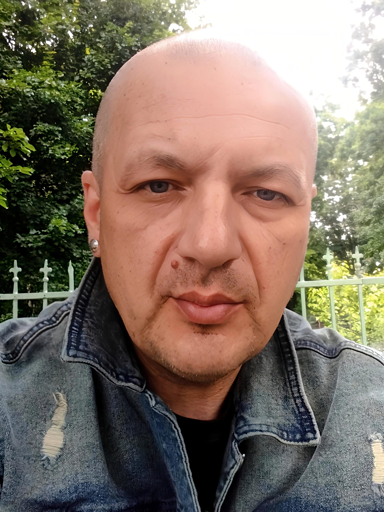

# Author

## Ciprian Ștefan Pleșca

- Founder
- Project Creator
- Lead Maintainer
- Principal Author

OpenLongevity — Open-source computational infrastructure for aging and longevity research.

The photograph is provided by the author for project attribution.
