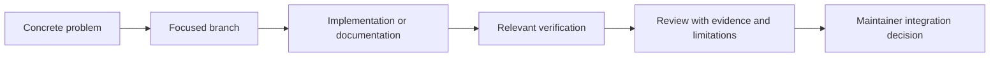

# Contributing

Create a focused branch, add tests for behavior changes, document provenance for scientific records, and run `pytest` and `ruff check .` before a pull request. Do not commit secrets, private datasets, or unsupported medical claims. Changes to evidence rules require rationale and fixture-based tests.

## Purpose and contribution scope

OpenLongevity welcomes contributions that make research information more traceable, computational behavior easier to inspect, and limitations clearer to readers. The project is currently research software with partially integrated infrastructure. A useful contribution can be small: correcting a constructor example, identifying a parser edge case, explaining an unsupported claim, or documenting a failed reproduction. Contributors should not assume that every method described in the academic collection is an implemented feature.

Begin by identifying the problem and the current behavior at a specific commit. Explain what a user or researcher encounters and how the proposed change improves that situation. Distinguish a software defect, documentation discrepancy, proposed scientific method, and new operational capability. They need different evidence. A typo does not need a benchmark, while a change to a statistical adjustment requires more than a screenshot of a successful command.

## Establish the local baseline

Inspect the working tree before editing and preserve changes that belong to other contributors. Use a focused branch based on the intended integration branch, and record the starting commit for substantive work. If the repository has moved or remote branches differ, investigate the history rather than reset files to make the checkout look familiar. Existing release tags are historical identifiers and must not be moved to conceal later corrections.

Use an isolated Python environment and install the extras required by the work. The API currently imports database components, so API development should include the database extra even when some tests use fixtures. The following commands express the basic local sequence; activation syntax depends on the shell and operating system. Record actual tool versions when reporting results that another person will need to reproduce.

```bash
python -m venv .venv
pip install -e ".[dev,api,db]"
pytest
ruff check .
```

Database-dependent work needs an isolated PostgreSQL instance, explicit migration, and test configuration. Do not point the synthetic seed script at a production or personally valuable database. A skipped integration test is a declared limit of the run, not evidence that the database path passed. Similarly, the current web package's compiler-only scripts should be described as type checking rather than a production build or browser test suite.

## Changing scientific or provider behavior

A scientific behavior change should identify the affected method, assumptions, and expected consequences. For an evidence-ranking rule, provide examples showing how ordering changes and explain why the new rule is appropriate for navigation. Do not describe a hand-selected confidence value as a calibrated probability without an actual calibration study. For a mathematical routine, include reference calculations that exercise the defect and the proposed correction.

Provider changes should preserve upstream identity, retrieval information, parser and normalization versions, and correction-related metadata where supported. Include representative difficult cases rather than only a typical publication. A fixture should document whether it is synthetic or source-derived and whether redistribution is permitted. Successful parsing does not establish that an extracted scientific interpretation is correct, so keep parser tests separate from any claim-extraction evaluation.

Avoid silently changing source content to make an example more convenient. If normalization intentionally removes or transforms information, explain the rule and its consequences. An unknown date or license should remain unknown. A record should not acquire a plausible but fabricated value simply because a response schema expects a field. If the schema cannot represent the uncertainty, propose a contract change and discuss compatibility.

## Writing and reviewing documentation

The editorial target is at least one thousand substantive prose words per tracked Markdown document, with consistent attribution to Ciprian Ștefan Pleșca as an independent Romanian researcher. This minimum does not justify repetition. Develop the document's specific question, context, method, assumptions, limitations, examples, and verification criteria. Preserve useful existing contributions while correcting claims that no longer match the implementation.

Code examples should use current imports and constructor fields. State whether an example is executable, pseudocode, or a proposed interface. Diagrams should distinguish existing connections from future design. A source citation should support the nearby statement; naming a respected institution or linking a general homepage is not evidence that the project has been reviewed or endorsed. Do not invent credentials, collaborators, study results, users, or performance measurements.

Run the documentation auditor after substantive edits. Its nonzero status is expected while the corpus backlog remains, but the change should not introduce missing attribution, broken local targets, or unclosed fences. Check Mermaid syntax separately and examine rendered diagrams when layout changes matter. The [script guide](scripts/README.md) explains the tools and their limitations. Word counting is an editorial measurement, not an automated scientific review.

## Tests proportionate to the change

Choose tests that could detect a meaningful error in the proposed behavior. A parser regression needs a source pattern and expected normalized fields. A repository change needs database-specific transaction and constraint cases. An API change needs both successful and failing requests. A documentation-only correction may need an executable snippet and link verification rather than a new test duplicating the prose.

Keep deterministic offline checks separate from live provider checks. A live request can fail because of network or source conditions unrelated to the code change. Preserve that observation without masking local test results. Conversely, offline fixtures cannot establish that the current external interface remains reachable. A review report should distinguish those kinds of evidence and give the exact command and outcome for each consequential claim.

Report failures and skips alongside successes. If a test cannot run because its prerequisite is unavailable, identify the missing prerequisite and the unverified claim. Do not replace the command with a weaker check and retain the original success label. This discipline helps maintainers decide whether a change is ready, whether more evidence is needed, and whether an issue belongs to implementation or environment.

## Pull-request content and review

A pull request should begin with the concrete problem and resulting behavior. Explain the scope, relevant assumptions, verification performed, and unresolved limitations. Link an issue or prior discussion when it supplies useful context, but make the description understandable without reading a conversation transcript. For broad documentation work, include a machine-readable inventory so that reviewers can distinguish developed documents from files changed only for attribution.



Review comments should refer to observable behavior or a specific claim. Explain the consequence and, where possible, provide a small reproduction. A maintainer may request a narrower change when unrelated modifications obscure the evidence. Contributors should preserve attribution to original research and third-party software, and should describe their own contribution accurately without implying authorship of upstream studies.

Integration and release are separate decisions. A reviewed change can improve the repository while the product remains below its release gates. Passing local checks does not automatically authorize a new scientific or production-readiness claim. Follow [governance](GOVERNANCE.md), preserve release history, and update affected documentation whenever behavior changes. The objective is a reviewable contribution whose value and limits can be assessed independently.

---

**Project author: CIPRIAN ȘTEFAN PLEȘCA — cercetător român independent.**
OpenLongevity · [Project repository](https://github.com/Ciprian-LocalPulse/OpenLongevityLab).
