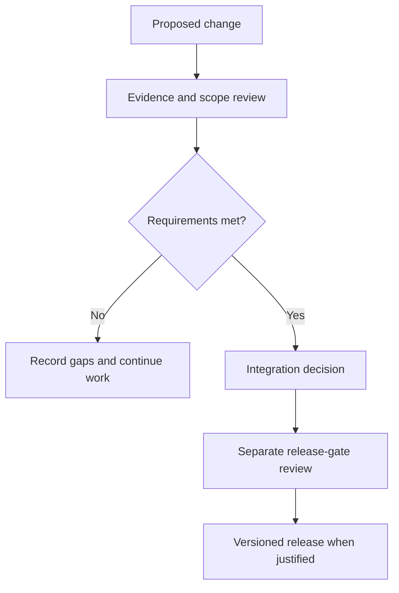

# Governance

OpenLongevity is led and maintained by Ciprian Ștefan Pleșca. The project uses public issues, pull requests, and release notes for decisions that affect scientific behavior.

Evidence records preserve source provenance. Machine extraction is labelled and does not become a verified claim without human review. Security and responsible disclosure are handled through [SECURITY.md](SECURITY.md).

Releases require passing CI, a reviewed pull request into `main`, and an annotated version tag.

## Governance model and present responsibility

OpenLongevity is an independent research-software project founded and maintained by Ciprian Ștefan Pleșca, cercetător român independent. The current governance model is maintainer-led. This document does not assert the existence of a governing board, institutional sponsor, ethics committee, or external scientific panel. If those arrangements are established later, their membership, responsibilities, and decision scope should be recorded explicitly rather than inferred from the project's aspirations.

Governance concerns how project decisions are made, recorded, challenged, and corrected. It is distinct from application authorization. A maintainer approving a pull request is not the same operation as a researcher reviewing an extracted claim inside a product. The repository currently represents review states but does not establish a complete operational review service. This policy therefore distinguishes project decision responsibilities from the future permissions required by a multiuser application.

## Decision classes and appropriate evidence

Routine editorial corrections can be evaluated by checking accuracy, readability, links, and examples. Implementation changes need evidence relevant to the affected behavior. Scientific-method changes need an explanation of assumptions and interpretation as well as software verification. Deployment changes need evidence from the target environment. A single approval label should not hide these different requirements or imply that one reviewer has expertise in every area.

Consequential decisions should identify the problem, alternatives considered, chosen approach, expected consequences, and conditions for revisiting the choice. Architectural decision records are a suitable place for durable technical tradeoffs. Release notes describe user-visible consequences. Issues and pull requests preserve the discussion and implementation evidence. The record should be sufficient for a later contributor to understand why a choice was made without relying on private conversations.

The maintainer is responsible for integrating changes coherently and for ensuring that public claims match the available evidence. That responsibility does not make every judgment final in a scientific sense. A decision can be reconsidered when a counterexample, source correction, new benchmark, or operational failure changes the evidence. The project should make that reconsideration traceable rather than treat correction as an embarrassment to conceal.

## Scientific claims and review boundaries

A proposed scientific claim should identify its source, scope, and inferential level. A publication summary, mechanistic hypothesis, statistical association, causal interpretation, and clinical recommendation are different kinds of statements. OpenLongevity's current scope supports research organization and experimental computation. It does not establish authority to convert a navigation score or graph relation into a claim of human longevity benefit.

Where independent review is needed, record whether it actually occurred and what was reviewed. Do not describe a maintainer's own inspection as an external audit. Do not describe a passing test suite as peer review. If a specialist reviews only one method or document, preserve that limited scope instead of presenting the review as approval of the whole platform. Accountability improves when the evidence is described precisely.

Conflicts of interest should be disclosed when they materially affect a contribution or interpretation. Funding, commercial interests, or strong prior commitments can influence decisions without automatically invalidating the work. The relevant governance response is transparent disclosure and an appropriate review process. The project should not promise an independent panel where none exists, but it can identify when additional independent examination remains necessary.

## Contribution, credit, and disagreement

Contributions should receive credit for work actually performed. Implementation, conceptual design, annotation, methodological review, and error discovery may involve different people. Git history supplies part of that record but not necessarily all of it. A document's authorship or acknowledgments should identify substantive contributions without creating honorary authorship or attributing participation to someone who did not agree to it.

Disagreement should be tied to a concrete claim, design choice, or observed behavior. A useful objection explains the issue, consequence, and supporting evidence. A useful response addresses those points and records whether the decision changes. Differences in expertise or project authority do not replace the need to examine a reproducible counterexample. Discussion should remain respectful while permitting direct technical criticism.

The project should distinguish a disagreement from misconduct or a security incident. A failed reproduction may reveal an environmental assumption rather than intentional misrepresentation. An exposed credential needs a different response from a disputed statistical interpretation. Classifying the concern helps route it to the correct process and avoids making every problem a general question of personal trust.

## Integration and release decisions

A pull request should be reviewed against its stated scope and evidence. Changes that are useful but incomplete can remain on a development branch or in a draft pull request with an explicit backlog. The project should not describe a partial documentation expansion as a completed corpus or a single working API path as a finished platform. Integration decisions should preserve that distinction in titles, descriptions, and release notes.

Release approval requires more than creating a tag. The relevant quality gates, documentation, compatibility checks, and deployment evidence must be evaluated for the intended release. An existing version tag remains a historical reference and must not be moved to include later fixes. If a release has a material defect, document the issue and publish an appropriately identified correction rather than rewriting its history.

Passing continuous integration supports the checks actually configured and executed. It does not establish scientific validity, complete security, or production readiness. A skipped test or missing deployment prerequisite should remain visible in the release decision. If a required gate is unresolved, the release remains unready even when other improvements are substantial.

## Corrections and policy evolution

Corrections should identify the affected artifact and practical consequence. A parser fix may require reprocessing records; a method fix may require recalculating outputs; a documentation correction may require withdrawing an overstated capability claim. Preserve enough history for users to determine whether their prior work is affected. A revision table or commit log is useful only when its meaning is explained.

This governance policy can evolve as the project gains contributors and operational experience. Proposed changes should explain the deficiency in the current process, the new responsibility or rule, and how the transition will be handled. Avoid designing elaborate voting structures for participants who do not yet exist. The immediate objective is transparent, proportionate decision making under the project's actual independent-maintainer model.

Related records include [contribution guidance](CONTRIBUTING.md), [authorship](AUTHORS.md), [security reporting](SECURITY.md), and [the academic review-boundary note](docs/academic/29-human-review-boundary-machine-extraction.md). Together they should make responsibility inspectable without presenting a policy document as evidence that every proposed operational control has already been implemented.

---

**Project author: CIPRIAN ȘTEFAN PLEȘCA — cercetător român independent.**
