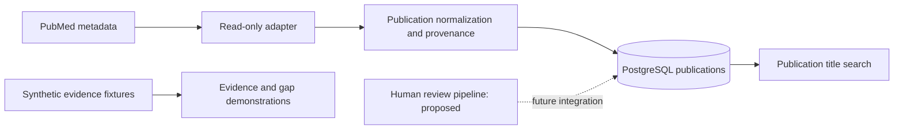

# OpenLongevity 🧬

Open-source computational infrastructure for understanding, measuring, mapping, and modeling biological aging.


[](https://github.com/Ciprian-LocalPulse/OpenLongevityLab/actions)
[](https://www.python.org/)
[](LICENSE)

OpenLongevity develops computational tools for organizing aging research with explicit source provenance and uncertainty. The current repository is a research prototype: publication ingestion and persistence coexist with synthetic evidence demonstrations and an early TypeScript interface. The Python package declares version 0.3.0; this does not establish a completed or scientifically validated release.

> Research use only. Not medical advice. OpenLongevity does not diagnose, prevent, treat, or cure disease and does not establish that any intervention extends human lifespan.

## Core capabilities

- Evidence records with study design, provenance, uncertainty, replication, and retraction status.
- A transparent A–G hierarchy distinguishing in-vitro, animal, observational human, clinical, RCT, review, and computational evidence.
- Research-gap signals for translational, replication, and source-concentration patterns.
- A graph abstraction for gene, pathway, mechanism, biomarker, intervention, and study links.
- Optional FastAPI routes and a Vite-built TypeScript dashboard with browser smoke checks.
- Read-only adapters for PubMed, Europe PMC, OpenAlex, Crossref, and ClinicalTrials.gov with provenance on every normalized record.
- PostgreSQL-ready repositories, evidence scoring, contradiction surfacing, pathway enrichment, survival curves, biological-age baselines, and multi-omics joins.

## Research pipeline



## Quickstart

```bash
python -m venv .venv
pip install -e ".[dev,api,db]"
pytest
openlongevity evidence "cellular senescence"
uvicorn 'openlongevity.api:create_app' --factory --reload
```

Synthetic records are software fixtures only and are not scientific conclusions. See [limitations](docs/research/LIMITATIONS.md), [data sources](docs/data/DATA_SOURCES.md), and the [v0.2.0 release notes](docs/releases/v0.2.0.md).

## Scientific specification

The [whitepaper](WHITEPAPER.md) defines the data model, provider contract, scoring equations, validation protocol, trust boundaries, and research roadmap. The [academic manifesto](ACADEMIC_MANIFESTO.md) states the review and ethics commitments behind the implementation. The [OpenLongevityLab impact article](docs/research/openlongevity-impact-article.md) explains the repository purpose, current maturity, intended final stage, collaboration path, and donation link in long-form academic prose.

## Repository structure

```text
src/openlongevity/   typed scientific core, API, and CLI
biomarkers/          biomarker catalog and interpretation guardrails
literature/          source adapter contracts
apps/web/             TypeScript dashboard and browser smoke checks
packages/rust/        optional safe performance kernels
sql/                  PostgreSQL schema
docs/                 academic notes, architecture, evidence, and security
```

## Reading the current product honestly

The project contains useful implementation work, but its parts should be assessed individually. A source adapter can retrieve bibliographic metadata without extracting a trustworthy scientific finding. A database can preserve publication revisions without providing a tamper-proof review history. A graph demonstration can illustrate relationships without supporting biological causation. These distinctions are part of the product contract and should remain visible when screenshots, exports, or examples are shared outside the repository.

The publication routes use PostgreSQL when a database is configured. Search currently filters publication titles; it is not a full-text engine or a federated systematic-review search. The evidence and research-gap endpoints use synthetic fixtures, and the graph endpoint provides an illustrative response. A successful request to one of those endpoints demonstrates software behavior on that input. It does not demonstrate that live publications have traversed an automated extraction, adjudication, and scientific synthesis workflow.

The frontend package now produces a Vite production artifact and runs a Playwright-powered browser smoke script against that artifact. The smoke path verifies provenance labels, fixture boundaries, graph navigation, source navigation, an unavailable-API state, and a mobile viewport. This is stronger than compiler-only verification, but it is still not a full accessibility audit, visual-regression suite, load test, or verified production deployment. Those stronger claims require their own observed evidence.

## Installation assumptions and reproducible operation

Create and activate an isolated Python environment before running the quickstart commands. On Windows PowerShell, activation uses `.venv\Scripts\Activate.ps1`; in a POSIX shell it normally uses `source .venv/bin/activate`. The installation includes development, API, and database extras because the application imports database components. Record the Python version and resolved packages when reporting a result. Version ranges in a project manifest are not a complete record of an installed environment.

The API can expose limited health and fixture responses without a configured publication database. Persisted publication operations need a PostgreSQL connection and the schema created through Alembic. Run migrations only against the intended environment and verify the target before any operation that changes schema. The repository's test seeding script belongs in a disposable test database; it inserts synthetic content and must not be treated as a mechanism for collecting genuine research evidence.

PubMed ingestion is an operator action protected by a server-side ingestion key. Keep the key out of browser bundles, public configuration variables, screenshots, and committed examples. A local operator key is not a complete user identity or role-management system. A public deployment needs its own documented access boundary, request limits, operational monitoring, and recovery procedure. Those requirements should be demonstrated in the deployment under review rather than assumed from local development behavior.

## A research workflow with explicit stopping points

Begin with a question whose population, measurement, and intended inference are clear. Searching for a broad term such as cellular senescence can support exploration, but the resulting record set should not be described as exhaustive. Save the provider name, query, retrieval time, returned identifiers, and any pagination or filtering decisions. If a request fails or reaches a limit, report incomplete retrieval instead of treating a partial list as the complete literature.

Next, inspect normalized metadata against the provider record. Check identity, title, date, correction notices, and the fields that the parser cannot recover. A missing abstract is missing information, not a negative finding. A publication marked with unknown retraction status has not thereby been verified as unaffected by corrections. Preserve source identifiers separately from local identifiers so that another reader can revisit the record and evaluate changes over time.

Only then consider a structured evidence observation. Define the study design, species, endpoint, population context, direction, and limitations. The current evidence model supports some of these directly and others only through text or metadata. An extracted statement needs its own provenance and review decision; a publication's bibliographic envelope is insufficient to establish that a specific outcome was reported accurately. Proposed review protocols in the academic collection describe work that still needs implementation and evaluation.

## Interpreting computational output

The A–G taxonomy assigns systematic reviews to A, randomized trials to B, clinical studies to C, observational studies to D, animal studies to E, in-vitro studies to F, and computational work to G. This is the project's navigation convention. It is not a claim that every review is stronger than every experiment or a substitute for evaluating bias and relevance. The implementation also maps retracted records to G, so clients must retain original study design alongside publication status.

The numerical navigation score uses hand-selected design weights, confidence, replication metadata, sample size, and publication age. It is not a probability of truth, a treatment effect, or a validated evidence-certainty scale. Date-sensitive outputs can now be frozen by passing an explicit scoring time to the evidence engine; API summaries also expose `scoring_as_of` so exported interpretations can record the temporal basis. The [whitepaper](WHITEPAPER.md) describes the actual arithmetic and its limitations. A research report should show the inputs and discuss whether conclusions depend on the ranking choices.

Experimental analysis utilities need similarly narrow interpretation. The biological-age routine is an ordinary-least-squares baseline. The survival utility produces Kaplan–Meier points without a complete inference framework. Multi-omics integration now rejects duplicate sample-layer pairs and inconsistent participant mappings, but it still does not perform feature harmonization, statistical batch correction, or biological interpretation. The pathway routine now applies a monotonic Benjamini–Hochberg correction across the valid pathway hypothesis family, while results still depend on the declared universe, pathway annotations, and upstream gene selection. These are reasons to inspect methods before drawing scientific conclusions, not details to hide behind a general research-use label.

## Documentation, evidence, and contribution standards

The documentation has three complementary levels. This page explains orientation and present capability. The whitepaper connects architecture, algorithms, and implementation limitations. The [academic collection](docs/academic/README.md) preserves thirty-one research topics, including the author's recent extensions, and develops their methods and evaluation boundaries. The [documentation index](docs/README.md) connects these materials to API, security, and architectural guidance. The former wiki directory has been removed and is not recreated.

Academic depth means that a reader can identify a question, assess assumptions, follow a method, examine a counterexample, and reproduce a relevant calculation. A thousand words alone cannot establish that standard. Code blocks should execute against the documented interface, diagrams should identify proposed components, and references should support the specific adjacent claim. New prose must not invent benchmark results, independent reviewers, institutional partnerships, or scientific validation that the project has not obtained.

Useful contributions include a focused bug reproduction, a parser fixture with clear redistribution rights, a correction to an overstated capability, or a reference calculation exposing an edge case. Identify the commit and environment and explain the expected behavior. Separate a software defect from a scientific disagreement: both deserve examination, but they require different evidence. Preserve the author attribution and credit the original studies and external software independently of project authorship.

## Collaboration and support

OpenLongevity welcomes focused collaboration from researchers, engineers, reviewers, students, and independent contributors who want transparent computational infrastructure for aging research. Useful contributions include reproducible bug reports, provider-adapter fixtures with clear redistribution rights, documentation corrections, API examples, database migration checks, benchmark proposals, and scientific-review notes that preserve uncertainty instead of replacing it with promotional certainty. Contributors should begin with [CONTRIBUTING.md](CONTRIBUTING.md), the [pull request template](.github/PULL_REQUEST_TEMPLATE.md), and the [OpenLongevityLab impact article](docs/research/openlongevity-impact-article.md) to understand the present research-prototype stage and the final platform target.

Financial support is optional and helps sustain maintenance, documentation, infrastructure, and research-tool development. Support can be offered through [PayPal](https://www.paypal.com/paypalme/agentflowenterprise), with additional context in [DONATE.md](DONATE.md). A donation does not purchase a scientific conclusion, evidence grade, private dataset, review status, clinical recommendation, or claim of longevity benefit. Funding and evidence remain separate: every result must still be traceable to source records, explicit methods, stated limitations, and human review where required.

## Author

**Ciprian Ștefan Pleșca** — Founder, Project Creator, Lead Maintainer, Principal Author, and independent Romanian researcher. See [AUTHORS.md](AUTHORS.md), [CITATION.cff](CITATION.cff), and [DONATE.md](DONATE.md).

## Governance and contribution

AI-generated interpretations remain separate from source evidence and require review. Every imported record should retain source identifier, retrieval date, license, and transformation history. See [DATA_GOVERNANCE.md](DATA_GOVERNANCE.md), [REPRODUCIBILITY.md](REPRODUCIBILITY.md), [SECURITY.md](SECURITY.md), and [CONTRIBUTING.md](CONTRIBUTING.md).

---

**Project author: CIPRIAN ȘTEFAN PLEȘCA — cercetător român independent.**
