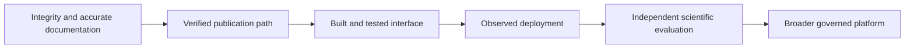

# Roadmap

## v0.2.0 — historical foundation

- The historical release introduced provider, provenance, API, heuristic, analysis, and interface foundations. This inventory is not a claim that every path was operationally or scientifically validated.

## v0.3.0 — reproducible curation

- Implemented foundation: Alembic migrations and persisted publication pagination; integration and recovery evidence still need explicit review.
- Proposed: entity resolution with documented matching rules, synonym handling, and conflict review.
- Proposed: reviewer accounts, provenance comparison, and accountable correction workflows.

## v0.4.0 — benchmarked science

- Publish a versioned, licensed benchmark corpus and parser gold labels.
- Add reproducible notebooks, calibration curves, subgroup error reports, and independent replication.

## v0.5.0 — scale with controls

- Add optional graph and vector backends with explicit licensing and privacy controls.
- Add queue-based ingestion, rate-limit telemetry, and retention policies.

## v1.0.0 — governed research platform

- Establish an external scientific review group, stability guarantees, formal release criteria, and a public audit trail.

## How to interpret the roadmap

The version headings organize intended development stages; they are not promises of delivery dates or proof that every listed capability exists. The Python package currently declares version 0.3.0, but a package string does not establish that the corresponding release gates have passed. The existing v0.2.0 tag remains a historical identifier and must not be moved to absorb later work. New release decisions need their own evidence and record.

Priorities should follow dependencies and observed risk. A polished interface depends on trustworthy labels and accurate contracts. Scientific evaluation depends on identified inputs and reproducible transformations. Public deployment depends on functioning build, configuration, access, and recovery paths. Adding more features before those foundations are examined can make the product appear more capable while increasing the number of unverified assumptions.

The current baseline is a research prototype with partially integrated infrastructure. Persisted publications coexist with synthetic evidence and graph demonstrations. The roadmap should make that starting point visible so that a reader can distinguish a demonstrated improvement from a proposed destination. Progress is measured by completed acceptance evidence, not by changing headings from planned to complete without executing the relevant path.

## Immediate integrity and documentation priorities

Publication-origin classification has moved from a fixed false synthetic flag to an explicit persistence contract. Synthetic seeds, manually documented records, ordinary PubMed provider-path records, and legacy unknown records now have different API semantics. Acceptance coverage includes the CI seed, ordinary PubMed search classification, a deliberately provider-shaped synthetic payload, persistence, list/detail responses, and revision history. The remaining work is presentation: the frontend must display these distinctions clearly rather than flattening them into a single visual style.

Complete the documentation expansion with distinct, source-backed explanations rather than repeated filler. Every tracked Markdown file has a minimum prose target, but accuracy and implementation alignment remain separate requirements. The automated inventory should continue to expose short documents, missing attribution, and structural problems. Code examples need execution checks, and diagrams need to identify proposed components clearly. A passing word-count gate is not a substitute for editorial review.

Resolve known analysis limitations through focused changes and reference cases. The pathway adjustment needs a clearly defined hypothesis family and correct adjustment behavior. Multi-omics integration needs an explicit duplicate and participant-consistency policy. Date-sensitive scoring needs a controllable or clearly recorded time basis. Each change should state its effect on existing outputs and should not be promoted as clinical validation merely because a regression test passes.

## Publication-path acceptance

The persisted publication path needs a repeatable demonstration from bounded retrieval through normalization, storage, detail, and history. Record provider identifiers, parser version, normalized content, and local revision. Then demonstrate unchanged replay, changed content, missing source fields, and a provider failure. Keep a live-source check distinct from an offline transport fixture so that each result has a clear meaning.

Database acceptance should include identity collisions, concurrent saves, partial batch failure, migrations, and backup restoration. Current ingestion saves publications individually, so a failed request can leave partial state. Operators need documented recovery behavior rather than an implied all-or-nothing guarantee. Tests should use PostgreSQL for database-specific semantics and should report prerequisites or skipped cases openly.

Search should remain described according to its implementation. Current title filtering is a useful narrow feature. Full-text retrieval, federation, and entity resolution would require separate contracts, evaluation corpora, and operational controls. They should not be implied by a generic search label. A future matching service should make uncertain merges reviewable and reversible while preserving original provider identities.

## Interface and deployment acceptance

The web application needs a real production build and interaction checks in addition to type checking. The current compiler-only scripts do not establish a deployable application artifact. Acceptance should demonstrate navigation, loading, empty results, unavailable services, and explicit fixture labels. Accessibility and responsive behavior need examination in rendered views, not only a successful TypeScript command.

Deployment should be verified against the chosen hosting environment with actual configuration and an observed URL. Record the commit deployed, build outcome, environment assumptions, and a smoke test of the intended public experience. A hosting configuration file or authenticated command-line tool is not by itself deployment evidence. Preview deployments and production publication should remain identifiable as different environments with appropriate secrets and data scope.

The server-side ingestion key must remain outside browser code. Public exploration should not require exposing an operator credential. Health indicators should describe their limited checks rather than claim the entire scientific workflow is healthy. Observability and failure messages should help an operator distinguish provider, storage, configuration, and client problems without leaking sensitive information.

## Scientific evaluation stage

Before claiming extraction accuracy or useful evidence ranking, create a versioned evaluation corpus with permitted-use information, annotation instructions, and representative difficult cases. Record reviewer disagreement and adjudication. Split related studies and cohorts appropriately so that duplicates do not inflate performance. Report errors by task or rule rather than only an aggregate number that hides a consistently weak component.

Model and biomarker work needs a defined target, population, comparator, and intended interpretation. The experimental regression baseline should be evaluated as a baseline before being described as an aging clock. External-cohort results, subgroup analyses, and calibration claims require actual studies and artifacts. The roadmap does not supply those results in advance or imply that the project has obtained independent clinical review.

## Longer-term architecture and governance

Graph, vector, queue, and cohort integrations should be introduced only with a clear problem that the existing architecture cannot adequately address. Each addition brings operational and interpretive costs. A graph relation needs provenance; a vector result needs retrieval evaluation; a queue needs retry and idempotence semantics. Naming a technology does not resolve the underlying research question.

External review and broader governance are desired developments, not existing institutional arrangements. The project is currently maintained by Ciprian Ștefan Pleșca as an independent Romanian researcher. Any future review group should have an actual membership, scope, and decision process. Stability commitments should reflect maintenance capacity and demonstrated compatibility rather than an aspirational version number.

The ordering is a dependency guide, not a rigid calendar. Work can proceed in parallel where dependencies permit, but a later milestone cannot erase an unmet earlier gate. See [the audit record](docs/audits/v0.3.0-baseline.md), [governance](GOVERNANCE.md), and [limitations](docs/research/LIMITATIONS.md) when assessing readiness. The roadmap remains useful only while it distinguishes evidence already obtained from work still required.

---

**Project author: CIPRIAN ȘTEFAN PLEȘCA — cercetător român independent.**
