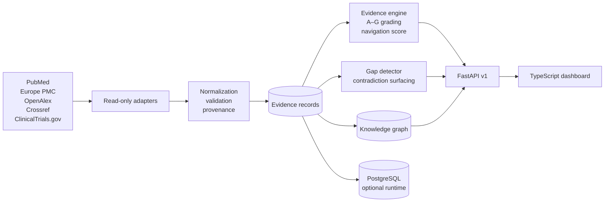
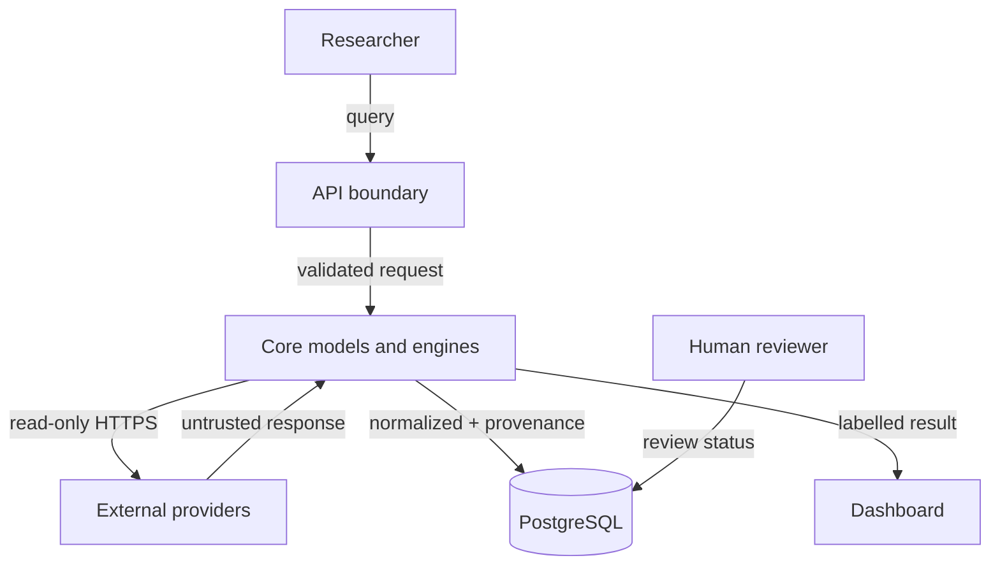
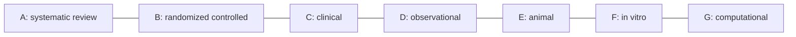
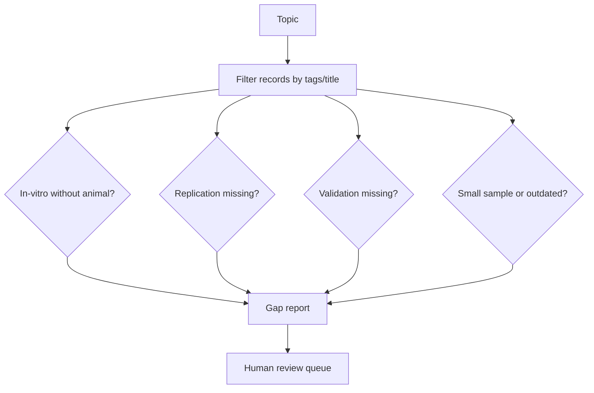
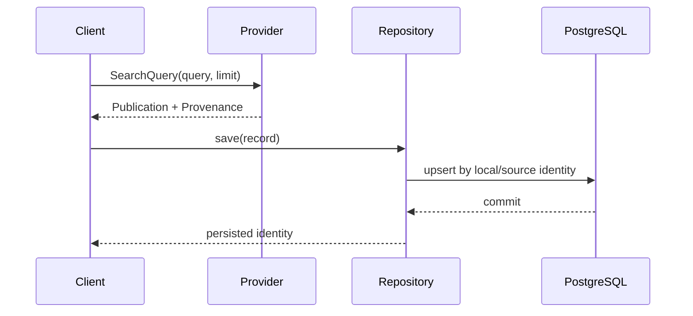
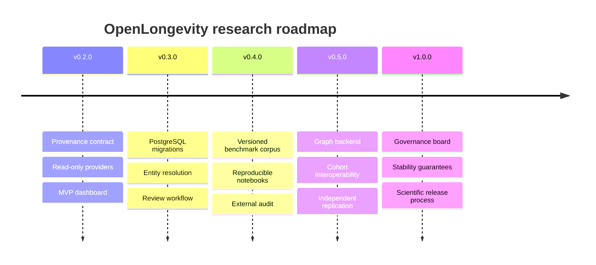

# OpenLongevity: a provenance-first computational infrastructure for aging research

**Technical specification and implementation audit · 15 September 2026 · baseline `9fddcbb`**
**Principal author and maintainer: CIPRIAN ȘTEFAN PLEȘCA — cercetător român independent.**

**Status:** the Python package declares 0.3.0; this document is not a verified release announcement. Diagrams that include automated evidence review or a fully connected dashboard describe the target architecture. Persisted publications and synthetic evidence currently follow separate paths.

> OpenLongevity is research infrastructure. It organizes observations, metadata, and review workflows; it does not diagnose disease, prescribe treatment, or establish that an intervention extends human lifespan.

## Abstract

Aging research is distributed across publications, registries, omics assays, biomarker studies, animal experiments, and clinical trials. These sources use different identifiers, vocabularies, study designs, and reporting conventions. A search interface alone cannot preserve the distinctions that determine whether a result is reproducible or clinically relevant.

OpenLongevity defines typed evidence records, provider provenance, a study-design taxonomy, and an experimental graph abstraction. The repository contains read-only metadata adapters, evidence-navigation heuristics, a PostgreSQL publication repository, and a TypeScript interface shell. An operational human-review dashboard and a validated publication-to-evidence extraction pipeline have not been established. Persisted publication search must remain distinguishable from synthetic evidence and graph demonstrations.

This document describes the system boundary, data model, algorithms, validation plan, threat model, and roadmap. It is an engineering specification and a reproducibility commitment, not a claim of scientific discovery.

## 1. Research question and scope

The platform addresses one operational question:

> Given a topic in biological aging, can a researcher trace each displayed statement back to a source record, understand the study design and uncertainty, and reproduce the transformation that produced the display?

The scope includes literature and trial metadata, structured evidence extraction, biomarker definitions, multi-omics sample joins, mechanistic graph edges, and review prioritization. The scope excludes patient care, autonomous diagnosis, hidden model training on private clinical data, and unreviewed causal claims.

### 1.1 Design principles

1. **Evidence before interpretation.** A source observation is stored independently from a score, summary, or model output.
2. **Provenance by construction.** A normalized record carries its provider, source identifier, URL, retrieval time, license, checksum when available, and parser version.
3. **Study designs remain distinct.** Cellular, animal, observational, clinical, randomized, review, and computational evidence are not silently pooled.
4. **Uncertainty is data.** Missing fields, confidence, replication state, correction state, and review status are explicit fields.
5. **Read-only external access.** Providers are queried without modifying upstream systems; local persistence is append-aware and auditable.
6. **Human review at the boundary.** Machine extraction can propose structure; only a documented reviewer can mark a finding verified.
7. **Reproducible computation.** Deterministic functions, pinned dependencies, tests, and release tags make every transformation rerunnable.

## 2. System architecture



The repository is a monorepo with a Python scientific core, an optional Rust kernel, a TypeScript dashboard, SQL schema assets, and documentation. The API can run with deterministic fixtures for development or with a configured database and provider credentials for a deployment.

### 2.1 Trust boundaries



Provider responses are untrusted input. The PubMed implementation includes bounded requests, response-size limits, selected retries, and typed failures; equivalent behavior must be checked separately for each other adapter. Successful parsing does not establish scientific validity. Human-review arrows above are proposed responsibilities, not an implemented authorization service.

## 3. Evidence data model

An `EvidenceRecord` represents a study observation used by the heuristic engine. It is distinct from a provider `Publication` and its typed provenance envelope. The following synthetic example uses the implemented constructor; it is not a real study.

```python
from openlongevity.models import EvidenceRecord, StudyType

record = EvidenceRecord(
    identifier="SYNTHETIC:WHITEPAPER-001",
    title="Example observation",
    study_type=StudyType.OBSERVATIONAL,
    species="human",
    endpoint="synthetic laboratory measurement",
    source="software fixture; no real study",
    confidence=0.62,
    replication_status="unknown",
    tags=("inflammation", "aging"),
)
```

The scientific model should distinguish the following concepts. Some are currently free-text metadata or proposed invariants, rather than dedicated validated fields:

| Field family | Meaning | Example guardrail |
| --- | --- | --- |
| identity | local and source identifiers | never overwrite a source ID |
| design | model, population, intervention, comparator, outcome | do not pool animal and human rows |
| result | direction, effect text, uncertainty | retain null and mixed findings |
| quality | confidence, sample size, replication, retraction | retracted records remain visible but score zero |
| review | machine extracted, human reviewed, verified, disputed | verification requires a reviewer |
| provenance | provider, URL, timestamp, license, parser version | every adapter populates it |

The A–G hierarchy is a navigation taxonomy, not a validity theorem:



These are the implemented categories, not the GRADE framework or a calibrated ordering of validity. Retraction currently overrides a record's category to G, conflating design and publication status; preserve the original study type when interpreting this output.

## 4. Provider and provenance contract

All literature adapters implement the `LiteratureProvider` protocol:

```python
from typing import Protocol
from openlongevity.providers.base import Publication, SearchQuery


class LiteratureProvider(Protocol):
    async def search(self, query: SearchQuery) -> list[Publication]: ...
    async def get_by_id(self, external_id: str) -> Publication | None: ...
```

`SearchQuery` normalizes whitespace, bounds limits to 1–100, and rejects invalid pages. `Provenance` records:

```json
{
  "source_provider": "pubmed",
  "source_identifier": "123456",
  "source_url": "https://pubmed.ncbi.nlm.nih.gov/123456/",
  "retrieved_at": "2026-09-14T14:00:00+00:00",
  "source_updated_at": null,
  "license": null,
  "checksum": null,
  "parser_version": "pubmed-2",
  "normalization_version": "2"
}
```

This JSON illustrates field structure, not a retrieved record. Real PubMed parsing calculates a checksum from canonicalized article XML. Parser, normalization, and package versions describe different things. Unknown licensing must remain unknown. Full-text redistribution and upstream writes are outside the default contract. See [`docs/data/DATA_SOURCES.md`](docs/data/DATA_SOURCES.md).

## 5. Evidence extraction and scoring

The evidence engine computes two independent outputs:

1. **Grade:** study-design category used to filter and compare records.
2. **Navigation score:** a bounded prioritization heuristic used to order review work.

The score is not an effect size, posterior probability, quality certification, or clinical recommendation. In pseudocode:

```text
base weights A..G ← 0.95, 0.85, 0.70, 0.50, 0.35, 0.20, 0.10
replication ← 1.15 for replicated/independent; 0.85 for unknown/unreplicated; else 1
sample ← min(1.15, 0.85 + n / (n + 200)) if n exists; else 1
age ← max(0, years since publication using current UTC time)
age_factor ← max(0.75, 1 - age * 0.01) for parseable date; else 1
score ← 0 if retracted; else round(clamp(base × confidence × replication × sample × age_factor, 0, 1), 4)
```

The engine also groups records by normalized topic tags and reports opposing `positive` and `negative` directions as `Contradiction` objects. It does not resolve disagreements automatically; reviewers must inspect endpoints, populations, interventions, and possible corrections.

## 6. Research-gap detection

The detector emits review hypotheses with confidence and supporting identifiers:



Current deterministic signals include translational gaps, replication gaps, source concentration, validation gaps, small samples, and explicitly marked outdated evidence. A gap is a reason to read more; it is not evidence that a treatment works or fails.

## 7. Biomarkers and multi-omics

The catalog covers epigenetic age estimates, telomere length, inflammatory proteins, HbA1c, immune-cell composition, senescence-associated signals, mitochondrial respiration, and age-associated proteomic and transcriptomic signatures. Each definition includes measured quantity, evidence maturity, confounders, and limitations. No marker is declared a universal biological-age truth.

Multi-omics integration is sample-keyed and missingness-preserving:

```python
from openlongevity.analysis import MultiOmicsSample, OmicsLayer, integrate_samples

integrated = integrate_samples([
    MultiOmicsSample("S1", "P1", OmicsLayer.GENOMICS, {"example": 1.0}),
    MultiOmicsSample("S1", "P1", OmicsLayer.PROTEOMICS, {"example": None}),
])
```

The biological-age module provides a standardized OLS baseline and regression metrics. The survival module provides Kaplan–Meier points without confidence bands or competing-risk analysis. The pathway module calculates hypergeometric tails, but its current rank adjustment lacks the reverse cumulative minimum for standard Benjamini–Hochberg adjusted values and excludes zero-overlap pathways. It must not be described as validated false-discovery-rate control. Multi-omics integration also overwrites repeated sample/layer entries and does not enforce participant consistency. These limitations require code changes and reference tests before broader research use.

## 8. API surface

The versioned API exposes:

| Route | Purpose |
| --- | --- |
| `GET /api/v1/health` | limited service/database status; provider not probed |
| `GET /api/v1/evidence` | filtered synthetic fixtures |
| `GET /api/v1/evidence/{id}` | one record with grade and score |
| `GET /api/v1/search` | persisted publication title filtering |
| `GET /api/v1/publications` | persisted publication list |
| `GET /api/v1/publications/{id}` | persisted publication detail |
| `GET /api/v1/publications/{id}/history` | stored publication revisions |
| `GET /api/v1/research-gaps` | deterministic gap hypotheses |
| `GET /api/v1/graph` | typed relationship view |
| `GET /api/v1/{resource}` | unavailable-resource error |
| `POST /api/v1/ingestion/pubmed` | operator-key-protected query and local persistence |

Production deployment must add authentication, rate limiting, structured request logging, database migrations, and monitoring. The development fixture endpoints are intentionally deterministic and labelled as synthetic.

## 9. Persistence and reproducibility

`Database` creates an async SQLAlchemy engine from `DATABASE_URL`; `PublicationRepository` stores publications and revision payloads. Alembic manages the schema. Install the database extras with the API extras for this application. Parser-only tests can remain offline. The repository uses PostgreSQL-specific operations, so another database is not an interchangeable integration-test substitute.



A reproducible release should record toolchain versions, resolved dependencies, test results, and an immutable tag. Those are acceptance requirements, not proof that every historical release satisfied them. Recorded parser fixtures support offline replay; live queries can change as upstream databases evolve.

## 10. Validation plan

The following is the required validation plan; it is not a report that every listed check has passed:

1. **Unit tests:** model invariants, parser fixtures, scoring, gap signals, survival censoring, pathway correction, and multi-omics joins.
2. **API integration tests:** health, search, not-found errors, and structured provider failures.
3. **Static checks:** Ruff, TypeScript compiler, Rust fmt and clippy, CodeQL, secret scanning.
4. **Build checks:** npm reproducible install, Docker Compose configuration, and image build.
5. **Scientific review:** independent reviewers examine source attribution, endpoint wording, population labels, and limitations before a finding is marked verified.

Evaluation datasets for future releases must be versioned, licensed, de-identified where necessary, and accompanied by a data statement. Performance metrics must include class definitions, missing-data handling, confidence intervals, and a comparison against a simple baseline.

## 11. Security, privacy, and ethics

The default system stores public research metadata and synthetic fixtures. It is not approved for protected health information. Deployments handling sensitive data must implement access control, encryption, key rotation, audit logs, retention limits, and an incident response plan. Threat assumptions and mitigations are documented in [`docs/security/THREAT_MODEL.md`](docs/security/THREAT_MODEL.md).

Responsible AI requirements are operational: preserve source text boundaries, label extraction, retain model/version metadata, surface uncertainty, and provide a correction path. A generated summary must never be presented as a source observation.

## 12. Current status and research roadmap

The audited repository is a **research software prototype with partially integrated infrastructure**. Its Python package declares 0.3.0, while the frontend package still declares 0.2.0. The historical milestone diagram below expresses aspirations, not demonstrated completion dates or a release guarantee:



Progress toward v1.0 requires independent scientific review, benchmark datasets, documented error rates, operational observability, and evidence that users can reproduce results. The project will not convert a heuristic into a clinical claim by changing its version number.

## 13. How to cite and contribute

Use [`CITATION.cff`](CITATION.cff) together with the exact commit used, and identify providers and retrieval dates separately. Contributions should include tests, provenance behavior, limitations, and an update to the relevant architectural decision. See [`CONTRIBUTING.md`](CONTRIBUTING.md), [`GOVERNANCE.md`](GOVERNANCE.md), and [the documentation index](docs/README.md).

## 14. Audit qualifications and acceptance criteria

Publication persistence currently commits one record at a time. A later failure can leave earlier records stored, so ingestion is not an atomic batch. Content hashing excludes retrieval time, separating repeated observation from changed content, but the revision tables are not a cryptographically immutable ledger. Database privileges still govern modification and deletion. A backup is only operational evidence when restoration has been rehearsed and the recovered schema and content have been checked.

Search currently filters titles. It does not search full text, reconcile multiple providers, or document the exhaustive query protocol required for a systematic review. Evidence and gap routes use fixtures independently of persisted publications. The graph response is illustrative. A functioning publication list therefore cannot establish that the entire research pipeline has run successfully. Integration evidence must show identifiers crossing each boundary with their origin and transformation history intact.

The CI seed is synthetic test material. Publication serialization currently assigns `synthetic: false` without deriving authenticity from source verification, so that flag alone is unreliable for records inserted outside the provider path. Fixing this needs an explicit origin model and a regression test; the present documentation correction does not resolve the runtime defect. Similarly, a healthy database response establishes only limited connectivity/schema information, not complete migration compatibility or scientific data quality.

Evaluation should be organized around falsifiable claims. Parser accuracy requires an annotated corpus with field-level disagreement, correction notices, and missing-data cases. Storage integrity requires unchanged replay, changed-content revisions, concurrent writes, identity collisions, and partial failures. Scientific extraction requires a separate reference annotation protocol with study-level data splitting and recorded reviewer disagreement. No benchmark scores or independent review outcomes are asserted here.

Navigation scores depend on hand-selected constants and, for dated records, current UTC time. They are not calibrated probabilities. Reproduction must capture the execution time or introduce a future explicit as-of parameter. Sensitivity analysis should compare ordering after removing sample-size, recency, and replication multipliers. Stable arithmetic is useful, but stability is not evidence that the resulting ranking is scientifically appropriate.

The distinction between data entities, transformation activities, and responsible agents in [W3C PROV-DM](https://www.w3.org/TR/prov-dm/) informs a future provenance export. The present envelope does not establish full conformance. [NCBI E-utilities documentation](https://www.ncbi.nlm.nih.gov/books/NBK25501/) remains the primary reference for the PubMed retrieval interface. These references support design choices; they do not certify this implementation.

---

**CIPRIAN ȘTEFAN PLEȘCA — cercetător român independent**

Founder and principal author of OpenLongevity. Independent project; no institutional affiliation or external validation is implied.

## References and related specifications

- [`docs/evidence/Evidence-Model.md`](docs/evidence/Evidence-Model.md)
- [`docs/data/DATA_SOURCES.md`](docs/data/DATA_SOURCES.md)
- [`docs/research/LIMITATIONS.md`](docs/research/LIMITATIONS.md)
- [`docs/API.md`](docs/API.md)
- [`REPRODUCIBILITY.md`](REPRODUCIBILITY.md)
- [`DATA_GOVERNANCE.md`](DATA_GOVERNANCE.md)
- [`SECURITY.md`](SECURITY.md)
