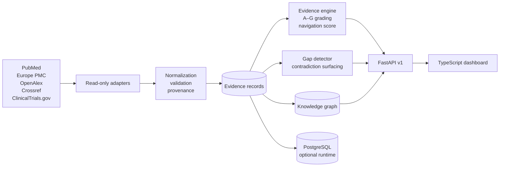
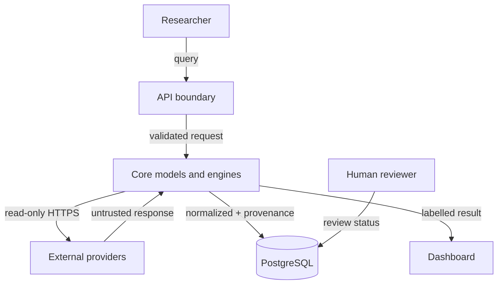
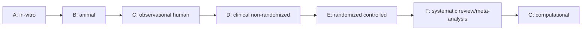
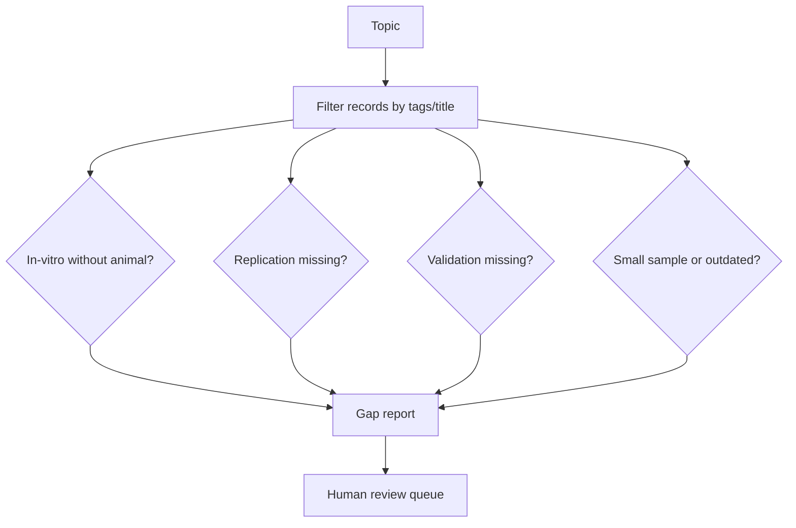
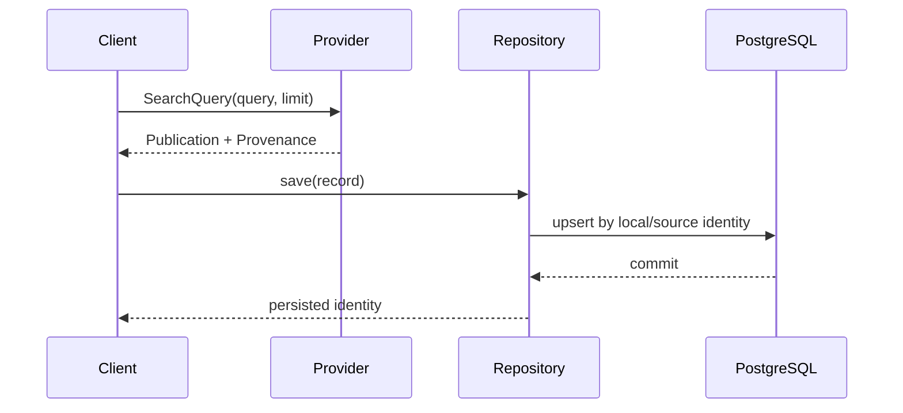
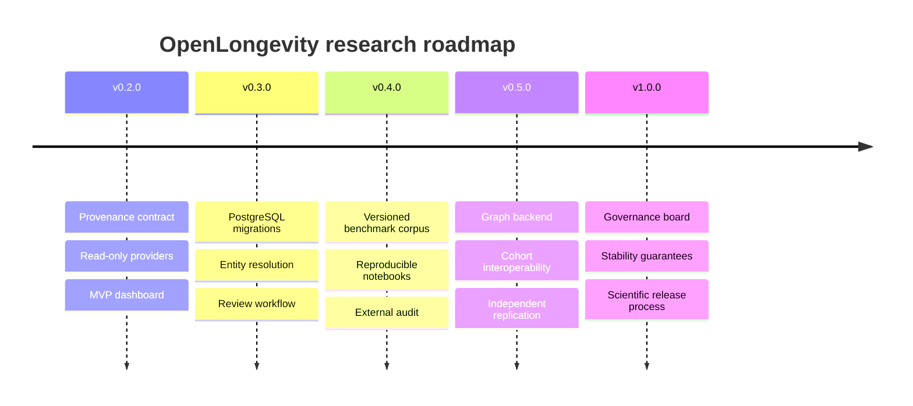

# OpenLongevity: a provenance-first computational infrastructure for aging research

**Version 0.2.0 · Technical and scientific design specification · 14 September 2026**
**Principal author and maintainer:** Ciprian Ștefan Pleșca

> OpenLongevity is research infrastructure. It organizes observations, metadata, and review workflows; it does not diagnose disease, prescribe treatment, or establish that an intervention extends human lifespan.

## Abstract

Aging research is distributed across publications, registries, omics assays, biomarker studies, animal experiments, and clinical trials. These sources use different identifiers, vocabularies, study designs, and reporting conventions. A search interface alone cannot preserve the distinctions that determine whether a result is reproducible or clinically relevant.

OpenLongevity defines a typed evidence record, a provenance contract, a study-design hierarchy, and a graph model that keep source observations separate from computational interpretation. The platform provides read-only adapters for PubMed, Europe PMC, OpenAlex, Crossref, and ClinicalTrials.gov; deterministic heuristics for evidence navigation and research-gap detection; PostgreSQL-ready persistence; and a dashboard for human review. The design is intentionally conservative: uncertainty, missingness, retractions, and disagreement remain visible.

This document describes the system boundary, data model, algorithms, validation plan, threat model, and roadmap. It is an engineering specification and a reproducibility commitment, not a claim of scientific discovery.

## 1. Research question and scope

The platform addresses one operational question:

> Given a topic in biological aging, can a researcher trace each displayed statement back to a source record, understand the study design and uncertainty, and reproduce the transformation that produced the display?

The scope includes literature and trial metadata, structured evidence extraction, biomarker definitions, multi-omics sample joins, mechanistic graph edges, and review prioritization. The scope excludes patient care, autonomous diagnosis, hidden model training on private clinical data, and unreviewed causal claims.

### 1.1 Design principles

1. **Evidence before interpretation.** A source observation is stored independently from a score, summary, or model output.
2. **Provenance by construction.** A normalized record carries its provider, source identifier, URL, retrieval time, license, checksum when available, and parser version.
3. **Study designs remain distinct.** Cellular, animal, observational, clinical, randomized, review, and computational evidence are not silently pooled.
4. **Uncertainty is data.** Missing fields, confidence, replication state, correction state, and review status are explicit fields.
5. **Read-only external access.** Providers are queried without modifying upstream systems; local persistence is append-aware and auditable.
6. **Human review at the boundary.** Machine extraction can propose structure; only a documented reviewer can mark a finding verified.
7. **Reproducible computation.** Deterministic functions, pinned dependencies, tests, and release tags make every transformation rerunnable.

## 2. System architecture



The repository is a monorepo with a Python scientific core, an optional Rust kernel, a TypeScript dashboard, SQL schema assets, and documentation. The API can run with deterministic fixtures for development or with a configured database and provider credentials for a deployment.

### 2.1 Trust boundaries



Provider responses are untrusted input. The adapter layer validates shape, bounds pagination, refuses redirects, limits retries, and raises a typed `ProviderError`. No provider response is treated as a scientific conclusion merely because it is parseable.

## 3. Evidence data model

An `EvidenceRecord` is the atomic unit shown in the API and dashboard. Its stable identifier is local; its external identifiers live inside provenance.

```python
from openlongevity.models import EvidenceRecord, StudyType

record = EvidenceRecord(
    identifier="PMID:00000000",
    title="Example observation",
    study_type=StudyType.OBSERVATIONAL_HUMAN,
    population="defined cohort",
    intervention_or_exposure="exposure as reported",
    outcome="endpoint as reported",
    confidence=0.62,
    replication_status="unknown",
    tags=("inflammation", "aging"),
)
```

The record distinguishes:

| Field family | Meaning | Example guardrail |
| --- | --- | --- |
| identity | local and source identifiers | never overwrite a source ID |
| design | model, population, intervention, comparator, outcome | do not pool animal and human rows |
| result | direction, effect text, uncertainty | retain null and mixed findings |
| quality | confidence, sample size, replication, retraction | retracted records remain visible but score zero |
| review | machine extracted, human reviewed, verified, disputed | verification requires a reviewer |
| provenance | provider, URL, timestamp, license, parser version | every adapter populates it |

The A–G hierarchy is a navigation taxonomy, not a validity theorem:



The arrows communicate translational distance; a higher letter does not guarantee better measurement, lower bias, or relevance to every question.

## 4. Provider and provenance contract

All literature adapters implement the `LiteratureProvider` protocol:

```python
class LiteratureProvider(Protocol):
    async def search(self, query: SearchQuery) -> list[Publication]: ...
    async def get_by_id(self, external_id: str) -> Publication | None: ...
```

`SearchQuery` normalizes whitespace, bounds limits to 1–100, and rejects invalid pages. `Provenance` records:

```json
{
  "source_provider": "pubmed",
  "source_identifier": "PMID:123456",
  "source_url": "https://pubmed.ncbi.nlm.nih.gov/123456/",
  "retrieved_at": "2026-09-14T14:00:00+00:00",
  "source_updated_at": null,
  "license": "NCBI terms",
  "normalization_version": "0.2.0"
}
```

Adapters are deliberately metadata-first. Full-text redistribution, bulk crawling, and upstream writes are outside the default contract. Rate limits, attribution, and terms for each source are documented in [`docs/data/DATA_SOURCES.md`](docs/data/DATA_SOURCES.md).

## 5. Evidence extraction and scoring

The evidence engine computes two independent outputs:

1. **Grade:** study-design category used to filter and compare records.
2. **Navigation score:** a bounded prioritization heuristic used to order review work.

The score is not an effect size, posterior probability, quality certification, or clinical recommendation. In pseudocode:

```text
base ← design_weight(study_type)
confidence ← clamp(record.confidence, 0, 1)
replication ← 1.15 if independently replicated else 0.85 if unreplicated else 1.0
sample ← min(1.25, 0.75 + log10(max(sample_size, 10)) / 10)
age_decay ← exp(-years_since_publication / half_life)
score ← 0 if retracted else clamp(base × confidence × replication × sample × age_decay, 0, 1)
```

The engine also groups records by normalized topic tags and reports opposing `positive` and `negative` directions as `Contradiction` objects. It does not resolve disagreements automatically; reviewers must inspect endpoints, populations, interventions, and possible corrections.

## 6. Research-gap detection

The detector emits review hypotheses with confidence and supporting identifiers:



Current deterministic signals include translational gaps, replication gaps, source concentration, validation gaps, small samples, and explicitly marked outdated evidence. A gap is a reason to read more; it is not evidence that a treatment works or fails.

## 7. Biomarkers and multi-omics

The catalog covers epigenetic age estimates, telomere length, inflammatory proteins, HbA1c, immune-cell composition, senescence-associated signals, mitochondrial respiration, and age-associated proteomic and transcriptomic signatures. Each definition includes measured quantity, evidence maturity, confounders, and limitations. No marker is declared a universal biological-age truth.

Multi-omics integration is sample-keyed and missingness-preserving:

```python
from openlongevity.analysis import MultiOmicsSample, OmicsLayer, integrate_samples

integrated = integrate_samples([
    MultiOmicsSample("S1", OmicsLayer.GENOMICS, {"TP53": 1.0}),
    MultiOmicsSample("S1", OmicsLayer.PROTEOMICS, {"IL6": 2.4}),
])
```

The biological-age module provides a transparent standardized OLS baseline and reports MAE, RMSE, and R². The survival module provides Kaplan–Meier points with censoring. The pathway module provides hypergeometric enrichment with Benjamini–Hochberg correction. These are reference implementations for reproducible analysis, not clinically validated models.

## 8. API surface

The versioned API exposes:

| Route | Purpose |
| --- | --- |
| `GET /api/v1/health` | service and provider status |
| `GET /api/v1/evidence` | filtered fixture or persisted evidence |
| `GET /api/v1/evidence/{id}` | one record with grade and score |
| `GET /api/v1/search` | unified resource search |
| `GET /api/v1/research-gaps` | deterministic gap hypotheses |
| `GET /api/v1/graph` | typed relationship view |
| `GET /api/v1/{resource}` | paginated catalog resources |
| `POST /api/v1/ingestion/pubmed` | bounded read-only PubMed query |
| `POST /api/v1/ingestion/clinical-trials` | bounded read-only trial query |

Production deployment must add authentication, rate limiting, structured request logging, database migrations, and monitoring. The development fixture endpoints are intentionally deterministic and labelled as synthetic.

## 9. Persistence and reproducibility

`Database` creates an async SQLAlchemy engine from `DATABASE_URL`; `EvidenceRepository` upserts normalized rows while serializing provenance. The database layer is optional so parser tests remain fast and offline.



Every release records the Python, Node, and Rust toolchain expectations, runs tests in CI, and publishes an immutable tag. A researcher can reproduce a parser result from a recorded fixture without contacting the network.

## 10. Validation plan

The project uses layered validation:

1. **Unit tests:** model invariants, parser fixtures, scoring, gap signals, survival censoring, pathway correction, and multi-omics joins.
2. **API integration tests:** health, search, not-found errors, and structured provider failures.
3. **Static checks:** Ruff, TypeScript compiler, Rust fmt and clippy, CodeQL, secret scanning.
4. **Build checks:** npm reproducible install, Docker Compose configuration, and image build.
5. **Scientific review:** independent reviewers examine source attribution, endpoint wording, population labels, and limitations before a finding is marked verified.

Evaluation datasets for future releases must be versioned, licensed, de-identified where necessary, and accompanied by a data statement. Performance metrics must include class definitions, missing-data handling, confidence intervals, and a comparison against a simple baseline.

## 11. Security, privacy, and ethics

The default system stores public research metadata and synthetic fixtures. It is not approved for protected health information. Deployments handling sensitive data must implement access control, encryption, key rotation, audit logs, retention limits, and an incident response plan. Threat assumptions and mitigations are documented in [`docs/security/THREAT_MODEL.md`](docs/security/THREAT_MODEL.md).

Responsible AI requirements are operational: preserve source text boundaries, label extraction, retain model/version metadata, surface uncertainty, and provide a correction path. A generated summary must never be presented as a source observation.

## 12. Current status and research roadmap

Version 0.2.0 is a **research infrastructure MVP foundation**. It has real read-only adapters and testable computational primitives, but it is not a validated clinical or population-scale system. The next milestones are:



Progress toward v1.0 requires independent scientific review, benchmark datasets, documented error rates, operational observability, and evidence that users can reproduce results. The project will not convert a heuristic into a clinical claim by changing its version number.

## 13. How to cite and contribute

Use the versioned citation in [`CITATION.cff`](CITATION.cff) and identify the provider and retrieval date for any source-derived result. Contributions should include tests, provenance behavior, limitations, and an update to the relevant ADR or data-source record. See [`CONTRIBUTING.md`](CONTRIBUTING.md), [`GOVERNANCE.md`](GOVERNANCE.md), and [`docs/wiki/Developer-Guide.md`](docs/wiki/Developer-Guide.md).

## References and related specifications

- [`docs/evidence/Evidence-Model.md`](docs/evidence/Evidence-Model.md)
- [`docs/data/DATA_SOURCES.md`](docs/data/DATA_SOURCES.md)
- [`docs/research/LIMITATIONS.md`](docs/research/LIMITATIONS.md)
- [`docs/API.md`](docs/API.md)
- [`REPRODUCIBILITY.md`](REPRODUCIBILITY.md)
- [`DATA_GOVERNANCE.md`](DATA_GOVERNANCE.md)
- [`SECURITY.md`](SECURITY.md)
