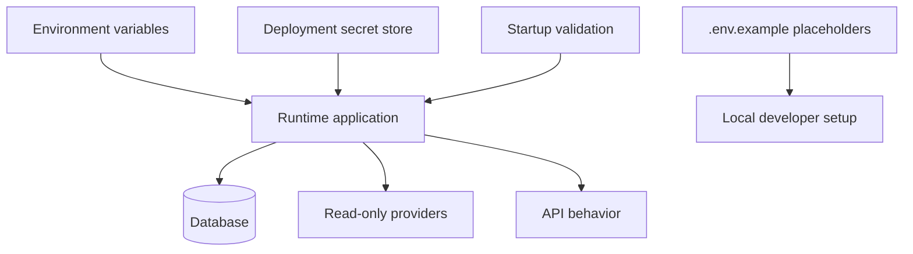

# Configuration

Author: CIPRIAN ȘTEFAN PLEȘCA — cercetător român independent.

## Purpose

The configuration layer defines how OpenLongevity receives runtime settings without embedding secrets, provider credentials, or deployment assumptions in source control. Runtime configuration is supplied through environment variables, deployment secrets, local development files, or platform-managed secret stores. The repository may contain examples and safe placeholders, but it must not contain real credentials, private connection strings, personal tokens, or restricted dataset keys.

Configuration is part of the scientific contract because it controls which providers are enabled, which database is used, which origins can call the API, and whether ingestion is active. A misconfigured environment can make a test fixture look like production data, point a release at the wrong database, expose an ingestion endpoint, or hide a provider failure. For that reason, configuration should be documented as carefully as code.

## Configuration Principles

No credential belongs in Git history. `.env.example` may describe variable names and safe dummy values, but it should never contain real tokens. Local `.env` files should be ignored. Deployment secrets should be managed by the hosting platform or operating environment. When a secret is rotated, documentation should mention the variable name and expected scope, not the value.

Configuration should fail clearly. If a database URL is required for a production service, startup should report that it is missing rather than silently falling back to an unsafe or misleading mode. If ingestion requires an API key, the endpoint should be disabled when the key is absent. If CORS origins are configured, they should be explicit rather than broad by default. Clear failure is better than surprising permissiveness.

## Environment Categories

Local development configuration supports testing, fixtures, and documentation examples. It may use synthetic data and local services. Test configuration should be deterministic and should avoid writing bytecode or cache files when CI requires clean workspaces. Preview configuration may connect deployed code to preview services but should still avoid production secrets unless explicitly approved. Production configuration should use durable persistence, restricted keys, reviewed origins, and audit-friendly logging.

These categories should not be blurred. A developer fixture key should not enable real ingestion. A production database URL should not be used by a seed script unless the script has explicit guardrails. A preview deployment should not imply scientific release readiness. Each environment should state what it is allowed to do.

## Required Documentation

Every runtime variable should have a name, purpose, required or optional status, safe example, accepted format, security sensitivity, and default behavior. If a variable changes scientific behavior, the documentation should say so. For example, a variable that enables ingestion or chooses a database affects the evidence pipeline, not merely application boot.

The configuration reference should also document disabled states. A disabled provider, missing database, or absent ingestion key should produce a predictable status. Users and maintainers need to know whether a service is unhealthy, intentionally disabled, or running in fixture mode.

## Security

Secrets should be scoped narrowly. Provider keys should use read-only permissions where possible. Ingestion keys should not be reused for unrelated services. CI tokens should use least privilege. Logs should avoid printing environment values. Error messages should name missing variables without exposing configured values.

Configuration review should be part of pull requests that add providers, services, deployments, or write paths. A change that introduces a new secret should update `.env.example`, documentation, deployment notes, and threat-model considerations. If it does not, reviewers should treat the change as incomplete.

## Scientific Integrity

Configuration can affect scientific interpretation. A service pointed at synthetic fixtures should label outputs as synthetic. A service pointed at a production database should preserve provenance and review status. A disabled provider should be visible in health output so users do not mistake partial source coverage for complete evidence. Configuration should help the platform tell the truth about its operating state.

This is especially important for public demos. A demo can be useful while using fixtures, but it should not appear to be live evidence ingestion unless it truly is. The configuration layer should make demo mode, fixture mode, preview mode, and production mode distinguishable.

## Audit Checklist

- Real secrets are absent from source control and Git history.
- `.env.example` contains only safe placeholders.
- Required variables are documented with purpose and default behavior.
- Missing credentials disable sensitive features rather than opening unsafe fallbacks.
- Database configuration distinguishes local, preview, and production contexts.
- Provider configuration preserves read-only boundaries.
- Logs and errors do not expose secrets.
- Any configuration that affects evidence interpretation is reflected in documentation.

## Current Maturity

The repository already documents safe placeholder keys and avoids embedding credentials. Future maturity should add a generated configuration reference, startup validation tests, environment-mode labels, and CI checks that scan for accidental secret patterns. The acceptance standard is that a maintainer can inspect configuration and understand not only how the application starts, but what scientific mode it is operating in.

## Failure Modes

Configuration failures are often quiet. A missing provider key can reduce source coverage while the interface still looks healthy. A local fixture mode can be mistaken for live evidence. A permissive origin setting can expose APIs to unintended callers. A database URL can point to an old schema. These are not just deployment mistakes; they can change what users believe about the evidence corpus.

OpenLongevity should therefore prefer visible state. Health responses should distinguish `not_configured`, `disabled`, `degraded`, and `ready` where practical. Documentation should say what each state means. If an endpoint is disabled because configuration is missing, that is better than accepting requests and producing partial or misleading outputs. A system that admits its missing configuration is easier to trust than one that hides it behind generic success.

## Release Review

Before release, maintainers should compare `.env.example`, deployment documentation, service code, and CI variables. Any variable used by code should appear in documentation. Any variable described in documentation should be used or marked planned. Unused configuration creates confusion and can hide stale assumptions. New configuration that changes evidence behavior should trigger updates to limitations, threat model, and release notes.

The review should also check that no private values were introduced through examples, screenshots, logs, audit reports, or generated files. Secrets can leak outside obvious `.env` files. A mature configuration review includes the whole repository surface.

## Research-Mode Labels

A future improvement should define explicit research modes: fixture, local development, preview, and production. Fixture mode uses synthetic records. Local mode supports development. Preview mode supports review deployments. Production mode supports public evidence navigation under the strongest available controls. Labeling modes would help users understand the meaning of outputs before they interpret them.

---

**Project author: CIPRIAN ȘTEFAN PLEȘCA — cercetător român independent.**
