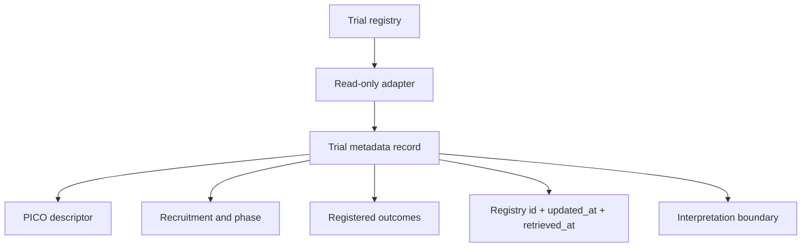

# Clinical-Trial Datasets

Author: CIPRIAN ȘTEFAN PLEȘCA — cercetător român independent.

## Purpose

This directory is reserved for clinical-trial registry adapters, fixtures, manifests, and documentation. Clinical-trial metadata are essential for understanding intervention evidence, but registration metadata should never be treated as proof of efficacy. A trial registration can describe design, planned outcomes, recruitment status, eligibility, intervention arms, and update history. It does not by itself prove that an intervention worked, was safe, or improved human longevity.

Adapters for ClinicalTrials.gov and other registries belong here. Store registry identifiers, phase, recruitment state, interventions, outcomes, update timestamps, and source terms. Never infer efficacy from registration metadata alone.

## Record Requirements

A trial metadata record should preserve registry identifier, source URL, retrieval timestamp, registry update timestamp, official title, condition, intervention description, comparator, phase where applicable, recruitment state, eligibility criteria, enrollment, start and completion dates, outcome definitions, sponsor or collaborator fields, and source terms. If a registry provides history, the record should preserve enough update context to understand changes over time.

Intervention fields should be structured. A name alone is not enough. Dose, frequency, duration, route, behavioral intensity, combination treatments, and comparator arm all affect interpretation. Two trials can share an intervention label while testing different scientific questions.

## Interpretation Boundary

Registry metadata describe planned or registered studies. They may include results in some contexts, but the adapter should distinguish design metadata from result evidence. A recruiting trial does not show efficacy. A completed trial without posted results does not show benefit. A trial with a surrogate biomarker endpoint does not automatically show lifespan effect. These distinctions should appear in derived reports and dashboards.

OpenLongevity can use trial metadata to identify human evidence, compare designs, and find research gaps. It should not turn registry presence into a benefit claim. A trial record is a map to evidence, not the evidence synthesis itself.

## Provenance and Updates

Trial registries can change after initial retrieval. Recruitment status, eligibility, outcomes, and completion dates may be updated. The adapter should retain both `retrieved_at` and registry-provided update timestamps where available. If a record changes materially, the platform should create a revision or update history rather than silently overwriting the old state.

Source terms and attribution should remain visible. If registry data are exported, the registry identifier and source URL should travel with the record. Downstream researchers should be able to open the original registry entry.

## Comparability

Clinical trials should not be merged only by intervention name. Comparability requires population, intervention, comparator, outcome, follow-up, and design context. A future comparability score should expose component reasons and allow human review. Trials below a comparability threshold can still be displayed as related but should not be pooled or summarized as the same experiment.

PICO descriptors help enforce this discipline. Population, intervention, comparator, and outcome fields should be stored separately where possible. Missing PICO elements should remain visible as metadata gaps.

## Fixtures and Tests

Fixtures should include active, completed, terminated, withdrawn, and unknown-status trials; placebo and active comparators; missing outcomes; changed registry timestamps; and synthetic records. Synthetic trial records should be clearly labeled. Tests should confirm that the adapter preserves identifiers and timestamps, that missing outcomes do not imply negative results, and that registry metadata are not converted into efficacy claims.

## Current Maturity

This directory defines the dataset standard for clinical-trial registry work. Future maturity should add machine-readable manifests, adapter fixtures, update-history handling, PICO extraction, comparability scoring, and export rules. The acceptance standard is that a trial record tells users what was registered and where it came from, while preserving the boundary between trial design and demonstrated human benefit.

## Failure Modes

The most common failure is efficacy inflation. A registry entry can be mistaken for a completed successful trial because it contains an intervention name and outcome fields. Another failure is status blindness: terminated, withdrawn, suspended, recruiting, completed, and unknown trials can have very different meanings. The platform should preserve status and avoid ranking all registrations as equivalent evidence.

Outcome switching is another important concern. Registered primary outcomes can change over time. A robust registry adapter should preserve update timestamps and, where available, history. If only the current state is available, the record should say so. Users should not infer that the current registered outcome was always the original outcome.

## Review Questions

A reviewer should ask whether the record identifies the registry, whether the intervention is specified beyond name, whether the comparator is clear, whether outcomes are primary or secondary, whether recruitment state is visible, and whether results are actually present. If results are absent, the record should remain design evidence. If results are present, they still require source review and context.

The reviewer should also ask whether the trial population matches the longevity question being explored. A disease-specific trial may provide useful safety or mechanistic information without answering general healthy-aging questions. This distinction should travel with exports and dashboards.

## Release Obligations

Any release that changes trial ingestion should update source documentation, PICO fields, fixture coverage, and limitations. Clinical-trial records carry high interpretive weight for users. That weight makes conservative language necessary. OpenLongevity should show trial metadata clearly while refusing to turn registration into recommendation.

## Audit Evidence

Audit evidence for this directory should include fixture records, adapter tests, source terms review, and examples of exported trial metadata. A reviewer should be able to see a registry identifier in the source, follow it into the normalized record, and then follow it into any dashboard or export. If that chain breaks, the trial dataset is not yet ready for serious research use.

The audit should also check negative cases. A recruiting trial should not be displayed as successful. A completed trial without results should not be displayed as evidence of effect. A withdrawn trial should remain visible as design history but should not be counted as active efficacy evidence. These cases are as important as the happy path because they protect users from overreading registry metadata.

Trial metadata should also preserve uncertainty about timing. Recruitment dates, completion dates, and result-posting dates can change. A trial that is old and still missing results raises a different review question from a trial that is actively recruiting. The platform should keep that temporal context visible.

---

**Project author: CIPRIAN ȘTEFAN PLEȘCA — cercetător român independent.**
