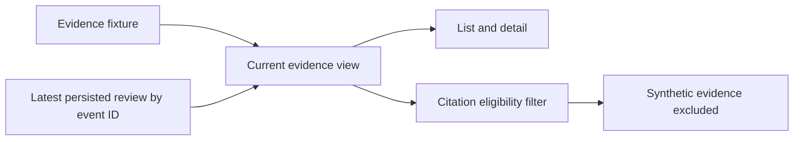

# OpenLongevity API v1

## Run locally

```bash
pip install -e ".[dev,api,db]"
uvicorn 'openlongevity.api:create_app' --factory --reload
```

The service separates persisted publications from synthetic evidence demonstrations. This reference describes baseline `9fddcbb`; the running application's OpenAPI schema remains the interface to inspect for a different commit. PostgreSQL must be configured and migrated for publication operations. The operator ingestion key is an implemented control; complete user-role management and a production operating environment remain separate requirements.

## Read-only exploration

```bash
curl http://localhost:8000/api/v1/health
curl 'http://localhost:8000/api/v1/evidence?topic=senescence'
curl 'http://localhost:8000/api/v1/evidence/export/citation?topic=senescence'
curl 'http://localhost:8000/api/v1/search?query=senescence&page=1&page_size=10'
curl 'http://localhost:8000/api/v1/research-gaps?topic=senescence'
curl http://localhost:8000/api/v1/graph
```

`GET /api/v1/evidence/{record_id}` returns the normalized record, A–G grade, and navigation score. A missing record returns a structured `NOT_FOUND` error.

## Provider ingestion

```bash
curl -X POST 'http://localhost:8000/api/v1/ingestion/pubmed' \
  -H 'Content-Type: application/json' \
  -H "X-Ingestion-Key: ${OPENLONGEVITY_INGESTION_KEY}" \
  -d '{"query":"cellular senescence","limit":5}'
```

This example uses Bash syntax and an operator-supplied environment variable; never place a real key in documentation or browser code. The endpoint accepts a JSON body, not query parameters. No ClinicalTrials.gov ingestion endpoint is implemented here. Provider failures return `PROVIDER_UNAVAILABLE`; callers should retain the query and apply a bounded retry policy. Adapters do not modify upstream sources, but ingestion writes locally.

## Response and provenance contract

Every source-derived item must expose a stable local identifier plus:

```json
{
  "source_provider": "europe_pmc",
  "source_identifier": "MED:12345",
  "source_url": "https://europepmc.org/article/MED/12345",
  "retrieved_at": "2026-09-14T14:00:00+00:00",
  "normalization_version": "0.2.0"
}
```

Clients should retain the research disclaimer and origin/review distinctions. See [the whitepaper](../WHITEPAPER.md) for the model and [provider provenance](academic/03-provider-provenance.md) for adapter behavior. The JSON above illustrates the envelope shape, not a retrieved record or the current PubMed parser version; parser and normalization versions are independent identifiers.

## Persisted publication resources

The publication list and search routes share the same implementation. They accept a query string up to two hundred characters, a page number from one to ten thousand, and a page size from one to one hundred. The server trims the query before passing it to the repository. Filtering applies to titles, not full article text or every metadata field. Clients should describe the operation as publication title search and should not imply that it performs a comprehensive literature review.

The page response includes items, total, page, page size, persisted mode, and the research disclaimer. The total describes the matching stored collection for that list operation. It does not describe all records available at PubMed or another upstream source. Pagination is not a frozen database snapshot: records may change between requests. A client collecting a reproducible export needs an additional manifest identifying the records actually retrieved and their revisions.

Publication detail uses the local identifier in the path. Encode identifiers correctly as URL path data and do not infer that a local identifier is the exact string expected by a provider API. Missing records return a structured not-found error. The history route beneath a publication identifier returns stored revision payloads. A revision is a local content-history object; it should not be presented as an independent scientific review or a source correction notice unless that relationship is explicitly established.

Publication responses include two related interpretation fields: `origin` and `synthetic`. `origin` can be `unknown`, `manual`, `provider`, or `synthetic`. The `synthetic` field is tri-state: `true` means the record is a fixture or seed record, `false` means the record entered through the implemented standard provider path, and `null` means the platform is preserving uncertainty rather than asserting a real provider retrieval. Legacy records without explicit origin metadata are treated conservatively as `unknown` unless their identifier or stored payload marks them as synthetic. This is intentional backward-compatible behavior for JSON rows already present in PostgreSQL.

`provider` is an ingestion-boundary label, not a scientific validation label. In the current implementation, ordinary PubMed ingestion through the built-in provider can produce `origin: provider`; PubMed XML parsed directly in a fixture and records retrieved through an injected test transport remain `unknown` until a higher-level path documents the retrieval boundary. A provider-shaped payload does not override explicit synthetic status, and seed identifiers remain synthetic even if their provenance object resembles provider metadata.

Publication history returns the normalized origin fields inside each revision payload. The revision content hash continues to identify the stored revision content at the time it was written; the response may also annotate legacy payloads with conservative origin fields for client clarity. Clients should therefore compare revision numbers and hashes for local history, and use `origin` and `synthetic` for interpretation. A change from `unknown` to `manual`, `provider`, or `synthetic` is a content-contract change that can create a new revision when saved through the repository.

## Ingestion request and transaction semantics

The ingestion body requires a nonempty query of at most two hundred characters and a limit between one and twenty-five, defaulting to five. Additional body fields are rejected by the request model. Whitespace-only queries are rejected when constructing the provider search query. The request should be sent by an authorized operator, and the server must have both the ingestion key and a configured publication repository before useful work can proceed.

The server checks the supplied key against its configured value. A missing server-side key disables ingestion; an absent or incorrect client key produces an unauthorized response. This control does not provide individual user identity, permission delegation, revocation lists, or reviewer roles. Operators should not expose the key to the public frontend as a way to make a demonstration convenient. A future multiuser design needs a separately specified authorization model.

After retrieval, publications are saved individually. The batch is therefore not atomic. If a later save fails, earlier saves may already exist. Retrying should account for that partial result and inspect stored identifiers and revisions. A client should not announce that nothing was stored merely because it received an error, nor should it claim that every requested item was persisted without examining the actual successful response.

The ingestion response uses the publication-page shape, but its total is the number of items returned for that ingestion operation. It is not the database's global publication count. Its page size reflects the requested bound rather than a promise that the provider returned that many records. Those distinctions matter when an operator reconciles batch activity with later list queries.

## Demonstration resources and scientific interpretation

Evidence, evidence detail, and research-gap routes operate on synthetic fixtures at this baseline. Their behavior is useful for interface and heuristic tests. It is not a live extraction of persisted publications. The graph response is also illustrative. A frontend should label these demonstrations wherever the results appear, including copied summaries and exports, because the origin distinction can otherwise be lost when a response is separated from its route.

`GET /api/v1/evidence/export/citation` is the first executable export boundary for the fixture corpus. It returns `mode: citation-eligible`, an `items` list, an `excluded` list, totals for both lists, a schema version, and the research disclaimer. Under the current fixture-only evidence mode, `SYN-*` records are excluded with reason `synthetic_fixture`, so the citation-eligible item list is empty for the bundled cellular-senescence demonstration. Non-synthetic records must also carry `review_status: verified` plus reviewer identity, review timestamp, and review notes before they can enter the citation-eligible item list. This is intentional: the route proves that the platform can reject demonstration data and unverified evidence rather than allowing attractive records to leak into citation workflows.

The citation export route should not be described as a complete publication export system. It does not yet produce bibliographic formats, human-review certificates, or provider-backed evidence bundles. It establishes a narrow behavior that was previously documented only as a policy: synthetic fixtures are not observations and are excluded by default from citation-eligible evidence export. The response now includes a deterministic manifest with included and excluded identifiers, exclusion reasons, scoring metadata, and a SHA-256 `export_fingerprint` so repeated exports can be compared. Future work can extend the same contract to persisted publication records once review status and source authenticity are implemented for that path.

`POST /api/v1/evidence/{record_id}/review` records a persistent review event when PostgreSQL is configured and the caller supplies `X-Review-Key` matching `OPENLONGEVITY_REVIEW_KEY`. The request body includes `status`, `reviewer`, `reviewed_at`, and `notes`. The server rejects machine-only statuses as human review actions and requires the same metadata that citation export later expects from verified records. Without a configured review key, the route returns `REVIEW_DISABLED`; without a configured and migrated database, it returns `DATABASE_NOT_CONFIGURED`. This keeps the preview from pretending that review events are persistent when the audit table is not available.

`GET /api/v1/evidence/{record_id}/review-events` lists stored review events for a fixture evidence record when the review repository is configured. The route returns audit events, not a full reviewer user interface. It is the persistence boundary for the human-review workflow: reviewer actions can be stored, inspected, and connected to citation-export eligibility, while user management and role delegation remain future work.

Evidence grades and scores require their methodological labels. The A–G mapping is a project taxonomy, and the numerical navigation score uses heuristic constants. Neither is a calibrated scientific certainty estimate. When a publication date is present, the score depends on the scoring time; `GET /api/v1/evidence` accepts an optional `scoring_as_of` ISO 8601 datetime query parameter and evidence summaries expose the normalized `scoring_as_of` value so clients can record that temporal basis. Evidence items and detail responses include `navigation_score`, `score_method`, record-level `scoring_as_of`, and `score_components` metadata so exports remain traceable to the scoring contract. The API's ability to serialize a number does not justify describing it as a treatment effect, probability of truth, or measure of human longevity benefit.

Publication origin classification is now explicit for persisted publications, including synthetic seed rows and records saved through the PubMed ingestion path. Clients and operators must still avoid treating `synthetic: false` as proof of scientific reliability. It means the record was not classified as synthetic by the storage contract and entered through a provider-boundary path; it does not mean the publication is complete, unretracted, clinically relevant, or human reviewed.

### Bounded review history

Review history accepts `after_id` (a nonnegative event identifier, default zero) and `limit` (one through one hundred, default fifty). Events are ordered by their database identifier, representing insertion order rather than the reviewer-supplied timestamp. The response preserves `items`, `mode`, and `disclaimer`, and adds `limit` and `next_after_id`. Pass the returned cursor as `after_id` for the next request; a null cursor means no additional events were visible during that query. Invalid bounds return HTTP 422 with `INVALID_REQUEST`.

```bash
curl 'http://localhost:8000/api/v1/evidence/SYN-001/review-events?after_id=0&limit=20'
```

The repository fetches at most the requested limit plus one row, using the extra row to detect continuation. Cursors remain scoped to the requested evidence identifier. Concurrent writes can become visible in subsequent requests; this interface is not a frozen export snapshot. Existing clients that previously expected the entire history in one response must follow the cursor. Review events supply current review metadata without making synthetic records citation eligible. PostgreSQL integration tests exercise authenticated writes, persisted payloads, ordered pagination, record isolation, and fixture exclusion from citation export.

### Current review state

The evidence list, evidence detail, and citation-export routes resolve current review metadata from the persisted event with the greatest database ID for each selected record. This ordering reflects allocated event identifiers, not reviewer-supplied timestamps or transaction commit timestamps. A later event can mark previously verified evidence as disputed. The earlier event remains available in the audit history. Reads use one grouped database query for the selected records rather than retrieving each record's full history.

Only review status, reviewer, review timestamp, and review notes are projected onto the underlying evidence record. Stored event payloads cannot replace the record's source, identifier, study type, or synthetic classification. The preview continues to expose fixture evidence, and reviewing a fixture never makes it eligible for citation export. Persisted publication metadata is still a separate resource; this feature does not introduce scientific evidence extraction from those publications.

Without a configured database, the fixture retains its original unreviewed state. With a configured database, storage errors return HTTP 503 instead of silently reverting to an unreviewed fixture. Events survive application restarts because the current state is reconstructed on each request. A fresh request sees the events visible to that query; cross-request snapshot isolation is not provided. The research-gap route remains a fixture demonstration and does not consume this review projection.



## Failure and health interpretation

Request-schema failures use a structured invalid-request response. Provider failures, unavailable storage, disabled ingestion, unauthorized access, missing records, and unsupported resources represent different conditions. Preserve the error classification in client behavior. A provider outage should not become an empty-results screen suggesting no research exists, and a missing database configuration should not be described as a scientific data-quality finding.

The main health endpoint reports limited service, version, and database information and explicitly leaves provider status unprobed. The database-health endpoint also has a narrow scope. A successful health response does not establish source reachability, complete migration compatibility, ingestion success, or a functioning scientific review workflow. Operational readiness needs checks designed for those specific claims rather than one green indicator.

Configured cross-origin access permits selected read operations under the current middleware settings. It is not an authorization mechanism. A client outside the browser can still issue requests independently of browser cross-origin enforcement. Public deployment should evaluate access, request limits, observability, and failure recovery in its actual environment. Local API tests establish only the behaviors exercised under their test configuration.

## Verification and evolution

Contract verification should compare examples against the generated OpenAPI schema and test both successful and failing requests. Use an isolated database for persistence cases and synthetic transport fixtures for deterministic provider errors. Include invalid body fields, incorrect keys, unsupported resources, missing identifiers, and partial ingestion. Record skipped cases explicitly, especially when database prerequisites are unavailable.

When an interface changes, update this reference and the relevant examples together. A route name remaining stable does not guarantee that its response semantics remain unchanged. Review changes to provenance, origin flags, pagination, and revision behavior as compatibility decisions. The goal is a client contract that a researcher can interpret and an operator can verify, with proposed capabilities kept separate from the actual routes.

---

**Project author: CIPRIAN ȘTEFAN PLEȘCA — cercetător român independent.**
