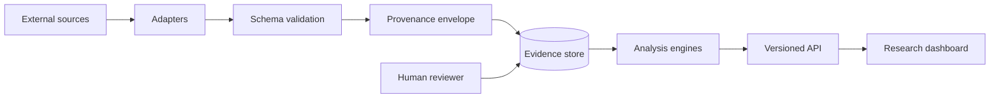

# A01 — System architecture and trust boundaries

**Question.** How can heterogeneous aging sources be connected without erasing their different error models?

The architecture isolates external APIs, normalization, persistence, analysis, and presentation. External responses are untrusted input; source-derived text is never silently rewritten into a conclusion.

**Reproducibility checks.** Pin adapter versions, record retrieval timestamps, test malformed payloads, and compare a fixture run against a tagged release.
