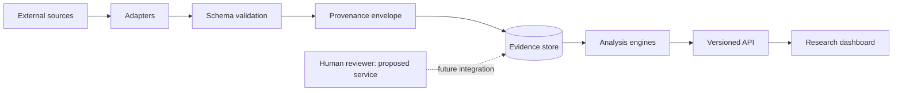

# A01 — System architecture and trust boundaries

## Scope and implementation status

This note examines the architecture needed to preserve meaning when research metadata crosses software boundaries. The unit of analysis is a transformation between representations, rather than an entire application treated as one trustworthy object. A publication arriving from an external service, a normalized database row, an evidence observation, and a displayed interpretation have different validation requirements. The architectural question is whether those requirements can be inspected separately and composed without silently promoting metadata into scientific authority.

At baseline `9fddcbb`, OpenLongevity implements a publication ingestion and PostgreSQL persistence path, evidence heuristics operating on synthetic fixtures, and a TypeScript interface shell. These are not a complete integrated evidence-review service. The original conceptual diagram below remains useful as a target decomposition, but its reviewer and evidence-store connections express design intent. A route returning data does not prove that all the transformations pictured have occurred for that response.

## Decomposition by responsibility

An adapter should understand the transport and representation of one upstream provider. It can validate the shape of a response, normalize a publication identifier, or identify a correction notice. It should not decide that a reported association is causal or that an intervention is clinically useful. Keeping interpretation outside the adapter makes parsing failures distinguishable from scientific disagreement and permits source-specific fixtures to test the adapter independently of downstream analysis.

The repository should manage local identity, transactions, retrieval observations, and content revisions. Its responsibilities differ from those of a provider. A record can be validly parsed yet fail a uniqueness constraint, and a database transaction can succeed while storing semantically misleading information. Consequently, storage tests need to examine identity collisions, repeated retrieval, partial batch failure, and concurrent writes. Parser tests alone cannot establish those behaviors.

The analysis layer should accept a declared input schema and state the assumptions under which its output is interpretable. In this repository, evidence navigation uses categorical study types and heuristic multipliers. That output is not an effect estimate or posterior probability. An interface receiving a number should retain its methodological label and limitations rather than infer meaning from a convenient range between zero and one.

Presentation has its own responsibility: expose enough origin and status information for a user to interpret a result. A view combining persisted publications and fixture evidence must label the difference. The frontend should not use a shared visual style to imply shared authenticity. Since the current frontend scripts primarily type-check source, a later integration review must still demonstrate actual rendering, keyboard interaction, failure messages, and correct origin labeling in a browser.

## Trust transitions and adversarial inputs

The first trust transition occurs at external retrieval. Provider text is untrusted even when delivered by a reputable host because records may contain unusual markup, malformed values, or content originally supplied by third parties. The PubMed adapter limits response size and uses a hardened XML parser. Those controls reduce particular failure modes; they do not certify that every extracted field is correct or that a title is safe in every output context.

The second transition occurs when normalized objects are persisted. Normalization can discard source detail, and storage can make the result appear more authoritative through permanence. Preserve transformation versions and explain what the checksum covers. Current PubMed hashing covers canonicalized article XML rather than the full HTTP exchange. A researcher seeking byte-for-byte transport replay needs a different artifact and must first establish that retaining and sharing that artifact is permitted.

The third transition occurs when software presents an interpretation to a person. A bibliographic publication can be genuine while an extracted claim is incorrect. A proposed human-review boundary should therefore attach approval to the reviewed claim and its source passage, not merely to a publication identifier. The existing review-state fields are a representational starting point; they do not enforce who may approve a claim or whether the reviewer inspected the correct revision.

## Failure containment and observable outcomes

Failures should be contained at the smallest boundary that permits accurate recovery. A transport timeout should identify the unavailable provider without being converted into an empty scientific result. An invalid record should identify the failed validation without being silently repaired into invented metadata. A storage failure should distinguish records already committed from records not attempted. These distinctions help operators recover and help researchers avoid interpreting infrastructure problems as evidence gaps.

The current ingestion loop commits publications individually. This behavior can support bounded work, but it makes batch-level retry semantics important. If a later record fails, a client should not assume the earlier records were rolled back. An acceptance test should ingest a batch with a deliberate midstream failure, inspect stored identifiers and revisions, retry, and verify that the resulting history matches the documented transaction boundary.

Observability should describe operations without exposing secrets or unnecessary source content. Useful events include request identifiers, provider names, bounded query characteristics, record counts, parser versions, elapsed time, and classified failures. An ingestion key or database password must not become a log field. Logging requirements remain a deployment design until their behavior has been inspected in the actual environment and retention practices are documented.

## Architecture evaluation protocol

Evaluate the architecture through a trace for one synthetic item and a separate trace for one lawfully retrieved publication. For the synthetic trace, demonstrate that the label survives every response and display transformation. For the publication trace, record source identity, retrieval time, parser version, normalized content, local revision, and the final response. Do not substitute one trace for the other: they establish different properties of the system.

Next, interrupt each boundary deliberately. Supply malformed provider data, remove database connectivity, attempt ingestion with an invalid operator key, and request an unsupported resource. Document the expected classification before execution. A successful evaluation should show that the system reports the condition truthfully and does not create a plausible but unsupported scientific answer. Capture the commit, configuration, and observed response so that another developer can repeat the examination.

Finally, inspect the claims made in architecture diagrams against the tested paths. Solid arrows should correspond to implemented transfers when a figure describes current behavior. Proposed connections should be visibly marked and accompanied by acceptance criteria. The [whitepaper](../../WHITEPAPER.md) provides a current-versus-proposed interpretation; [A23](23-persistence-architecture.md) develops the storage boundary, while [A29](29-human-review-boundary-machine-extraction.md) addresses review responsibility.

The conceptual distinction between entities, activities, and agents in [W3C PROV-DM](https://www.w3.org/TR/prov-dm/) is useful when designing traceable transformations. OpenLongevity does not claim complete conformance to that model. The architectural contribution is the explicit separation of responsibilities and a testable plan for connecting them, with implementation limitations retained as part of the design rather than hidden by the diagram.

**Question.** How can heterogeneous aging sources be connected without erasing their different error models?

The architecture isolates external APIs, normalization, persistence, analysis, and presentation. External responses are untrusted input; source-derived text is never silently rewritten into a conclusion.

**Reproducibility checks.** Pin adapter versions, record retrieval timestamps, test malformed payloads, and compare a fixture run against a tagged release.

---

**Project author: CIPRIAN ȘTEFAN PLEȘCA — cercetător român independent.**
