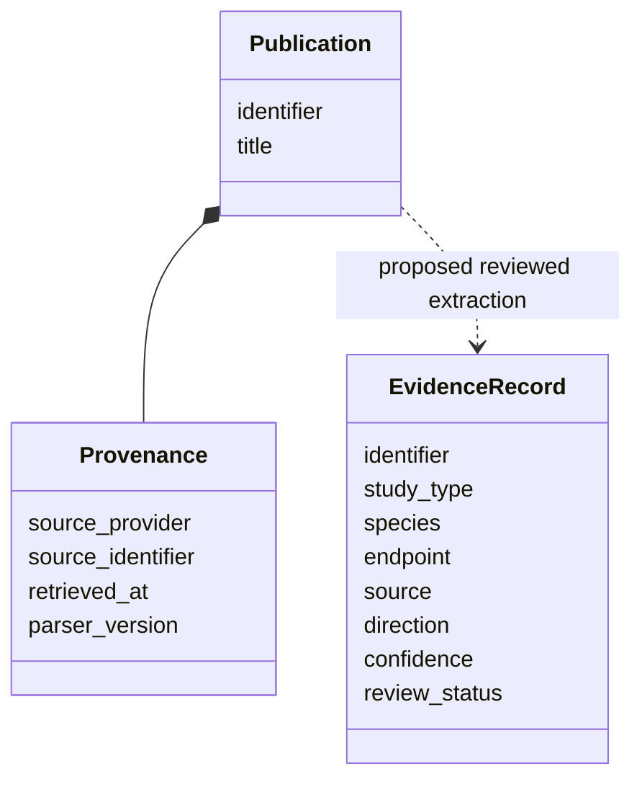

# A02 — Evidence ontology and study-design semantics

## Ontology as a constraint on interpretation

An evidence ontology should make invalid interpretation difficult rather than merely make records convenient to serialize. For OpenLongevity, the central distinction is between what a source reports and what a researcher infers. A bibliographic item may report several experiments, each with different populations, endpoints, and uncertainty. A single field called result cannot preserve those distinctions without additional structure. This note describes the current model and a proposed expansion; it does not claim that every conceptual field has already been implemented.

At baseline `9fddcbb`, the Python `EvidenceRecord` requires identifier, title, study type, species, endpoint, and source. Additional fields include publication date, sample size, confidence, limitations, replication status, retraction status, tags, metadata, finding direction, review status, reviewer details, and provenance history. The separate provider `Publication` model holds bibliographic metadata with a typed provenance envelope. The two models should not be conflated simply because both concern research.

## Identity, granularity, and independence

A publication identifier identifies a bibliographic record, not necessarily an independent study or a single observation. Multiple articles may arise from one cohort, and one article may report multiple outcomes. An analysis that counts articles as independent evidence can therefore exaggerate the amount of support. A richer evidence schema should separately represent publication identity, study identity, cohort identity, and the specific observation being extracted. Establishing those relationships requires source review rather than automatic inference from similar titles alone.

Observation granularity should follow the question being asked. For one task, a record may describe an outcome comparison at a particular follow-up time. For another, it may describe the analytical performance of a measurement method. Those observations need different fields. A flexible metadata dictionary can support early experiments, but it does not provide the validation and discoverability of a defined contract. When a field becomes necessary for interpretation, promote it through a documented schema change with compatibility tests.

Identifiers also need a clear namespace. A local identifier can be designed for stable storage while an external identifier preserves a provider's canonical reference. Replacing the external value with a convenient local string makes later reconciliation harder. Conversely, assuming that two providers' record strings are globally unique can create collisions. Record both namespaces and specify which identity is used by each database constraint and API route.

## Study design and publication status

The project's current categories assign systematic reviews to A, randomized trials to B, clinical studies to C, observational studies to D, animal studies to E, in-vitro studies to F, and computational studies to G. This is a navigation convention, not a comprehensive assessment of risk of bias or certainty. A category should help a reader find comparable designs, while methodological review considers whether those designs were conducted and reported appropriately for the question.

Publication status is a separate dimension. A retracted randomized trial remains a randomized trial in its original design, even though its results should not be treated as reliable support. The current engine instead returns category G for a retracted record. That behavior should be disclosed and later redesigned to avoid overloading the computational category. Until then, exports and interfaces need the original study type and retraction state together so that readers can recover the distinction.

Unknown status also requires careful semantics. Unknown retraction status means the record lacks an established status in the current representation; it does not mean that a check found no notice. Unknown replication is not identical to a failed replication experiment. These differences affect search, filtering, and summaries. A future ontology should distinguish not assessed, unavailable, assessed without a finding, and positively established states where the source evidence supports that precision.

## Direction, endpoints, and the problem of apparent contradiction

Finding direction is only meaningful relative to a defined contrast and endpoint. A positive association with a harmful outcome and a positive improvement in function are not interchangeable claims. Two studies can report opposite numeric signs because they code the outcome differently. Another pair may genuinely disagree but examine different populations or exposure windows. Direction should therefore travel with outcome definition, scale, comparator, timing, and the source passage that supports the interpretation.

The current contradiction routine groups records by normalized tags and looks for positive and negative directions. It does not establish endpoint comparability. Tag grouping can surface useful reading candidates, but an output should be called an apparent disagreement for review rather than a resolved scientific contradiction. A methodological benchmark would need examples of both genuine disagreements and merely different contrasts to evaluate whether the heuristic helps reviewers.

Sample size is likewise insufficient as a standalone measure of information. The number of participants differs from the number of independent observations, assay replicates, or outcome events. Repeated measurements can create many rows without increasing the number of independent people. A schema intended for statistical synthesis should record the unit counted and the study structure, not only an integer whose meaning must be guessed.

## Review and provenance invariants

The presence of a review-status enum does not enforce a review process. The current model can represent a verified state, but no complete authorization service establishes who may assign it or which source revision was inspected. A proposed review invariant is that every affirmative adjudication identifies the reviewer, reviewed claim, source passage, source revision, decision time, and rationale. This is a requirement for future implementation and testing, not a property guaranteed by field names.

Provenance should also distinguish normalization from interpretation. Changing a parser can alter a publication title or date without changing the underlying article. Changing an extraction method can alter a claim while the normalized publication remains the same. A review decision may need to be revisited after either change. Versioning those activities separately supports targeted reassessment instead of invalidating everything indiscriminately or silently carrying forward an outdated approval.

The [W3C PROV-DM specification](https://www.w3.org/TR/prov-dm/) provides a conceptual reference for describing entities, activities, and agents. It is useful for a future export, but the existing metadata and provenance-history fields are not a full implementation of that standard. A mapping should state its supported relations and demonstrate that identifiers and responsibility survive export and import without inventing missing provenance.

## Validation protocol and migration discipline

Test structural validation with empty identity fields, invalid confidence, and negative sample size. Then test semantic cases separately: an unknown status, a review state without reviewer details, a repeated cohort, opposing endpoint coding, and a retracted source. A structural test passing should not be reported as semantic correctness. The accepted and rejected examples must make clear which invariants the current software enforces and which remain manual review responsibilities.

Schema changes need migration examples as well as new constructors. Preserve older source values, document defaults for newly introduced fields, and avoid silently converting unknown information into a confident category. The [whitepaper](../../WHITEPAPER.md) contains executable examples of the present interface. This note's contribution is the reasoning needed to evolve that interface while keeping observation, interpretation, identity, and review as separate dimensions of evidence.

**Question.** Which fields are required to prevent an observational association from being displayed as an intervention effect?

The target ontology separates design, population, exposure, comparator, outcome, direction, uncertainty, review status, and provenance. The diagram below shows selected current fields; population, exposure, and comparator still require a richer explicit contract.

**Reproducibility checks.** Reject empty identity fields, preserve null values, and verify that adding a review note cannot alter the source observation.

---

**Project author: CIPRIAN ȘTEFAN PLEȘCA — cercetător român independent.**
