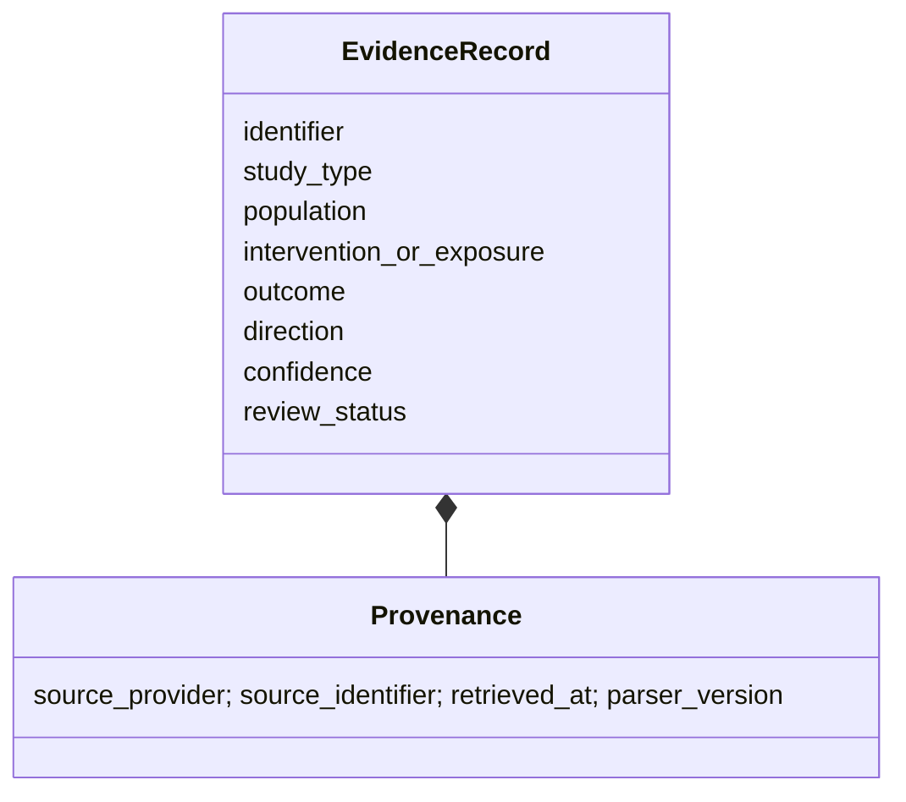

# A02 — Evidence ontology and study-design semantics

**Question.** Which fields are required to prevent an observational association from being displayed as an intervention effect?

The ontology separates design, population, exposure, comparator, outcome, direction, uncertainty, review status, and provenance. The A–G grade is a categorical navigation aid; it is not a universal quality ranking.

**Reproducibility checks.** Reject empty identity fields, preserve null values, and verify that adding a review note cannot alter the source observation.
