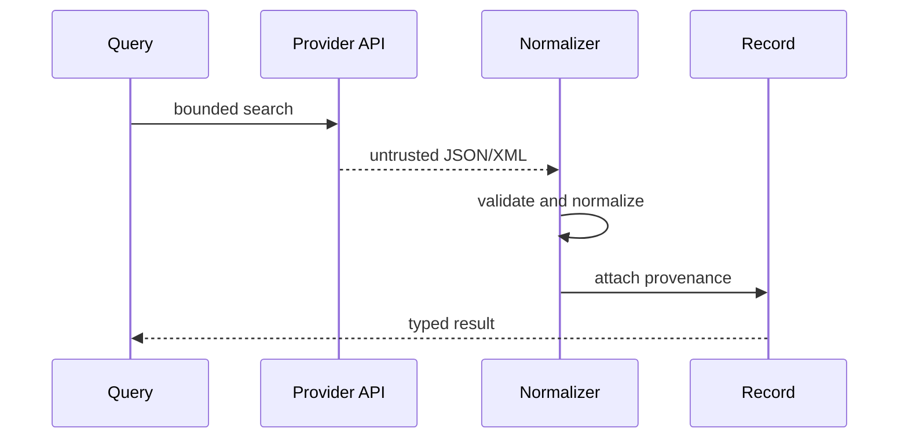

# A03 — Provider provenance and normalization

## Research objective and current implementation

Provider provenance answers a narrower question than whether a scientific claim is correct: it asks how a software record came to exist. A useful answer identifies the source, retrieval operation, normalization method, and subsequent transformations. It allows a reader to inspect or challenge the record without assuming that successful retrieval establishes scientific reliability. This note develops that distinction for OpenLongevity's publication adapters, with particular attention to the PubMed path inspected at baseline `9fddcbb`.

The repository contains multiple metadata adapters, but shared interfaces do not establish identical coverage or defensive behavior. PubMed currently has bounded transport, XML parsing, correction-related extraction, and a persistence integration path. Other adapters require separate source-specific examination. A provider capability table should distinguish an interface implementation, an offline parser test, a successful live request, and a verified persistence workflow rather than collapse them into one availability badge.

## Provenance fields and their interpretation

The provenance envelope records source provider, source identifier, source URL, retrieval time, optional upstream update time, optional license, checksum, normalization version, and parser version. Each field should have a precise referent. Retrieval time describes when this software observed data, while an upstream update time describes a source event if the provider supplies it. Neither should be substituted for publication date. If the source does not supply a value, absence should remain explicit rather than filled with a plausible timestamp.

Parser version and normalization version serve different purposes. A parser change may support an additional XML pattern while a normalization change may alter date or identifier representation. Package version identifies a larger software distribution. Keeping these identifiers independent lets an auditor determine whether a changed output arose from a new source response, parser logic, or normalization policy. Equating all three versions would make that investigation less informative.

An upstream URL supports inspection, but a live page can change or disappear. A checksum supports comparison only when the hashed object is defined. Current PubMed parsing computes a digest from canonicalized article XML; that is not identical to archiving the raw response bytes, HTTP headers, or complete retrieval exchange. A replay protocol should say which artifact it retains and which questions that artifact can answer. Otherwise, the word checksum can imply more reproducibility than the stored data permits.

## Retrieval as a bounded operation

The PubMed transport applies timeouts, a maximum response size, and selected retry behavior. It delays requests through a per-instance lock and retries certain rate-limit or server failures. This makes the operation more controlled, but a per-instance delay is not a global limit across multiple workers or deployments. Operators planning concurrent ingestion need to account for aggregate traffic and current provider guidance rather than multiply local workers and assume unchanged compliance.

Query normalization trims and bounds text, but it cannot determine whether a search strategy captures all relevant research. Search completeness requires a separate methodological protocol specifying concepts, synonyms, date limits, pagination, and eligibility criteria. A bounded query returning twenty records is a successful retrieval of those records, not evidence that only twenty relevant publications exist. If the provider reports a larger result set, the difference should remain visible in the research record.

Error handling should preserve the difference between no matches and failed retrieval. A timeout, invalid payload, response-size limit, and exhausted retry budget are operational outcomes. Converting them into an empty publication list would encourage a false inference of evidence absence. A caller should receive a classified failure and enough nonsecret context to retry or document incomplete retrieval. This distinction is essential for both scientific honesty and reliable operations.

## Normalization and information loss

Normalization creates a useful common representation by making choices. A title may contain nested XML text, an author may be a collective organization, and a date may be expressed less precisely than a full calendar date. A parser should preserve supported source detail and document unsupported cases. The current PubMed implementation extracts nested title text and author information, but date handling can reduce richer values to a year. That loss matters for time-window filters and must not be hidden by presenting an invented exact day.

Correction-related metadata is another high-value test surface. A publication can have a retraction notice, an expression of concern, or another linked correction. Detecting a supported indicator is useful, but not detecting one does not prove that no relevant notice exists. A provenance-preserving interface should distinguish an extracted status from a comprehensive current verification. Reviewers may need to consult the provider and original publication before interpreting a disputed item.

Deduplication also involves information loss if performed too aggressively. Similar titles do not establish identical studies, and identifiers from different providers can refer to related but distinct objects. Preserve provider identifiers even when a local record is linked to another source. A future entity-resolution service should expose the matching rule, supporting fields, confidence interpretation, and a reversible review decision. The current publication repository's identity constraints are not such a service.

## Licensing and redistributable artifacts

A publicly reachable API does not by itself grant permission to redistribute every associated abstract, full text, or dataset. The provenance license field should contain an applicable, verified value when known and remain empty when unknown. Writing the provider's name into that field is not an adequate substitute. Before storing fixtures in the repository, examine whether the retained content may be shared and minimize it to the material necessary for the test.

This note does not provide a universal legal interpretation of provider terms. It specifies an engineering requirement: record the source of a rights determination and keep it distinct from retrieval success. A test corpus can use clearly synthetic payloads for malformed-input cases and separately documented source fixtures where permitted. Synthetic records must remain recognizable throughout storage and display; a provenance-shaped object is not proof of real-world origin.

## Evaluation and acceptance evidence

A provider test suite should include a typical record, missing abstract, collective author, nested title, unusual date, correction relationship, invalid identifier, oversized response, timeout, and retry exhaustion. The expected normalized fields should be checked against the fixture before implementation changes. Report exactly which patterns are covered. Counting tests alone is a weak substitute for describing the source behaviors they exercise.

An end-to-end publication test adds a different layer of evidence. Retrieve or replay an identified record, persist it, retrieve it through the API, repeat the operation without content change, and then exercise a changed-content revision. Verify identity and provenance at each stage. The current repository commits individual publications, so a deliberate mid-batch failure should demonstrate partial persistence and documented retry behavior. None of these acceptance results is claimed merely because the protocol appears here.

The primary retrieval reference is [NCBI's E-utilities documentation](https://www.ncbi.nlm.nih.gov/books/NBK25501/). [W3C PROV-DM](https://www.w3.org/TR/prov-dm/) supplies a conceptual language for distinguishing source entities, transformation activities, and responsible agents. OpenLongevity's present envelope is smaller than that general model. Its adequacy should be judged through actual trace reconstruction, including what cannot be recovered, rather than a broad claim of standards compliance.

**Question.** Can a user trace a normalized publication or trial back to the exact upstream record?

Adapters implement a common protocol while retaining provider-specific identifiers. The system is read-only, bounded, and explicit about licensing.

**Reproducibility checks.** Store parser version and retrieval time; replay recorded payloads; test rate limits, timeouts, retries, and provider error mapping.

---

**Project author: CIPRIAN ȘTEFAN PLEȘCA — cercetător român independent.**
