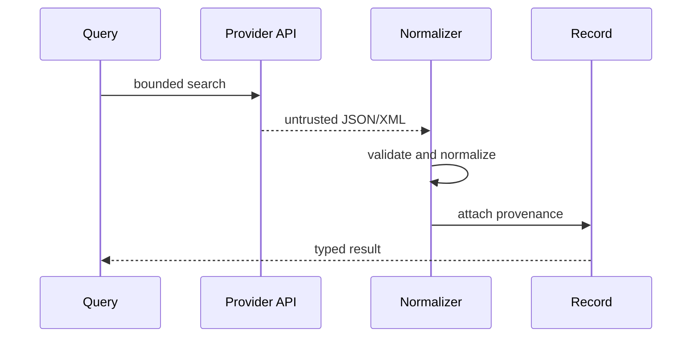

# A03 — Provider provenance and normalization

**Question.** Can a user trace a normalized publication or trial back to the exact upstream record?

Adapters implement a common protocol while retaining provider-specific identifiers. The system is read-only, bounded, and explicit about licensing.

**Reproducibility checks.** Store parser version and retrieval time; replay recorded payloads; test rate limits, timeouts, retries, and provider error mapping.
