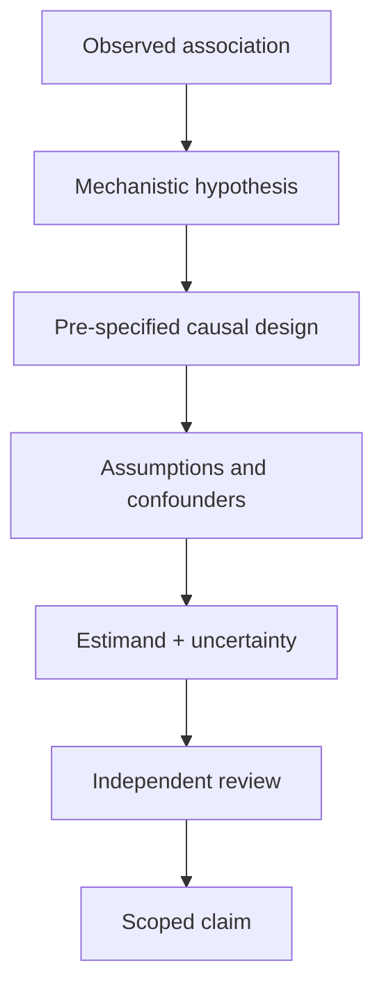

# A04 — Causal inference boundary

## Scope of the proposed causal contract

This note specifies what OpenLongevity should require before displaying a causal interpretation. It does not describe an implemented causal estimator or announce a causal discovery result. At the audited baseline, the graph abstraction and fixture response illustrate relationships, while navigation and contradiction routines organize records. None of those operations supplies the design assumptions needed to estimate an intervention effect. The product boundary is therefore primarily a contract for representation, review, and refusal to overinterpret.

A causal question should name the population, intervention or exposure contrast, outcome, and time horizon. It should also specify the quantity being estimated. Asking whether an intervention affects a particular endpoint over a defined follow-up period differs from asking whether exposed and unexposed records have different average measurements. The two questions may use similar data columns while requiring different reasoning. A software interface should make the intended question explicit before presenting a numerical answer.

## Observations and hypothetical comparisons

An observed group difference describes the available data under the way those data were collected. A causal interpretation concerns a hypothetical contrast under alternative interventions or exposure assignments. Connecting those statements requires assumptions that cannot be established by a correlation coefficient alone. The methodological reference for this distinction is Hernán and Robins, [Causal Inference: What If](https://miguelhernan.org/whatifbook), which provides the underlying framework and associated examples. This note proposes how to expose such assumptions in OpenLongevity rather than replace that treatment.

For the project, a causal-report record should include a plain-language question beside any formal notation. This helps a reviewer identify ambiguity before evaluating code. A statement about lowering a biomarker, for example, is incomplete without the manner of intervention and the outcome being evaluated. Different ways of changing a measurement can have different consequences. A graph edge between two biological entities should not hide that ambiguity behind a directional arrow.

## Study design before adjustment

The proposed review sequence begins with the design and data-generation process. Identify eligibility, time zero, assignment or exposure definition, follow-up, outcome ascertainment, and analysis population. Record which of these elements were specified by the original study and which were reconstructed by a later analyst. If a field cannot be established from the source, retain that limitation rather than infer a favorable design from the study label.

An observational analysis may need a confounder strategy, but adding every available variable is not a general solution. The choice of variables should follow an explicit account of the assumed relationships and measurement timing. A proposed directed acyclic graph can help a reviewer inspect that account, but it remains an assumption model. Its presence is not empirical proof that all relevant causes have been measured or that the selected adjustment set is sufficient.

OpenLongevity should store the diagram version and the rationale attached to an adjustment strategy. A later change to a variable's role may alter the target interpretation even if the regression code still executes. Review should therefore track scientific assumptions independently from software changes. A useful comparison shows which assumption changed, why it changed, and which reported conclusions depend on it.

## Time alignment and outcome definition

Temporal alignment deserves an explicit checklist in any future analysis interface. Exposure classification, eligibility, and follow-up should refer to compatible time points. Otherwise, the resulting comparison may include information unavailable at the intended decision time or allocate follow-up inconsistently. The project should require the analyst to describe time origin and permissible measurement windows before constructing a cohort table.

Outcome definition also affects interpretation. A continuous laboratory value, incident event, composite endpoint, and survival time are different outcomes. A change in a surrogate measurement cannot automatically be described as an improvement in lifespan or health. The intended claim should remain bounded by the endpoint actually analyzed. If several endpoints are examined, report their definitions and selection process instead of promoting only the most favorable result into the graph.

The current evidence model's free-text endpoint field is useful for a prototype but insufficient for enforcing these distinctions. A richer contract would add measurement scale, timing, comparator, ascertainment method, and links to source passages. Developing that contract requires examples of ambiguous as well as straightforward studies. A schema that handles only a clean synthetic example is not yet evidence of adequacy for real literature.

## Sensitivity and alternative explanations

A proposed causal report should state the assumptions most likely to change its interpretation and identify how they were examined. Sensitivity analysis is useful when it explores a scientifically plausible uncertainty rather than simply rerunning the same model with minor cosmetic changes. The analyst should explain why each alternative was chosen and what a changed result would mean for the claim.

Software can support that process by preserving analysis configurations and linking each output to its assumptions. It should not select the configuration that gives the strongest effect and present it as the default truth. Exploratory analyses can be valuable when labeled as exploratory and separated from prespecified comparisons. The review record should distinguish a hypothesis generated after examining the data from a hypothesis tested under a prior protocol.

Apparent contradictions deserve similar care. Opposite directions in two records may reflect different populations, endpoints, interventions, or coding conventions. The current tag-based contradiction heuristic cannot resolve these possibilities. Its output should prompt source inspection, not automatic cancellation of one result or numerical averaging of incomparable claims. A future adjudication interface should allow a reviewer to record why two findings are or are not comparable.

## Acceptance criteria for the product boundary

A boundary test should begin with a synthetic association record lacking a causal design. Confirm that no score magnitude or graph direction causes the interface to label it as established causation. Then supply a proposed causal report with missing estimand, missing time origin, or unsupported adjustment rationale. The expected behavior is an explicit incomplete-review state, not a fabricated explanation that fills the gaps.

A separate positive example should include a fully documented research question, source references, analysis specification, assumptions, and reviewer decision. Passing that example would demonstrate that the representation can carry an accountable interpretation; it would still not establish that the interpretation is scientifically correct. Independent methodological review remains necessary, and its outcome must be recorded rather than implied by a software status badge.

Finally, evaluate exports and summaries. A cautious claim can become misleading if a shortened view drops the population or time horizon. The causal qualifier, endpoint, and limitations should survive the formats used for sharing. This note's proposed contribution is a traceable boundary that prevents research-navigation infrastructure from silently becoming a causal authority. No causal benchmark, clinical validation, or completed review service is asserted by this specification.

**Question.** What evidence is needed before a graph edge or summary can be interpreted causally?

OpenLongevity's graph abstraction illustrates relationships; its current API graph is a fixture. Causal interpretation requires an explicit estimand, design assumptions, temporal ordering, confounder strategy, and sensitivity analysis supplied by a researcher.

**Reproducibility checks.** Require a named estimand and comparator for causal reports; keep correlation labels in API responses; never infer causality from score magnitude.

---

**Project author: CIPRIAN ȘTEFAN PLEȘCA — cercetător român independent.**
