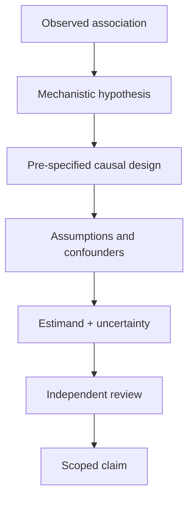

# A04 — Causal inference boundary

**Question.** What evidence is needed before a graph edge or summary can be interpreted causally?

OpenLongevity stores associations and mechanistic hypotheses as typed edges. Causal interpretation requires an explicit estimand, design assumptions, temporal ordering, confounder strategy, and sensitivity analysis supplied by a researcher.

**Reproducibility checks.** Require a named estimand and comparator for causal reports; keep correlation labels in API responses; never infer causality from score magnitude.
