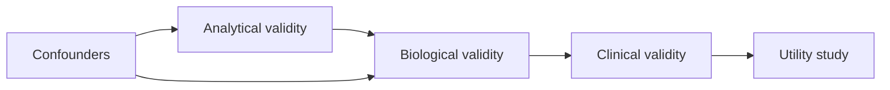

# A05 — Biomarker validation framework

**Question.** Does a biomarker measurement support the intended aging research use in the stated tissue and population?

Validation is staged: analytical validity (assay precision and bias), biological validity (relationship to a defined process), clinical validity (association with a specified outcome), and utility (improves a decision in a tested setting). The catalog records confounders and maturity rather than declaring a universal clock.

**Reproducibility checks.** Report tissue, assay platform, batch handling, missingness, calibration cohort, and external validation cohort separately.
