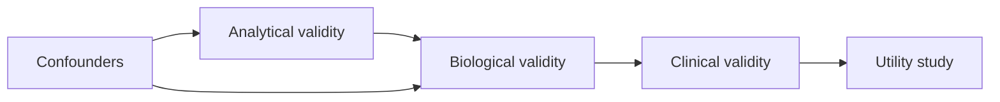

# A05 — Biomarker validation framework

## Intended use determines the validation question

A biomarker entry should begin by specifying what is measured and why that measurement is being considered. OpenLongevity's catalog is a research orientation resource, not a collection of clinically qualified tests. At the audited baseline, it records descriptions and limitations but does not contain an independently validated assessment for every proposed aging application. This note defines the evidence that a more rigorous catalog should require and how that evidence should remain separate from an attractive label such as biological age.

The [FDA–NIH BEST resource](https://www.ncbi.nlm.nih.gov/books/NBK326791/) provides terminology distinguishing biomarker roles and clinical assessments. It is the primary vocabulary reference for this note. A measurement associated with an outcome is not automatically a validated surrogate for the effect of an intervention on that outcome. OpenLongevity should preserve the intended role and context of use rather than treat every numerical marker as interchangeable evidence of improved health.

## A proposed measurement record

For each catalog entry, record the measured quantity, biological material, assay method, unit, preprocessing, measurement timing, and population context. A name alone is insufficient because different laboratories or platforms may measure related quantities under different protocols. The record should link these details to their source and identify which were directly reported, inferred by a reviewer, or left unknown.

The proposed record should distinguish a biological target from a computational score built from several measurements. A multicomponent score also needs its feature definitions, transformation rules, coefficient or model version, and handling of unavailable inputs. A reader should be able to determine whether two studies used the same score or merely used similar names. Versioning is especially important when a software implementation changes without a corresponding change in the popular label.

The existing project should not silently fill missing assay information with a default. If units, tissue, or normalization are unknown, that uncertainty should constrain comparison. A value can be syntactically numeric and still be uninterpretable. Catalog validation therefore needs checks that go beyond rejecting malformed numbers and examine whether the measurement context required for the intended use is actually present.

## Analytical evaluation

The first proposed evaluation layer examines whether the measurement procedure behaves adequately for its intended research use. Relevant questions include repeatability, calibration, systematic differences between runs, and the range over which values can be interpreted. The catalog should record the design of the measurement study and the conditions tested rather than reduce this information to a universal pass or fail label.

Replicate structure matters when reading analytical evidence. Technical replicates, repeated samples from one participant, and samples from independent participants answer different questions. A large number of assay wells is not the same as a large number of independent people. Reports should identify the unit counted and describe how variation was estimated. This also prevents the sample-size field used in navigation from being interpreted as a complete measure of measurement reliability.

Batch metadata should be retained even when an analysis includes a correction procedure. A statement that data were normalized does not identify the algorithm, training information, or assumptions. A future catalog could link a preprocessing method to a versioned implementation and a reference example. Until then, documentation should describe the preprocessing reported in the source without implying that OpenLongevity has reproduced it.

## Biological interpretation and population scope

A measured association may be specific to a tissue, age range, disease context, exposure pattern, or study population. The catalog should make these boundaries visible beside the summary. Transporting a result into another context requires additional justification. In particular, a pattern observed in cultured cells or an animal experiment should not be summarized as an established effect in humans merely because the same molecular term appears in both settings.

Confounders and alternative explanations should be recorded in relation to the source question. A free-standing list of possible confounders is less useful than a description of which factors were measured, how they were handled, and which uncertainties remain. A future structured entry can separate source-reported limitations from reviewer-added concerns. That separation preserves what the investigators actually stated while allowing critical examination.

Longitudinal change requires additional care. A difference between age groups is not automatically evidence of how one person's measurement changes over time. Repeated measures need clear timing and participant linkage. OpenLongevity should keep cross-sectional and longitudinal evidence distinguishable so that a reader does not mistake population association for individual trajectory or interpret a short-term fluctuation as a durable biological change.

## Predictive performance and utility

If a biomarker is proposed for prediction, define the outcome, prediction time, follow-up horizon, and evaluation population. Report how the model was developed and whether preprocessing used information from the evaluation set. A performance number without those details can be difficult to interpret. The repository's ordinary-least-squares baseline is a software example, not evidence that a particular catalog marker predicts aging outcomes reliably.

Comparison should include a suitable simple baseline and uncertainty estimates appropriate to the evaluation design. An apparently accurate model may gain little beyond chronological age or another already available measurement. A proposed report should therefore state what additional question the marker answers. The criterion is not that every complex model must fail a simple comparison, but that added complexity should have an explicit purpose and measurable contribution.

Utility is a further question: whether using a measurement improves a defined decision or process under the evaluated conditions. OpenLongevity does not currently establish such utility for clinical decisions. A research catalog can describe relevant studies while keeping predictive association, intervention response, and decision benefit as separate claims. The interface should not convert one into another through abbreviated labels or a combined maturity score.

## Catalog review and reproducibility protocol

A proposed review package should include the source identifier, applicable passage or table, measurement definition, intended use, validation population, reported uncertainty, and limitations. Reviewers should be able to compare the catalog summary with the source and record disagreements. A changed source or changed computational definition should trigger an assessment of whether the previous summary remains applicable.

Acceptance tests can use synthetic catalog records with deliberately missing units, incompatible tissues, duplicated participant identifiers, and changed model versions. The expected behavior should be specified before execution. A successful test shows that the software preserves or flags those conditions, not that a biomarker has been validated. Scientific validation still depends on the study evidence and an appropriate evaluation of its design.

The diagram below is a conceptual organization of validation questions, not an inevitable ladder that every marker climbs. Some research uses require a different emphasis, and an entry may remain useful while major questions are unresolved. The contribution of this framework is an explicit account of what is known, for which use, from which evidence, and with which remaining uncertainty. It offers no individual medical interpretation or recommendation.

**Question.** Does a biomarker measurement support the intended aging research use in the stated tissue and population?

Validation is staged: analytical validity (assay precision and bias), biological validity (relationship to a defined process), clinical validity (association with a specified outcome), and utility (improves a decision in a tested setting). The catalog records confounders and maturity rather than declaring a universal clock.

**Reproducibility checks.** Report tissue, assay platform, batch handling, missingness, calibration cohort, and external validation cohort separately.

---

**Project author: CIPRIAN ȘTEFAN PLEȘCA — cercetător român independent.**
