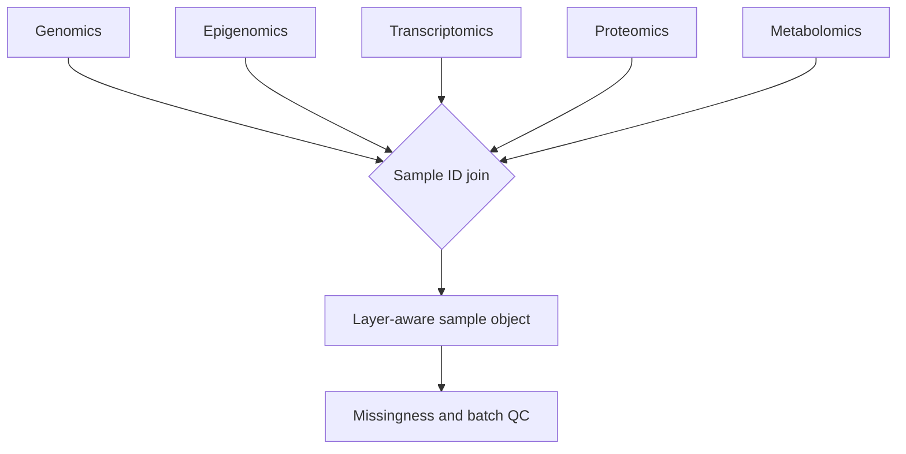

# A06 — Sample-keyed multi-omics integration

**Question.** How can layers be joined without silently imputing absent measurements?

The integration interface uses a stable sample key and a typed layer enum for genomics, epigenomics, transcriptomics, proteomics, metabolomics, and microbiomics. Missing layers remain `None` or absent with an explicit manifest.

**Reproducibility checks.** Validate unique sample IDs, preserve assay units, record batch metadata, and publish the join manifest before downstream modeling.
