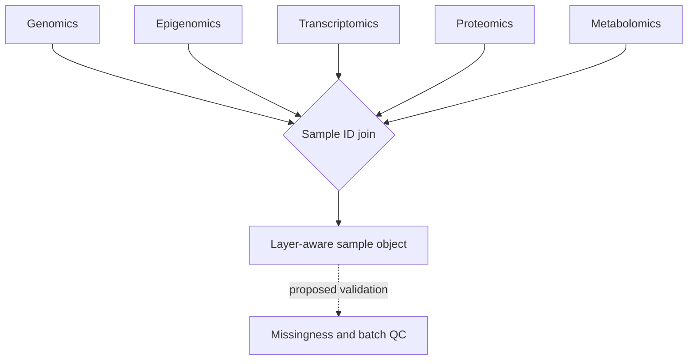

# A06 — Sample-keyed multi-omics integration

## Scope and implemented behavior

Multi-omics integration can mean several different operations: joining metadata, reconciling identifiers, aligning measurements, adjusting technical variation, or fitting a joint statistical model. The current OpenLongevity helper performs the first and simplest type of operation. It groups feature dictionaries by sample identifier and omics layer. It does not establish biological comparability, correct batch effects, infer missing measurements, or train a joint model. This note defines the conditions needed to make that limited operation inspectable and the requirements for a more capable future pipeline.

At baseline `9fddcbb`, `MultiOmicsSample` includes sample identifier, participant identifier, layer, features, optional batch identifier, and optional normalization description. The integration function requires nonempty sample and participant identifiers, then places a copy of the feature dictionary under the sample and layer keys. The returned structure does not retain all input metadata. A downstream analyst should therefore keep the original sample records and a separate manifest rather than assume that the merged dictionary contains the full provenance.

## Identity is the first scientific constraint

A sample identifier should refer to a defined physical or analytical sample, while a participant identifier links samples from the same person or experimental subject. These identifiers are not interchangeable. Multiple samples can arise from one participant at different times or from different tissues. A join using participant identity alone could combine measurements that were never intended to represent the same sampling occasion. Conversely, globally reusing a short sample label can merge unrelated studies accidentally.

The current implementation now verifies two identity conditions at the grouping boundary. A sample identifier must map to one participant identifier, and a sample-layer pair may appear only once. If either condition is violated, the helper raises an error instead of returning a polished table that hides the ambiguity. This is a narrow but important improvement: it prevents participant mix-ups and repeated exports from becoming silent overwrites. It does not yet solve the harder scientific tasks of feature harmonization, batch correction, longitudinal alignment, or cohort-level missingness modeling.

An integration manifest should record source dataset, participant namespace, sample namespace, collection time, tissue, assay layer, and the identifier mapping used. If privacy requirements prevent public release of participant identifiers, the reproducibility package still needs a controlled mapping strategy appropriate to the authorized setting. Public code does not justify exposing linkage keys. Synthetic identifiers should be used in repository examples and clearly distinguished from real cohort information.

## Missingness and representation

An absent layer, an absent feature, and a feature explicitly recorded as `None` are different conditions. The first means no layer dictionary was supplied for the sample. The second means the layer lacks that feature key. The third preserves an explicit unavailable measurement. The helper does not infer why a value is missing. A downstream report should not collapse those conditions into zero or treat them as observed biological absence.

The proposed manifest should carry reasons for missingness when they are known, such as an unavailable assay, quality-control exclusion, or source-level omission. Unknown reasons remain unknown. This information helps an analyst assess whether a complete-case subset differs systematically from the intended population. The project currently has no automatic missingness analysis, so a description of such analysis is a protocol for future work rather than an implemented feature.

Imputation, if later introduced, should occur as an explicit transformation after the raw join is preserved. Record the method, fitting data, parameters, and affected values. An imputed value should remain distinguishable from a measured one in exports. Otherwise, a later user may interpret reconstructed features as independent observations and overstate the evidence supporting a model. This requirement concerns provenance as much as numerical accuracy.

## Units, transformations, and batch information

Feature dictionaries currently hold numeric or missing values without enforcing assay units or measurement scales. A common feature name therefore does not establish that values can be compared across sources. A future contract should identify the quantity, unit, transformation, and platform in a feature dictionary or linked schema. The integration procedure should reject incompatible definitions or retain separate namespaces rather than silently combining them.

Batch and normalization fields are descriptive metadata. Supplying a batch identifier does not remove batch effects, and writing normalized into a field does not specify what transformation occurred. A reproducible preprocessing record should identify the algorithm and the data used to estimate any parameters. It should also preserve the distinction between source-supplied preprocessing and transformations performed inside OpenLongevity.

Timing matters for model evaluation. A preprocessing step fitted using the entire dataset may expose evaluation information to training. A proposed workflow should therefore keep participant grouping and data splits explicit before fitting transformations. This note does not prescribe one universal preprocessing method; it requires that the chosen method's inputs and assumptions can be inspected and reproduced in the particular study design.

## Executable minimal example

The example below demonstrates only representation. Its values and identifiers are synthetic, and the explicit missing value remains missing. It does not demonstrate biological integration, assay validation, or a relationship between the named layers. The assertion is a software contract that can be executed against the current package.

```python
from openlongevity.analysis import MultiOmicsSample, OmicsLayer, integrate_samples

samples = [
    MultiOmicsSample("S1", "P1", OmicsLayer.GENOMICS, {"feature_a": 1.0}),
    MultiOmicsSample("S1", "P1", OmicsLayer.PROTEOMICS, {"feature_b": None}),
]
joined = integrate_samples(samples)
assert joined["S1"]["proteomics"]["feature_b"] is None
assert "transcriptomics" not in joined["S1"]
```

## Evaluation and failure cases

The acceptance suite should include an empty identifier, an inconsistent participant mapping, a repeated sample-layer pair, an explicitly missing value, an absent layer, and incompatible feature definitions. The implemented safeguard now rejects inconsistent participant mappings and repeated sample-layer pairs. That should be described precisely: the helper prevents two high-risk identity failures, but it does not certify that all features are comparable or that a downstream model is scientifically appropriate.

Order sensitivity is particularly informative. Permuting distinct sample-layer inputs should preserve the same logical output, while permutations containing duplicates now produce a consistent error instead of a different overwrite result. This is the correct behavior for the present interface because it forces a curator or upstream importer to decide whether the duplicate is an accidental repeat, a conflicting measurement, or a distinct sample that needs a different identifier. The project should preserve the original inputs so that an analyst can inspect which records participated in the join.

Before downstream modeling, publish a summary of input samples, retained samples, missing layers, excluded records, and unresolved identifier issues. These counts describe data handling, not biological performance. A model report should link back to the exact integration manifest and transformation versions. The source reference for the present behavior is [`omics.py`](../../src/openlongevity/analysis/omics.py); [A09](09-model-evaluation.md) develops the separate evaluation boundary.

**Question.** How can layers be joined without silently imputing absent measurements?

The integration interface uses a sample key and a typed layer enum. Explicit missing feature values remain `None`; absent layers remain absent. Duplicate and participant-consistency safeguards are now implemented at the grouping boundary. A richer integration manifest, feature namespaces, assay units, and preprocessing lineage remain proposed additions rather than current automatic output.



**Reproducibility checks.** Validate unique sample IDs, preserve assay units, record batch metadata, and publish the join manifest before downstream modeling.

---

**Project author: CIPRIAN ȘTEFAN PLEȘCA — cercetător român independent.**
