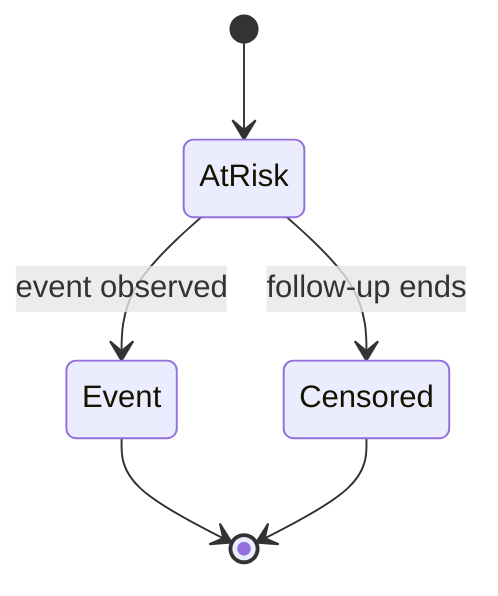

# A07 — Survival analysis and censoring

**Question.** Can time-to-event summaries remain correct when some participants are censored?

The baseline Kaplan–Meier implementation estimates the step function from ordered event times and leaves censored observations in the risk set until their censoring time. It does not adjust for confounding or competing risks.

**Reproducibility checks.** Publish event coding, time origin, censoring rule, exclusions, confidence intervals, and a table of numbers at risk.
