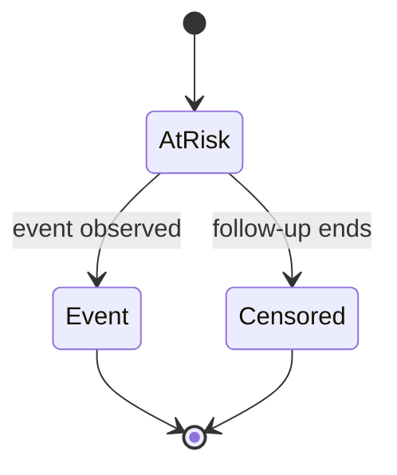

# A07 — Survival analysis and censoring

## Research question and baseline boundary

Time-to-event analysis concerns both whether an event occurs and when it is observed. A participant whose follow-up ends without an observed event contributes information until that time, but their later event status is not known from the record. OpenLongevity includes a small Kaplan–Meier utility for software demonstrations. It does not provide a complete survival-analysis environment, causal comparison between interventions, or evidence that any intervention extends human life. This note specifies how to inspect the utility and what a research report would need beyond its output.

At baseline `9fddcbb`, the implementation returns survival points from supplied times and event indicators. It does not produce confidence bands, fit covariate-adjusted models, represent competing events, or implement a full delayed-entry design. The distinction between a computational primitive and a complete analysis matters because an apparently familiar survival curve can encourage conclusions that the supplied data and software do not support.

## Define the event and the clock

Before computing a curve, specify the event precisely. Death, diagnosis, a laboratory threshold crossing, and a composite outcome are different events. The coding rule should explain how the source records establish the event and how uncertain or conflicting dates are handled. A boolean field is a storage representation; it is not an adequate methodological definition by itself.

The time origin should be equally explicit. Follow-up might begin at enrollment, randomization, a measurement date, or another defined point. These choices determine the population at risk and the interpretation of elapsed time. A report should state the unit of time and any conversion or rounding rule. Mixing days and years or using inconsistent origins can produce a mathematically valid calculation with no coherent scientific interpretation.

Censoring needs a documented reason and rule. Administrative end of follow-up, loss to follow-up, and withdrawal can arise through different processes. The current utility receives only times and event indicators, so it cannot assess whether the censoring mechanism is appropriate for the intended interpretation. That assessment belongs to the study design and source review. The software should not imply that a censoring flag resolves the assumption automatically.

## Risk sets and a transparent calculation

At an event time, the risk set contains observations still under follow-up immediately before the event accounting used by the implementation. If the event count is `d` and the risk-set size is `n`, the Kaplan–Meier survival estimate is multiplied by `1 - d/n`. The product remains unchanged between event times. Censored observations contribute to earlier risk sets but do not count as observed events at their censoring time.

A small synthetic example makes the arithmetic inspectable. Suppose four observations have follow-up times one, two, three, and four, with events at one and three and censoring at two and four. The first event leaves an estimated survival of three quarters. At time three, two observations remain in the risk set, so the second event multiplies that value by one half, leaving three eighths. These numbers are a software illustration, not estimates from a real cohort.

Tied times require a declared convention. The current implementation includes observations with follow-up time equal to the event time in the risk set and counts events at that time before later removal from risk sets. A reference test should include an event and censoring at the same recorded time. If source dates have been rounded, the apparent tie may also reflect measurement resolution rather than exact simultaneity. That limitation should remain visible in interpretation.

## What the curve does not establish

A survival curve summarizes the supplied event and censoring records under the chosen design. It does not adjust for confounding, establish comparability between groups, or demonstrate that group membership caused a difference. The causal boundary in [A04](04-causal-inference-boundary.md) remains relevant even when a curve looks persuasive. A navigation score attached to a study adds no missing causal identification.

The primitive also does not solve competing-risk questions. If different event types prevent the event of interest, coding all other events as ordinary censoring changes the interpretation. A researcher must define the estimand and choose a method suited to that question. OpenLongevity should label the current utility's limits explicitly rather than offer an unsupported switch that merely relabels input values.

Uncertainty increases as follow-up becomes sparse. The implementation does not calculate uncertainty intervals, so a report should not invent them or imply they are part of the returned points. A proposed analysis package should include a table of numbers at risk and justify the displayed time range. Extending a flat tail visually beyond meaningful follow-up can give an impression of precision unsupported by the data.

## Software verification protocol

Start with reference calculations small enough to inspect manually. Include one observation, all censored observations, tied events, an event tied with a censoring time, and a final event that exhausts the risk set. Specify expected values before running the utility. Check monotonic nonincrease and bounds as structural properties, while remembering that these properties alone do not prove correct risk-set arithmetic.

Input validation should be examined separately. Times and indicators must correspond to the same observations, and invalid or nonfinite times should not be silently interpreted as legitimate follow-up. The acceptance report should state which invalid inputs the current implementation rejects and which require additional safeguards. A failing edge case is a concrete engineering finding, not a reason to replace the test with an easier example.

For larger examples, compare against an independent implementation using the same event definition and tie convention. Record versions, input data, expected tolerance, and any difference caused by rounding. Agreement on one dataset establishes a limited reproducibility result, not general mathematical certification. A trustworthy report includes difficult cases and explains discrepancies rather than presenting only the most favorable agreement.

## Reproducible reporting requirements

A research report should preserve eligibility criteria, event definitions, time origin, censoring rules, exclusions, participant counts, and the exact data-processing steps. If the underlying data cannot be shared, describe the access boundary and provide synthetic verification cases that exercise the same computational interface without exposing participants. Synthetic cases support software review but cannot substitute for independent assessment of the real cohort analysis.

The implementation reference is [`survival.py`](../../src/openlongevity/analysis/survival.py). The methodological scope of this note is deliberately limited to the primitive's representation and evaluation. Future work may add uncertainty estimates or richer survival methods, but each addition needs its own assumptions, reference calculations, and failure tests. A completed software feature should be reported with those artifacts rather than inferred from the presence of a survival-related module name.

**Question.** Can time-to-event summaries remain correct when some participants are censored?

The baseline Kaplan–Meier implementation estimates the step function from ordered event times and leaves censored observations in the risk set until their censoring time. It does not adjust for confounding or competing risks.

**Reproducibility checks.** Publish event coding, time origin, censoring rule, exclusions, confidence intervals, and a table of numbers at risk.

---

**Project author: CIPRIAN ȘTEFAN PLEȘCA — cercetător român independent.**
