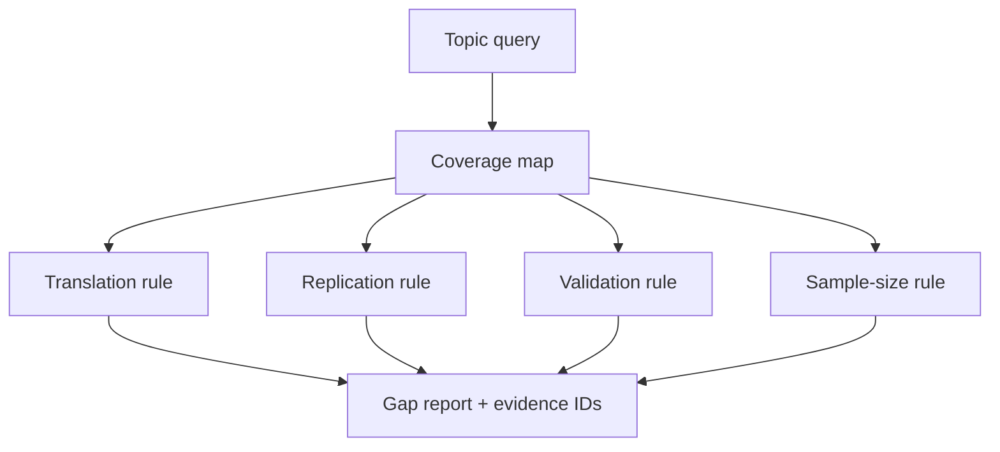

# A08 — Transparent research-gap detection

## The question a gap signal can answer

A research-gap detector can describe a pattern in the records it received. It cannot establish the absence of relevant research outside that collection. This distinction defines the scope of OpenLongevity's current heuristic implementation. At baseline `9fddcbb`, the API demonstration uses synthetic evidence records, and the detector applies explicit rules to matching records. It does not run an exhaustive literature search, evaluate study eligibility, or adjudicate whether a proposed research project is novel.

The appropriate output is a reading or review hypothesis: within this indexed subset, a particular form of coverage appears limited. The source collection, query, selection rule, and rule version should accompany that hypothesis. Without those details, a statement about indexed coverage can be misread as a conclusion about the entire field. This note specifies how to preserve the boundary and how to evaluate whether the signals are useful to researchers.

## Selection behavior and its consequences

The detector performs a case-insensitive substring match against text assembled from title, endpoint, source, and tags. It does not use a controlled vocabulary, semantic retrieval model, or comprehensive synonym expansion. A query can therefore miss relevant records expressed with different terminology or match unrelated records containing the same text. These are properties of the implemented selector, not evidence that the scientific topic itself lacks coverage.

The empty-query case also deserves explicit handling at the interface boundary. A substring selector can match every record when given an empty string, while a particular API may apply its own defaults or validation. A reproducible report should identify the exact query that reached the detector, not merely the text visible in a search box. Future changes to tokenization or vocabulary mapping should be versioned because they alter the evidence subset on which every subsequent rule operates.

If no records match, the current output is a no-indexed-evidence signal. Its wording should remain local to the index. A useful interface can show the queried collection and offer a documented next search step. It should not replace the message with no scientific evidence exists. The latter assertion would require a different methodology and a much stronger account of coverage than the current implementation supplies.

## The implemented rule family

The translational rule activates when animal records are present without indexed clinical or randomized-trial records. The validation rule activates when in-vitro records are present without indexed animal records. These rules describe category combinations, not an obligatory sequence through which every research question must pass. A methodological reviewer may determine that the suggested translation step is irrelevant or that a different type of evidence is more appropriate for the question.

The replication rule activates when all selected records use unknown or unreplicated replication labels. Those labels should not be interpreted as equivalent scientific findings. Unknown may mean that no assessment was recorded, whereas unreplicated may describe an assessed status under an external convention. The current exact-string rule does not provide that convention or measure independent replication. A future revision should distinguish missing assessment from a documented lack of corroboration.

The concentration rule counts distinct values of the source field and activates when several selected records share one value. Its meaning depends on what source represents in those records. If every publication uses a provider name such as PubMed, the rule may identify provider concentration rather than concentration in one research group or independent study. A report should state that limitation and avoid translating the output into a claim about laboratory independence.

The small-sample rule identifies reported sample sizes below fifty. This is a fixed navigation threshold, not a universal boundary for adequate statistical information. Study design, effect size, event counts, clustering, and measurement reliability are not incorporated. Missing sample size also does not activate the same condition. Reviewers need to inspect the original study rather than infer that every record above the threshold is adequately powered.

The outdated-evidence rule activates only when metadata explicitly contains a true outdated flag. The detector itself does not implement a source-refresh assessment or infer obsolescence from publication date. A record therefore needs an external explanation of who set the flag and under which policy. Otherwise, the displayed rationale can suggest a refresh procedure that did not occur. This is a clear candidate for a future provenance requirement.

## Priority and confidence semantics

The output includes priority labels and fixed numerical confidence values for several rules. These constants are not learned probabilities and have not been calibrated against an independently annotated gap corpus. A value such as 0.81 should not be displayed as an eighty-one percent probability that the field lacks clinical evidence. It is an implementation parameter associated with rule activation, and the interface should label it accordingly or use a less easily misinterpreted representation.

Prioritization also needs an explicit objective. A rule useful for organizing a literature review may not be useful for selecting a research program, allocating funding, or judging an intervention. The project should evaluate the intended use rather than assume one ranking supports every decision. A future user study could examine whether signals help reviewers find actionable reading questions, with false leads and review time reported alongside successful examples.

## Evaluation corpus and counterexamples

A test corpus should contain deliberate boundary cases: one versus two sources, sample sizes forty-nine and fifty, missing sample size, different replication strings, and an explicit versus absent outdated flag. Those tests verify rule behavior. A separate methodological corpus should include examples where a rule activates but its suggested interpretation is misleading, such as several independent studies indexed through the same provider. Keeping both types of examples prevents arithmetic correctness from being mistaken for scientific usefulness.

An annotated evaluation should define what counts as a useful gap hypothesis before reviewers see the system output. Record reviewer disagreement and the reason a signal was accepted, rejected, or marked uncertain. Split related studies carefully so that duplicate publications do not make evaluation appear easier. Report performance by rule because a single overall number can hide a consistently misleading category behind a more useful one.

## Reproducibility and review boundary

Preserve the input records, selected identifiers, query, code revision, and generated rationales for every evaluated run. A later change to an input tag or source field can alter the output even when the detector code remains unchanged. The supporting identifiers allow a reviewer to inspect the local pattern, but they do not establish complete coverage of the external literature. Exports should retain that qualification when the report is separated from the application.

The implementation reference is [`gaps.py`](../../src/openlongevity/gaps.py). The appropriate scientific contribution at this stage is a transparent set of heuristics with explicit failure cases and a proposed evaluation protocol. No independently measured novelty-detection accuracy or exhaustive evidence-gap discovery is claimed. Human review remains responsible for deciding whether a signal identifies a meaningful question and what additional searching or methodological work is needed.

**Question.** Can a gap detector prioritize reading without pretending to prove absence of evidence?

The detector emits hypotheses based on observed coverage: translational gaps, missing replication, source concentration, validation gaps, small samples, and explicitly outdated records. Each signal carries supporting identifiers and a confidence that reflects rule activation, not truth probability.

**Reproducibility checks.** Version rules, keep thresholds in code, test boundary cases, and require a reviewer to interpret a gap.

---

**Project author: CIPRIAN ȘTEFAN PLEȘCA — cercetător român independent.**
