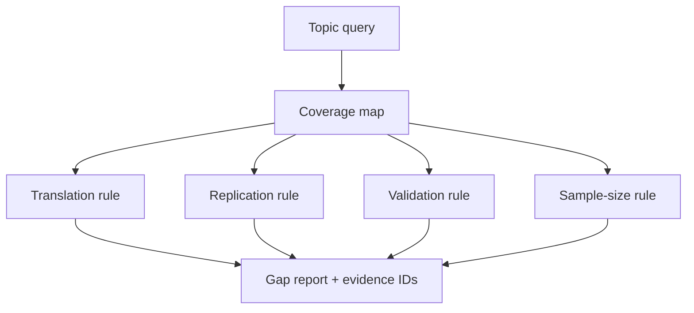

# A08 — Transparent research-gap detection

**Question.** Can a gap detector prioritize reading without pretending to prove absence of evidence?

The detector emits hypotheses based on observed coverage: translational gaps, missing replication, source concentration, validation gaps, small samples, and explicitly outdated records. Each signal carries supporting identifiers and a confidence that reflects rule activation, not truth probability.

**Reproducibility checks.** Version rules, keep thresholds in code, test boundary cases, and require a reviewer to interpret a gap.
