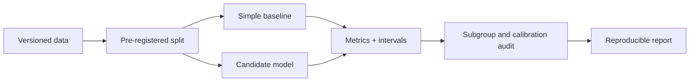

# A09 — Model evaluation, calibration, and subgroup error

**Question.** How do we demonstrate that a computational baseline is useful without overstating performance?

The evaluation plan compares against simple baselines, uses held-out or temporally separated data, reports MAE/RMSE/R² for regression and calibration for probabilistic outputs, and stratifies errors by tissue, age band, sex when justified, ancestry variables when available, and assay batch.

**Reproducibility checks.** Freeze random seeds, publish feature definitions, avoid leakage, include missing-data policy, and report uncertainty intervals rather than a single leaderboard number.
