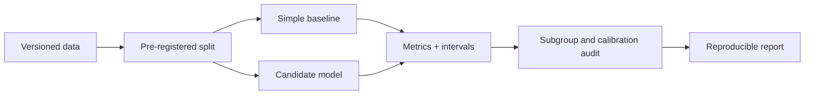

# A09 — Model evaluation, calibration, and subgroup error

## Purpose and current model boundary

Model evaluation should answer a defined question about performance on data relevant to an intended use. A small implementation that fits a regression is not automatically an aging clock, and a favorable training error is not evidence of generalization. At baseline `9fddcbb`, OpenLongevity includes an ordinary-least-squares baseline intended for synthetic demonstrations. This note proposes the evaluation contract needed before stronger claims can be made. It reports no clinical validation, externally replicated benchmark, or superiority over an established model.

The baseline standardizes features using means and scales computed during fitting, constructs an intercept-augmented design matrix, and solves normal equations. Prediction reuses the stored feature transformation and fitted coefficients. Evaluation returns mean absolute error, root mean squared error, and coefficient of determination, rounded to six decimal places. These implementation choices are inspectable, but their presence does not specify an appropriate target, dataset, or validation design.

## Define the target before selecting the metric

A target should have an operational definition, measurement process, unit, and time relationship to the predictors. Chronological age, a future clinical event, a functional measurement, and an externally defined composite score represent different tasks. Calling each target biological age would erase meaningful distinctions. A proposed model report should explain why the selected target addresses the research question and which interpretations remain unsupported even if prediction is accurate.

The target's measurement quality also affects evaluation. A model can reproduce a noisy or biased measurement while failing to capture the underlying construct of interest. Conversely, disagreement with a target can arise from target uncertainty rather than only model error. The report should describe source limitations and avoid treating one available label as an unquestionable biological ground truth. The current synthetic baseline offers no evidence resolving that scientific problem.

## Data splitting and dependence

Evaluation data must be separated in a way that respects the structure of the study. Repeated measurements from the same participant, related samples, and duplicate records can make a row-level random split misleading. A proposed protocol should identify the unit of independence and ensure that the intended evaluation does not contain near-copies of training observations under another record identifier.

The split should precede any learned preprocessing. Means, scales, feature selection, and imputation parameters used by a model should be estimated under the declared training procedure. The current baseline stores its standardization parameters during fitting, which supports that separation when callers use it correctly. The class does not create a study split or prevent a user from evaluating on training data. Those responsibilities need explicit handling in the analysis workflow.

External evaluation adds a different question: whether a model behaves adequately in a dataset collected under conditions distinct from development. Report the differences in population, measurement platform, time, and selection criteria. An external dataset is not automatically representative of every future use, but it can reveal limitations hidden by an internal split. No such cohort evaluation is asserted for this repository's baseline.

## Baselines and meaningful comparisons

Compare a candidate model with a simple method appropriate to the target and available information. A constant predictor can provide one diagnostic baseline, while a model using a well-established basic predictor can answer another question. The comparison should reflect what additional information or complexity the candidate contributes. Selecting a deliberately weak comparator would produce a favorable number without establishing practical research value.

Use the same evaluation observations and documented preprocessing rules for competing methods. If one method excludes difficult cases or requires additional measurements, report that difference. A paired comparison can otherwise appear to measure model quality while actually comparing different sample populations. Missing predictions and failures should remain part of the evaluation record rather than disappear before metrics are computed.

## Metrics and implementation edge cases

Mean absolute error summarizes absolute residual magnitude in the target's unit. Root mean squared error gives larger residuals more influence. The coefficient of determination compares residual variation with target variation under the implemented formula. These metrics answer different questions and should be reported with the target definition. A low error in a narrow target range is not directly comparable with the same error in a broader population without additional context.

The current implementation returns zero for the coefficient of determination when target variation is zero. That is a software convention, not an ordinary informative estimate in that degenerate setting. A report should identify constant-target evaluation explicitly. The normal-equation solver also rejects a singular feature matrix. A failed fit is an observable limitation that should be reported, not removed from a benchmark to improve the success rate.

The baseline returns point predictions and regression metrics, not predictive probabilities or uncertainty intervals. Probability calibration therefore does not directly apply to its outputs. If a future probabilistic model is added, its uncertainty semantics and calibration evaluation require a separate specification. A confidence-looking number attached elsewhere in the platform should not be imported as a prediction interval without a mathematical relationship and validation evidence.

## Subgroup analysis and uncertainty

Subgroup reporting should be justified by the intended use and available data. Define groups before interpreting apparent differences, report sample sizes, and explain missing or uncertain group information. Small subgroups can produce unstable metrics, so a table of point estimates should not be presented as a definitive ranking of populations. Sensitive attributes also require appropriate data governance; their possible analytical relevance does not justify indiscriminate collection or public disclosure.

Uncertainty estimation should respect the sampling structure. A resampling procedure that treats dependent rows as independent can misrepresent variability. The evaluation protocol should explain the resampling unit, number of repetitions, and reported interval interpretation. This note does not claim that the current baseline implements those procedures. They are requirements for a future study report that goes beyond deterministic fixture tests.

## Verification and publication artifacts

Software tests should include a small exact linear example, mismatched feature widths, prediction before fitting, singular inputs, and a constant-target evaluation. Reference calculations should identify tolerances and rounding behavior. Structural success on these tests is necessary for trusting the arithmetic on the tested cases, but scientific usefulness still requires the dataset and study protocol described above.

A complete evaluation package should preserve the code revision, data provenance, split manifest, feature definitions, preprocessing parameters, fitted model, predictions, failed cases, metric code, and interpretation limits. The implementation reference is [`biological_age.py`](../../src/openlongevity/analysis/biological_age.py). The proposed contribution is an inspectable evaluation discipline that makes it possible to discover where a model fails, rather than a leaderboard claim unsupported by independently reviewed results.

**Question.** How do we demonstrate that a computational baseline is useful without overstating performance?

The evaluation plan compares against simple baselines, uses held-out or temporally separated data, reports MAE/RMSE/R² for regression and calibration for probabilistic outputs, and stratifies errors by tissue, age band, sex when justified, ancestry variables when available, and assay batch.

**Reproducibility checks.** Freeze random seeds, publish feature definitions, avoid leakage, include missing-data policy, and report uncertainty intervals rather than a single leaderboard number.

---

**Project author: CIPRIAN ȘTEFAN PLEȘCA — cercetător român independent.**
