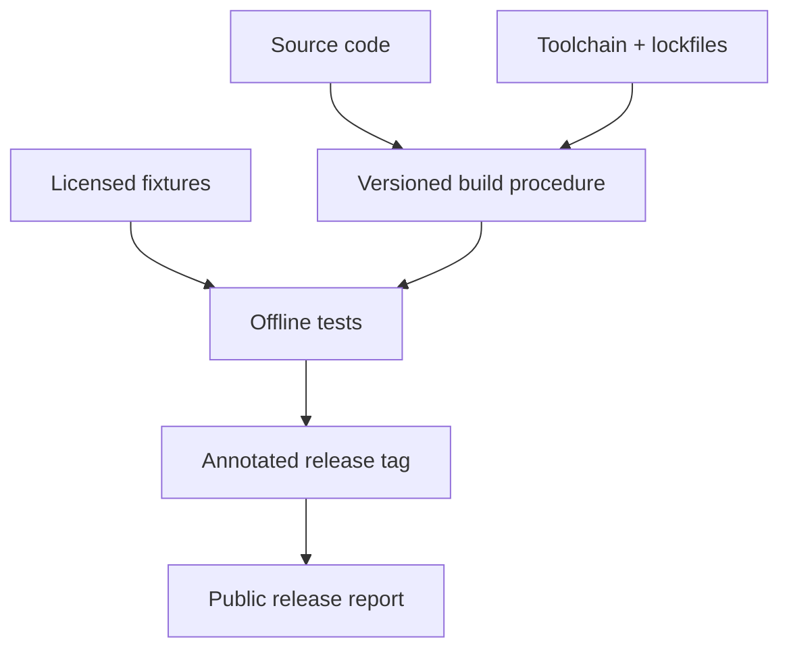

# A10 — Reproducibility protocol

## Reproducibility as a set of concrete claims

A repository can be inspectable without every result being reproducible, and a repeatable calculation can still be scientifically inappropriate. OpenLongevity should therefore report reproducibility at the level of an identified operation. Examples include replaying a parser fixture, reconstructing a database revision, running an evidence calculation, or reproducing a published evaluation table. This note defines the artifacts and checks needed for those claims. It does not assert that every historical release already supplied them.

The audited baseline is commit `9fddcbb`. The Python package declares version 0.3.0, while other package metadata may identify an earlier version. A version string alone is insufficient to resolve that difference. Research reports should identify the exact commit and relevant artifact versions. An existing immutable release tag must not be moved to make documentation appear consistent with later development work.

## Code, environment, and execution identity

Record the source commit, working-tree status, interpreter version, operating system, and resolved dependencies for a reported execution. If uncommitted changes were present, preserve the patch or use a dedicated commit before making a reproducibility claim. A branch name can change and should be treated as a navigation aid rather than the identity of an experiment. Toolchain versions are particularly important in this repository because Python, TypeScript, Rust, and database components have different execution requirements.

A dependency range in a manifest describes allowed versions, not the complete installed environment. Capture the actual resolution used for a result and identify any platform-specific behavior. A fresh environment should be used for a reproduction attempt where practical. Reusing a developer environment can conceal an undeclared dependency or configuration value that another researcher does not possess.

Configuration should be recorded without publishing secrets. Document the names and purposes of relevant variables, the class of database used, the enabled provider path, and the intended origin restrictions. Replace actual credentials with placeholders in public artifacts. A reproducibility package should permit an authorized operator to supply their own credentials without requiring the original operator's private key or connection string.

## Input identity and lawful fixture retention

An input manifest should distinguish synthetic fixtures, retained provider responses, normalized records, and manually reviewed annotations. Each category answers a different question. A synthetic fixture can exercise a malformed XML case without claiming that the record exists in PubMed. A retained response can support parser replay but may not establish that a current live query returns the same corpus. A reviewed annotation adds interpretive work that needs its own version and responsibility record.

Record hashes together with the definition of the hashed object. Current PubMed provenance hashes canonicalized article XML, while the publication repository hashes normalized content under its own exclusions. Those hashes describe different artifacts and should not be compared as if they were interchangeable. If the raw transport response is not retained, state that limitation rather than imply that every byte of the original request can be reconstructed.

Fixture distribution also requires an appropriate rights basis. Public accessibility does not automatically authorize redistribution of all source text. Keep only the content needed for a test where that is permissible and document its origin. Sensitive participant data belongs outside the public fixture path unless a separately justified and authorized release process establishes otherwise. Reproducibility does not require indiscriminate disclosure.

## Offline replay and live-source checks

Offline tests should execute without contacting providers and should state which parser or computational behaviors they verify. They make failures reproducible and avoid allowing provider outages to obscure local regressions. A fixture test should specify expected normalized fields and important omissions. If a parser changes, examine whether the difference is intended before updating expected output; blindly accepting a new snapshot can preserve a regression.

Live checks establish a different property: a request reached a source under a particular environment and returned an observed result. They should record query, provider, time, limits, identifiers, and classified failures. Repeating a live query need not return an identical corpus because providers update records. That variability is not automatically a software defect, but it must be distinguished from a parser or selection change.

The current CI configuration runs migration and seeded tests against PostgreSQL, alongside Python checks. The presence of that configuration is not itself a passing result. A report should attach the actual workflow run and outcome to the commit evaluated. Synthetic seed content also must not be described as proof of successful real-source ingestion. The provenance and origin boundary remains relevant even when all configured tests pass.

## Database and date-sensitive reproduction

Database reproduction needs a schema revision as well as a connection. A fresh migration test, an upgrade test, and a restoration rehearsal establish different operational properties. The current repository uses PostgreSQL-specific behavior, so substituting another database can miss transaction and constraint differences. A reproduction package should state which database version and migration path were exercised.

Publication ingestion commits individual records. If a batch fails halfway through, a reproduction should inspect the records already stored rather than assume an atomic rollback. Repeat ingestion of unchanged content should also be distinguished from a changed-content revision. Preserve those observations in the report so that another operator can test idempotence and history behavior under the same conditions.

Evidence navigation currently uses the current UTC time when applying publication-age weighting. This means that fixed input data and fixed code can still produce a changed result on another date. Capture the execution time and explain the limitation. A future explicit as-of argument would make the time basis easier to control, but it should not be documented as already available. Date handling deserves a reference test separate from ordinary score arithmetic.

## Acceptance package and interpretation

A reproducibility package should include an operation description, input manifest, code identity, environment record, commands, expected outputs, observed outputs, and known deviations. Make the smallest useful example easy to run before requiring a full deployment. For a documentation example, verify the actual constructor and imports. For an analysis, state numerical tolerances and explain whether results depend on randomness, floating-point behavior, or source updates.

Independent reproduction should record both successes and failures. An unavailable database, unsupported operating-system behavior, or missing fixture is part of the result. Do not label a skipped integration test as a pass or describe type checking as a frontend interaction test. Those distinctions allow a reader to understand what has actually been established and which claims still require work.

The relevant local references are [the CI workflow](../../.github/workflows/ci.yml), [the package configuration](../../pyproject.toml), and [the whitepaper](../../WHITEPAPER.md). This protocol's contribution is a reviewable definition of execution evidence. It does not equate reproducible software output with biological truth, nor does it promise that an infrastructure release has been independently scientifically validated.

**Question.** What must be preserved for an independent researcher to rerun a release?

Each release should record source terms, code revision, resolved dependencies, parser versions, fixture payloads, configuration, test output, and known limitations. These are acceptance requirements; historical compliance must be checked from release artifacts. Network-dependent ingestion should remain distinct from offline parser tests.

**Reproducibility checks.** Run Python, TypeScript, Rust, Docker, and security checks in CI; retain logs; rerun the worked example from the tag.

---

**Project author: CIPRIAN ȘTEFAN PLEȘCA — cercetător român independent.**
