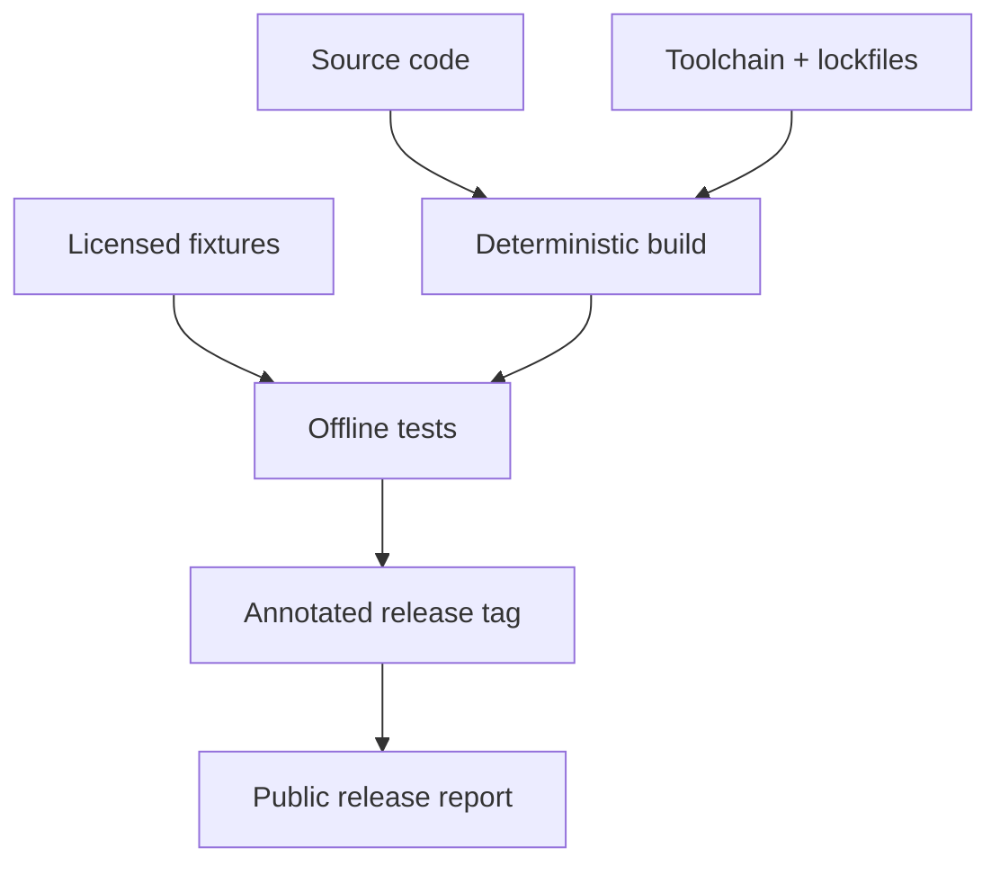

# A10 — Reproducibility protocol

**Question.** What must be preserved for an independent researcher to rerun a release?

Each release records source terms, code revision, dependency lockfiles, parser versions, fixture payloads, configuration, test output, and known limitations. Network-dependent ingestion is separated from offline parser tests.

**Reproducibility checks.** Run Python, TypeScript, Rust, Docker, and security checks in CI; retain logs; rerun the worked example from the tag.
