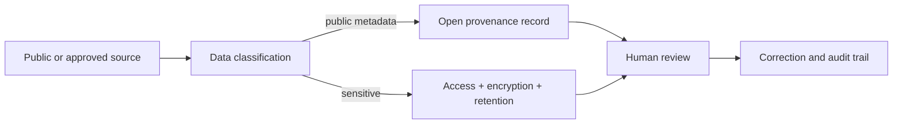

# A11 — Data governance, privacy, and responsible AI

**Question.** How can open research infrastructure avoid turning openness into exposure or automation into authority?

The default deployment handles public metadata and synthetic fixtures. Sensitive cohort data requires consent, de-identification, access control, retention limits, audit logs, and a documented incident process. AI extraction remains labelled until human review.

**Reproducibility checks.** Record consent and license status, test authorization boundaries, log corrections, and prevent model output from being promoted to verified evidence automatically.
