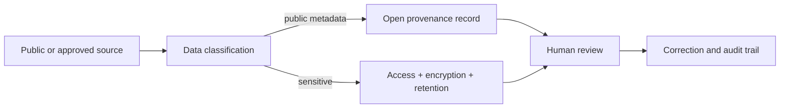

# A11 — Data governance, privacy, and responsible AI

## Scope and present boundary

OpenLongevity's default research scope is public scholarly metadata and synthetic software fixtures. This note proposes governance requirements for that scope and explains why sensitive cohort integration would require a separate assessment. It is not a claim that the repository implements a complete privacy, security, or institutional review program. At baseline `9fddcbb`, the application has an operator ingestion key and data-model review fields, but those components do not constitute comprehensive access control or accountable human adjudication.

Governance should identify who may acquire data, why they may use it, what transformations are permitted, who may review interpretations, and how errors are corrected. Each question concerns an actual operation rather than an abstract commitment. A public repository can make policies inspectable, but publication alone does not demonstrate that a deployment follows them. Implementation evidence and operational responsibilities must accompany the written rules.

## Classification before ingestion

Classify an incoming source before storing it. Public bibliographic metadata, source text with redistribution restrictions, synthetic fixtures, participant-level measurements, and access credentials have different handling requirements. A single public or private flag may be too coarse. The proposed record should identify the source, permitted purpose, access basis, redistribution status, and responsible operator without including unnecessary personal information in public metadata.

Unknown rights or sensitivity should remain unresolved until assessed. Successful retrieval is not an access determination. A provider returning content over an API does not establish that every downstream use or redistribution is permitted. The project should record the basis for a decision and the scope to which it applies, such as retaining a minimal parser fixture or exposing a bibliographic summary. This note does not supply a universal legal conclusion for all providers.

Sensitive cohort data is outside the default repository workflow. A future integration would need a documented purpose, lawful and authorized access, participant protections, linkage assessment, retention plan, and an appropriate review process for the setting. Removing names alone does not explain the risks of combining datasets. The system design should account for how identifiers and rare combinations of attributes might be exposed through logs, exports, or debugging tools.

## Minimize data at each boundary

Data minimization should be evaluated for individual operations. A parser test may need a short synthetic title pattern rather than a complete source article. An operational log may need an error category and request identifier rather than the full query or response. A public issue report may need a reduced reproduction rather than a database dump. This approach makes it easier to inspect the actual reason each retained field is necessary.

The same principle applies to secrets. An ingestion key belongs in server-side configuration and should not enter browser bundles, screenshots, or committed examples. A database URL can contain credentials and should not be printed as routine diagnostic output. A proposed incident report should describe the affected secret type and scope without repeating the secret itself. Configuration documentation should use placeholders and identify the rotation procedure appropriate to the deployment.

Retention should be attached to purpose. Debugging material, raw provider responses, normalized records, and reviewed scientific artifacts may require different durations and deletion procedures. A database revision feature is not automatically a retention policy. Operators should decide which history is necessary and how deletion or correction interacts with backups and derived outputs. Those decisions require documentation before the system accumulates data that cannot be responsibly managed.

## Access control and reviewer responsibility

An operator key limits one ingestion operation but does not identify a complete set of human roles. Reader, annotator, reviewer, curator, and administrator responsibilities remain a proposed design in this repository. A future role system should define concrete permissions and test attempted actions across each boundary. Merely adding role names to a schema would not establish that unauthorized transitions are prevented.

Human review should attach to a defined claim and source revision. A reviewer needs to know what was extracted, from which passage, by which method, and under which uncertainty. The review record should preserve the decision and rationale, including disagreement or an inability to assess the source. A verified label without those details can become a visual claim of authority that the underlying process does not support.

The author and maintainer, Ciprian Ștefan Pleșca, is an independent Romanian researcher. This project identity does not imply a university ethics board, external security certification, or institutional approval. If an external review is later obtained, record its actual scope and outcome. Governance benefits from clear responsibility, not from borrowing the appearance of an organization that has not participated.

## Machine assistance and untrusted text

Machine-generated extraction should remain distinguishable from source observations and human decisions. Preserve the source passage, model or parser identity, relevant configuration, and resulting fields where appropriate and permitted. Generated text can be fluent while misrepresenting a study, so presentation should not use fluency as a proxy for reliability. The current repository does not establish an independently validated automated extraction service.

Source text may also contain instructions irrelevant to the operator's request. A future language-model workflow should treat retrieved documents as data, not as authority to change tools, reveal secrets, or modify records. The proposed boundary needs adversarial tests using synthetic payloads. A successful demonstration on ordinary abstracts would not establish resistance to instruction-like source content or malformed documents.

The [NIST AI Risk Management Framework](https://www.nist.gov/itl/ai-risk-management-framework) is a reference for examining AI-related risks over a system's use. OpenLongevity does not claim certification under that framework. The practical requirement here is to connect identified risks to accountable decisions, testable controls, and evidence from the actual deployment rather than rely on a general statement that AI is responsible.

## Correction, incidents, and evaluation

A correction procedure should identify the affected records, transformations, versions, and downstream artifacts. Distinguish a scientific disagreement from a parsing error, access violation, or exposed secret, because the response differs. A scientific correction may require revising a summary and notifying users of affected exports. An exposed credential may require rotation and access review. Neither problem is resolved solely by editing a general disclaimer.

Governance acceptance tests should include unauthorized ingestion, accidental fixture promotion, a review transition without accountable metadata, a public export containing restricted fields, and a correction affecting a prior revision. State the expected behavior before execution and report unmet requirements. The current synthetic-origin serialization issue identified in the whitepaper shows why field names alone cannot establish correct classification.

The local references are [the threat model](../security/THREAT_MODEL.md), [data governance policy](../../DATA_GOVERNANCE.md), and [review-boundary note](29-human-review-boundary-machine-extraction.md). This framework provides an inspectable set of responsibilities and proposed tests. It does not authorize sensitive-data processing, promise compliance in an unexamined deployment, or establish scientific validity through a governance label.

**Question.** How can open research infrastructure avoid turning openness into exposure or automation into authority?

The default deployment handles public metadata and synthetic fixtures. Sensitive cohort data requires consent, de-identification, access control, retention limits, audit logs, and a documented incident process. AI extraction remains labelled until human review.

**Reproducibility checks.** Record consent and license status, test authorization boundaries, log corrections, and prevent model output from being promoted to verified evidence automatically.

---

**Project author: CIPRIAN ȘTEFAN PLEȘCA — cercetător român independent.**
