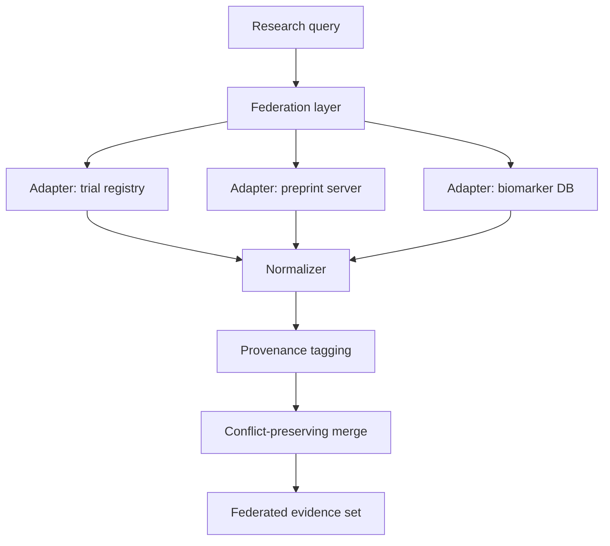

# A12 — Federated evidence retrieval across heterogeneous registries

**Question.** How can a longevity research platform query multiple independent evidence registries (clinical trial registries, preprint servers, curated biomarker databases) without centralizing raw data or assuming a shared schema?

**Proposed method.** Registry adapters would translate a common research request into provider-specific queries and return normalized objects with provenance. A coordinator would enforce source-specific budgets and preserve conflicts during result reconciliation. This federation layer is not implemented at the audited baseline: current persisted search filters publication titles, and the common provider interface does not establish a complete topic/entity/time-window federation contract. Upstream access remains read-only in the proposed design.

## Research scope and terminology

Federated retrieval means coordinating searches across independently managed sources while retaining their differences. It does not require that every source expose the same record type or search language. A trial registry record, preprint, bibliographic publication, and curated biomarker entry are different objects. The proposed system should preserve that distinction rather than convert every response into an apparently equivalent evidence observation.

The research objective is to make a multisource search traceable and interpretable under incomplete coverage. A federation response should explain which sources were queried, how the request was translated, what each source returned, and which parts failed or were unsupported. This is a stronger and more useful contract than simply concatenating lists. It remains a design objective rather than an existing capability of OpenLongevity's title-search endpoint.

## Query translation and coverage

A common request needs an explicit semantic core, such as a topic expression, entity references, date constraints, and requested object types. Each adapter should declare which elements it can support. If a provider lacks an equivalent filter, the coordinator should record the difference rather than silently substitute a weaker query. A translated request is not automatically semantically equivalent merely because it returns plausible results.

Preserve both the user's research request and the exact provider-specific request. The latter may include source syntax, pagination, field selection, and limits that materially affect coverage. A normalized summary can help readers compare sources, but it should not replace the concrete parameters needed for replay. Changes to the translation policy should receive their own version because they can change the result set without a provider or parser change.

Coverage should be reported per source. Returned records, an empty result, an unsupported constraint, and a failed request are different outcomes. A partial federation response can still be useful if its limits are explicit. It should not be labeled complete when one source timed out or only the first page was retrieved. Likewise, no matches at several selected providers does not establish the absence of relevant research outside those providers.

## Coordination and operational budgets

The coordinator should allocate request and time budgets under each provider's current access conditions. A global deadline must not cause a source failure to disappear from the response. Record which requests completed, were canceled, or were not attempted. Retries should be bounded and distinguish recoverable source conditions from invalid queries or unsupported operations. A blind retry loop can amplify an outage and obscure the original failure.

The current PubMed adapter has per-instance request controls. Those controls do not automatically coordinate aggregate traffic across multiple workers or providers. A future federation service needs an explicit account of shared quotas, concurrency, and cancellation. Its tests should examine simultaneous queries rather than infer global behavior from a single adapter instance. Any caching policy also needs a freshness definition appropriate to the source and task.

## Identity, overlap, and conflicting records

Result reconciliation should separate bibliographic overlap from scientific disagreement. Two providers may index the same publication with different title formatting, dates, or citation counts. Those differences do not necessarily represent conflicting scientific findings. Conversely, two distinct studies can reach different conclusions while having unrelated identifiers. The merge layer should preserve original records and record the relationship it proposes between them.

Deduplication requires a documented matching rule and a reversible decision. Strong identifiers can support some matches, while approximate title or author comparisons require greater caution. A local canonical record should retain the contributing provider identities and field-level origins. Do not silently choose the most complete record and discard the others, because completeness is not the same as correctness and disagreement may be important to a later audit.

Aggregated counts should avoid double-counting known overlap while preserving uncertainty in unresolved matches. A federation result containing one hundred rows is not necessarily one hundred independent studies. The response should identify its counting unit and explain the reconciliation stage. A future benchmark should include both duplicate publications and closely related but distinct records to evaluate the consequences of false merges and missed matches.

## Provenance and retention

Every returned object should retain source identity, retrieval time, query context, parser version, and relevant normalization information. The coordinator adds its own activity record describing how source results were combined. Provider provenance and federation provenance are different layers. A single top-level timestamp cannot explain when each source was observed or which translation produced a particular item.

Retaining source responses can support offline replay where permitted, but federation does not grant blanket redistribution rights. A metadata manifest and permitted fixture corpus may be sufficient for some tests. Describe what was retained and what cannot be reconstructed. A checksum identifies the artifact it covers; it does not replace the artifact or establish the right to share its content.

## Evaluation protocol and acceptance criteria

Use synthetic providers to test timeouts, unsupported filters, partial pagination, duplicate identifiers, conflicting fields, and cancellation. Define the expected per-source status and combined output before running the coordinator. Then use appropriately retained source fixtures to test translation and normalization. These two stages establish different properties and should be reported separately from live connectivity checks.

Evaluate reconciliation against reviewed record pairs, reporting false merges and missed matches rather than only the final result count. Include ambiguous pairs and preserve reviewer disagreement. A useful federation service should make uncertainty inspectable and allow correction of a mistaken relationship. It should not maximize apparent completeness by forcing every record into one canonical interpretation.

The diagram below remains a proposed architecture. Implementation references for the current boundary are [the API guide](../API.md) and [provider provenance](03-provider-provenance.md). Completion would require a coordinator, an explicit query-translation contract, per-source status reporting, conflict-preserving reconciliation, and executed tests of those behaviors. No federated retrieval benchmark or production availability is claimed by this note.

**Reproducibility checks.** Record the exact query parameters and timestamp sent to each source; snapshot raw adapter responses in a fixture corpus; re-run the federation layer offline against fixtures and diff the merged output against a tagged release; verify that source disagreement is never silently averaged away.
---

**Author.** Ciprian Ștefan Pleșca — independent Romanian researcher.

**License.** Licensed under the Apache License, Version 2.0. You may not use this file except in compliance with the License. You may obtain a copy at http://www.apache.org/licenses/LICENSE-2.0. Distributed on an "AS IS" BASIS, WITHOUT WARRANTIES OR CONDITIONS OF ANY KIND, either express or implied.

---

**Project author: CIPRIAN ȘTEFAN PLEȘCA — cercetător român independent.**
