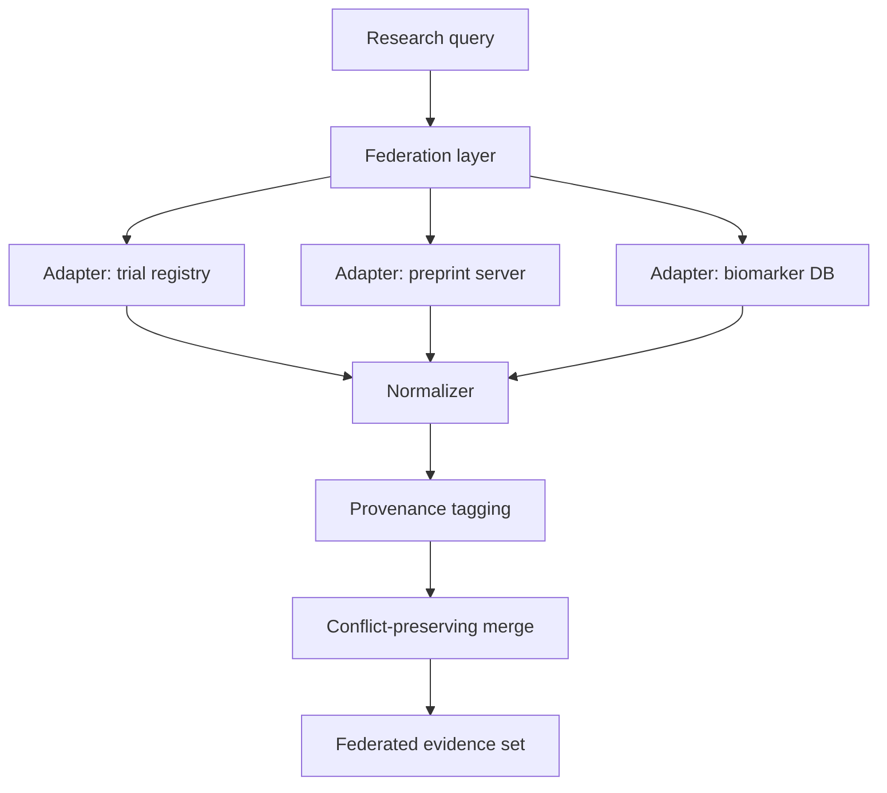

# A12 — Federated evidence retrieval across heterogeneous registries

**Question.** How can a longevity research platform query multiple independent evidence registries (clinical trial registries, preprint servers, curated biomarker databases) without centralizing raw data or assuming a shared schema?

**Method.** Each external registry is wrapped by an adapter that exposes a common query contract (topic, entity, time window) and returns typed evidence records with a provenance envelope. A federation layer fans out queries, applies per-source rate limits and timeouts, and merges results without deduplicating away conflicting findings — conflicts are surfaced, not resolved silently. No adapter is allowed to write back to a source; all federation is read-only.

**Reproducibility checks.** Record the exact query parameters and timestamp sent to each source; snapshot raw adapter responses in a fixture corpus; re-run the federation layer offline against fixtures and diff the merged output against a tagged release; verify that source disagreement is never silently averaged away.
---

**Author.** Ciprian Ștefan Pleșca — independent Romanian researcher.

**License.** Licensed under the Apache License, Version 2.0. You may not use this file except in compliance with the License. You may obtain a copy at http://www.apache.org/licenses/LICENSE-2.0. Distributed on an "AS IS" BASIS, WITHOUT WARRANTIES OR CONDITIONS OF ANY KIND, either express or implied.

---

**Project author: CIPRIAN ȘTEFAN PLEȘCA — cercetător român independent.**
