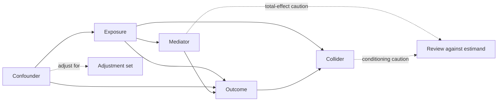

# A13 — Confounding structure and covariate adjustment

**Question.** When observational aging cohorts are compared, which variables should be adjusted for, and which adjustments introduce collider bias rather than removing confounding?

**Proposed method.** Define the causal estimand and an explicit assumed graph before selecting an adjustment set. Determine a sufficient set using the relevant graphical and identification criteria, rather than a universal rule based on isolated variable labels. A variable's role depends on the path and question; mediation and time-varying exposure require additional methods. OpenLongevity does not currently implement an automated causal-adjustment service.

## Scope and target question

Covariate adjustment is meaningful only in relation to a defined question and data-generation model. An analysis seeking a total intervention effect differs from one seeking a direct effect or a descriptive association. The same measured variable can play a different role under those questions. This note develops a proposed review record for adjustment decisions; it does not claim that drawing a diagram makes a causal interpretation valid.

Specify population, exposure contrast, outcome, time origin, and follow-up before choosing covariates. Record how each variable was measured and when it was available. A variable measured after the exposure is not interchangeable with a baseline measurement bearing a similar name. If the source does not establish timing or measurement meaning, preserve that uncertainty in the analysis record rather than select a convenient role automatically.

## Assumptions behind an adjusted contrast

For a simple baseline-exposure setting, an adjusted causal interpretation commonly invokes consistency, conditional exchangeability, and positivity under a stated covariate set. These assumptions concern the meaning of interventions, the comparability of exposure groups conditional on the chosen variables, and the availability of relevant exposure possibilities. They are not guaranteed by fitting a regression with many columns. Hernán and Robins' [Causal Inference: What If](https://miguelhernan.org/whatifbook) provides the methodological reference.

OpenLongevity's proposed contribution is to expose the assumptions and supporting reasoning beside an analysis. A report should say which assumptions follow from study design, which depend on subject-matter knowledge, and which remain especially uncertain. It should not produce an automatically approved adjustment set based solely on data availability or a statistical significance threshold. A graph expresses assumptions that can be challenged; it does not empirically certify that every relevant cause is represented.

## Roles are path-dependent

The illustrative diagram below includes a common cause, mediator, and collider in a simplified setting. It can explain why adjustment is not equivalent to adding every measured variable. It should not be read as a universal instruction never to include a variable with a particular label under every possible estimand. More complicated structures can require different identification strategies and a careful account of measurement timing.

For a proposed total-effect analysis, conditioning on a mediator can change the question being answered. A direct-effect question requires its own definition and assumptions rather than simply adding the mediator to an ordinary model. Similarly, conditioning on a collider can open a noncausal path in the relevant graph. These considerations should be examined at the path level and documented in the proposed adjustment rationale.

An instrument label also does not mean that a variable is an ordinary confounder to include automatically. Instrumental-variable reasoning has separate assumptions and targets. The project should avoid a single enum that turns complex causal roles into an unconditional inclusion rule. A useful interface would permit an analyst to state the relevant path, proposed role, and justification, with uncertainty and reviewer disagreement retained.

## Measurement quality and available covariates

Even an appropriate conceptual adjustment variable may be measured poorly or at the wrong time. A source can report a broad proxy where the analysis needs a more specific construct. Missingness can also affect which observations remain after adjustment. The review record should distinguish the conceptual variable in the graph from the actual measured field, including transformations and limitations of the mapping.

A large available dataset does not resolve unmeasured confounding by itself. Adding variables because they predict the outcome may serve a predictive task while answering a different causal question. Conversely, excluding a scientifically important variable because its sample association is weak can undermine an assumed adjustment strategy. Selection should be tied to the stated design and causal model rather than an automated search for the most favorable coefficient.

## Diagnostics and sensitivity analysis

Comparing adjusted and unadjusted estimates can reveal sensitivity to modeling choices, but a coefficient change does not prove that confounding was removed. Lack of change also does not prove its absence. The original proposal to refit with and without covariates is therefore best treated as a diagnostic exercise whose interpretation needs a prior rationale. Report the comparison without promoting it into a validation theorem.

Sensitivity analysis should identify the uncertain assumption and a plausible range or alternative model under examination. Explain why the alternative is relevant and what a changed result would mean. A collection of arbitrary reruns can create the appearance of robustness without investigating the central concern. Exploratory alternatives should be labeled so that a later reader can distinguish them from prespecified analyses.

Repeated exposures and time-varying confounders introduce additional complications, particularly when earlier exposure affects later covariates. The proposed baseline-adjustment template should reject or flag such a design as outside its simple scope rather than reuse the same formula automatically. A future longitudinal causal module would need a separate specification and reference evaluation; the current repository does not provide it.

## Proposed analysis record and review

Preserve the question, graph version, variable dictionary, measurement timing, chosen set, excluded candidates, and rationale. Link each choice to relevant source information or subject-matter reasoning. The record should also identify the model specification, missing-data handling, and evaluation artifacts. A reviewer needs enough context to contest the causal assumptions without reconstructing them from variable names in a code snippet.

Review should permit an unresolved state. If two plausible graphs imply different adjustment strategies, presenting one as verified can conceal an important scientific uncertainty. Retain the alternatives and show which conclusions depend on them. The project should not resolve disagreement through a navigation score or a majority label disconnected from the underlying assumptions.

## Acceptance criteria and limitations

Use synthetic causal structures to test whether a proposed interface preserves the declared graph, timing, and adjustment rationale. Include a mediator, collider, missing conceptual variable, and time-varying case. These tests establish representational and procedural behavior, not identification in a real cohort. Independent methodological review is still required for a substantive causal claim.

The [causal boundary note](04-causal-inference-boundary.md) explains the broader interpretation limits, and [model evaluation](09-model-evaluation.md) addresses a different predictive task. This note's contribution is a transparent adjustment-review protocol that makes assumptions contestable. It reports no implemented causal discovery engine, universally sufficient covariate list, or empirically validated adjustment recommendation for a particular aging cohort.

**Reproducibility checks.** Preserve the estimand, assumed graph, measured-variable mapping, and adjustment rationale. Compare alternative specifications as diagnostics, without treating coefficient changes as proof that confounding is eliminated. Identify time-varying or otherwise unsupported designs explicitly.
---

**Author.** Ciprian Ștefan Pleșca — independent Romanian researcher.

**License.** Licensed under the Apache License, Version 2.0. You may not use this file except in compliance with the License. You may obtain a copy at http://www.apache.org/licenses/LICENSE-2.0. Distributed on an "AS IS" BASIS, WITHOUT WARRANTIES OR CONDITIONS OF ANY KIND, either express or implied.

---

**Project author: CIPRIAN ȘTEFAN PLEȘCA — cercetător român independent.**
