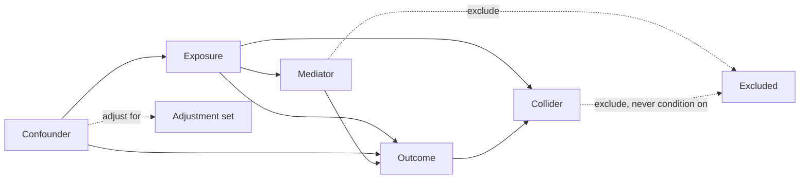

# A13 — Confounding structure and covariate adjustment

**Question.** When observational aging cohorts are compared, which variables should be adjusted for, and which adjustments introduce collider bias rather than removing confounding?

**Method.** Every covariate proposed for adjustment is first classified against an explicit causal diagram (confounder, mediator, collider, or instrument). Only confounders — variables affecting both exposure and outcome and not on the causal path between them — are entered into the adjustment set. Mediators and colliders are logged as excluded, with the reasoning attached to the analysis record so a reviewer can contest the classification.

**Reproducibility checks.** Publish the causal diagram alongside the adjustment set for every reported association; re-fit the model with and without each covariate and record the direction and magnitude of change; flag any adjustment set assembled without an explicit diagram as non-conforming.
---

**Author.** Ciprian Ștefan Pleșca — independent Romanian researcher.

**License.** Licensed under the Apache License, Version 2.0. You may not use this file except in compliance with the License. You may obtain a copy at http://www.apache.org/licenses/LICENSE-2.0. Distributed on an "AS IS" BASIS, WITHOUT WARRANTIES OR CONDITIONS OF ANY KIND, either express or implied.
