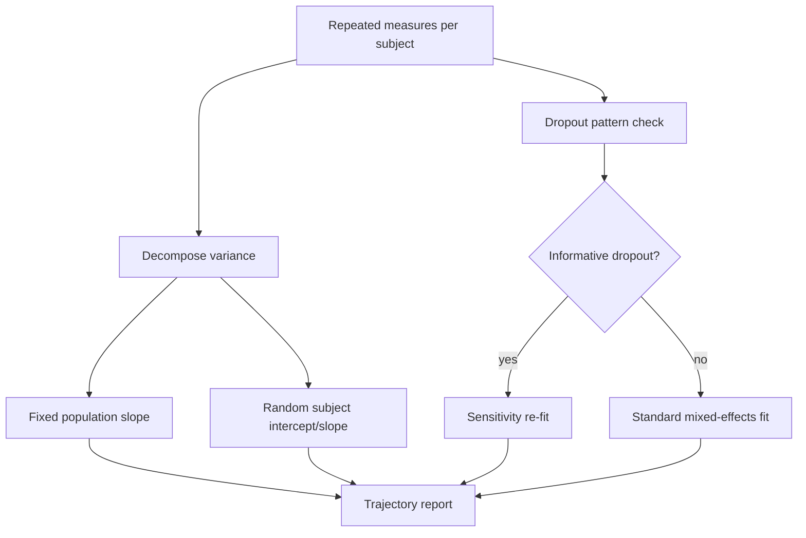

# A14 — Longitudinal biomarker trajectory modeling

**Question.** How should repeated biomarker measurements per individual be modeled so that within-person change is not confounded with between-person differences at baseline?

**Method.** Trajectories are fit with mixed-effects models that separate a fixed population-level slope from a random per-individual intercept and slope. Irregular visit spacing and informative dropout (individuals leaving the study for health-related reasons) are treated as modeling assumptions to be tested, not ignored. Sensitivity analyses re-fit the model under a missing-not-at-random assumption and report how conclusions shift.

**Reproducibility checks.** Report the number of measurements per subject and dropout rate; publish both the standard and sensitivity-analysis estimates side by side; re-run on a held-out simulated dataset with known ground-truth slopes to confirm the model recovers them.
---

**Author.** Ciprian Ștefan Pleșca — independent Romanian researcher.

**License.** Licensed under the Apache License, Version 2.0. You may not use this file except in compliance with the License. You may obtain a copy at http://www.apache.org/licenses/LICENSE-2.0. Distributed on an "AS IS" BASIS, WITHOUT WARRANTIES OR CONDITIONS OF ANY KIND, either express or implied.
