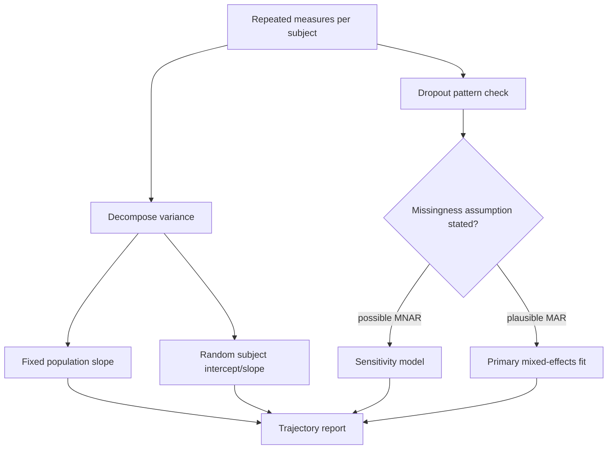

# A14 — Longitudinal biomarker trajectory modeling

**Question.** How should repeated biomarker measurements per individual be modeled so that within-person change is not confounded with between-person differences at baseline?

**Method.** Trajectories should be modeled with an explicit separation between population-level change and individual-level departure from that change. A mixed-effects specification is the default design target because it can represent a fixed mean trajectory while allowing each participant to have a distinct baseline and, where the data support it, a distinct slope. This file describes a proposed analytical protocol for future platform modules; it does not claim that OpenLongevity currently performs clinical longitudinal inference automatically.

**Reproducibility checks.** Report the number of measurements per subject and dropout rate; publish both the standard and sensitivity-analysis estimates side by side; re-run on a held-out simulated dataset with known ground-truth slopes to confirm the model recovers them.

## Analytical framing

Aging research often compares a biomarker measured once in older people with the same biomarker measured once in younger people. That comparison is useful for descriptive epidemiology, but it does not answer the longitudinal question: how fast does the biomarker change inside one person? The distinction matters because a cross-sectional age gradient can be produced by cohort effects, survival selection, medication history, laboratory drift, or baseline socioeconomic differences. A repeated-measure design gives stronger leverage on change, but only if the model keeps the within-person and between-person components visible.

The proposed OpenLongevity representation therefore treats every repeated measurement as a dated observation attached to a participant, an assay method, a laboratory context, and a provenance source. The minimum dataset for a trajectory analysis is not merely subject, time, and value. It also needs baseline age, visit date or time since baseline, units, specimen type, assay platform, batch indicator where available, and an explicit missingness note for visits that were planned but not observed. Without these fields, a trajectory graph can look polished while hiding the exact uncertainty that makes interpretation difficult.

## Model boundary

The standard mixed-effects form is a starting point, not a universal truth. A simple linear random-intercept and random-slope model may be defensible for a short follow-up window when measurement frequency is similar across participants and the biomarker is approximately linear over the observed range. It becomes weaker when trajectories bend, when interventions begin midway through follow-up, when batch corrections are applied after the fact, or when disease onset changes both the biomarker value and the probability of continued participation. For those cases, the document should require a model justification rather than a template answer.

The platform should store the estimand before it stores a fitted coefficient. Example estimands include annual within-person change in C-reactive protein, change in epigenetic age acceleration after a defined intervention window, or between-group difference in slope under an observational exposure contrast. A slope without an estimand is easy to plot and hard to interpret. A slope tied to a named population, time origin, biomarker definition, and censoring rule can be audited.

Missing data deserve special caution. A dataset cannot usually prove whether dropout is missing at random or missing not at random. It can show patterns that make one assumption more or less plausible: dropout clustered after adverse events, dropout higher among frailer participants, long gaps after hospitalization, or missingness tied to site-level disruption. The protocol should ask analysts to report these patterns and then run sensitivity analyses under alternative assumptions. The result is not a declaration that dropout has been solved; it is a transparent statement of how much the conclusion depends on a fragile assumption.

## Evidence fields

For each trajectory analysis, OpenLongevity should preserve a machine-readable design card with at least these fields: cohort identifier, participant count, median number of observations per participant, observation time span, biomarker definition, assay platform, preprocessing steps, time scale, primary model family, covariates included, missingness handling, sensitivity models, and code version. The design card should sit beside the plotted result so that a reader can see whether the curve came from dense follow-up or from sparse measurements connected by a smooth line.

Covariates also need provenance. Adjusting for baseline age, sex, site, and batch may be routine, but adjustment for time-varying disease state, medication, or body composition can change the scientific question. A model that adjusts for a variable affected by the intervention may estimate a controlled direct association rather than a total association. That may be appropriate, but it must be named. This keeps the platform aligned with the broader evidence-governance principle that a computational output should carry its assumptions, not merely its score.

## Reviewer questions

Human review should focus on questions that a model fit cannot answer alone. Did the cohort collect the biomarker in a way that supports longitudinal interpretation? Is the time origin biologically meaningful? Are visits sufficiently dense to support individual slopes, or only a population mean? Are extreme values genuine measurements or preprocessing artifacts? Does the graph invite causal interpretation where the underlying design is observational? These questions can be expressed as a review checklist and stored with the result.

The preferred report should show the primary estimate, interval estimate, participant count, measurement count, dropout summary, and at least one sensitivity estimate. If subgroup slopes are displayed, the subgroup definitions and sample sizes must appear beside them. The platform should avoid ranking biomarkers solely by the steepness of a trajectory, because steepness may reflect measurement scale, assay instability, or survivor bias. A slower or faster slope is not automatically better evidence of biological aging.

## Implementation path

The current repository contains foundational evidence models and documentation, but it does not yet implement a production longitudinal modeling engine. A credible implementation path would begin with fixture datasets where the true slope is known, then move to public longitudinal examples, then add storage for design cards, and only afterward expose trajectory reports to users. Each stage should have tests that verify the separation of participant-level records, model metadata, and rendered summaries.

For release readiness, the acceptance bar is deliberately high: no trajectory result should be shown without its measurement density, time scale, missingness summary, and method version. A future API response could include both a compact visualization payload and a fuller audit payload. The compact payload would serve the interface; the audit payload would serve reproducibility. That division would allow OpenLongevity to present longitudinal evidence clearly while staying honest about the methodological uncertainty behind every curve.
---

**Author.** Ciprian Ștefan Pleșca — independent Romanian researcher.

**License.** Licensed under the Apache License, Version 2.0. You may not use this file except in compliance with the License. You may obtain a copy at http://www.apache.org/licenses/LICENSE-2.0. Distributed on an "AS IS" BASIS, WITHOUT WARRANTIES OR CONDITIONS OF ANY KIND, either express or implied.

---

**Project author: CIPRIAN ȘTEFAN PLEȘCA — cercetător român independent.**
