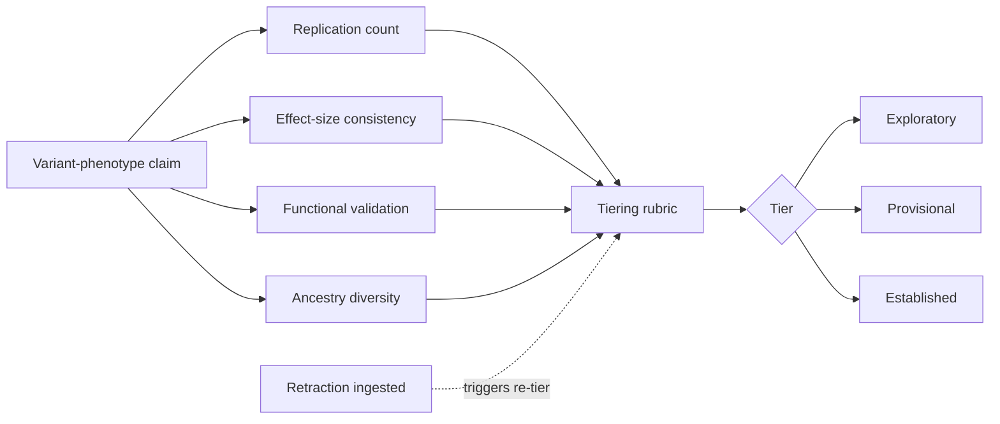

# A15 — Genomic variant evidence tiering

**Question.** How can a variant linked to a longevity- or aging-related phenotype be labeled with a tier that reflects the strength of supporting evidence rather than the confidence of a single study?

**Method.** Each variant-phenotype association is scored on independent axes — replication count, effect-size consistency across cohorts, functional validation status, and ancestry diversity of the supporting cohorts — and combined into a tier (exploratory, provisional, established) via a documented rubric rather than a black-box score. Tiers are re-evaluated whenever a new study or a retraction is ingested.

**Reproducibility checks.** Publish the rubric weights and thresholds; re-compute all tiers from raw inputs on every release and diff against the previous release; confirm a synthetic retraction event correctly demotes the affected tier in the fixture corpus.
---

**Author.** Ciprian Ștefan Pleșca — independent Romanian researcher.

**License.** Licensed under the Apache License, Version 2.0. You may not use this file except in compliance with the License. You may obtain a copy at http://www.apache.org/licenses/LICENSE-2.0. Distributed on an "AS IS" BASIS, WITHOUT WARRANTIES OR CONDITIONS OF ANY KIND, either express or implied.
