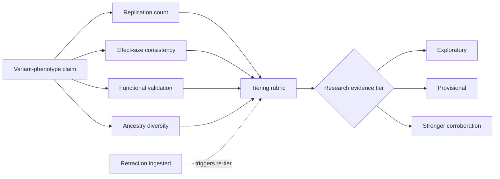

# A15 — Genomic variant evidence tiering

**Question.** How can a variant linked to a longevity- or aging-related phenotype be labeled with a tier that reflects the strength of supporting evidence rather than the confidence of a single study?

**Method.** Each variant-phenotype association should be evaluated on independent axes: replication count, effect-size consistency across cohorts, functional validation status, ancestry and geography coverage, phenotype comparability, and data-source provenance. The tier is a research-evidence label, not a clinical pathogenicity label. It describes how well a claim is supported inside the OpenLongevity corpus and must be re-evaluated whenever a new study, correction, or retraction is ingested.

**Reproducibility checks.** Publish the rubric weights and thresholds; re-compute all tiers from raw inputs on every release and diff against the previous release; confirm a synthetic retraction event correctly demotes the affected tier in the fixture corpus.

## Scientific boundary

Longevity genetics is vulnerable to attractive overstatement. A variant may be associated with exceptional survival in one cohort, weakly associated with a biomarker in another, absent in a third, and experimentally plausible in a cell model. Those signals are not equivalent to a validated human intervention target. The OpenLongevity tiering system should therefore avoid language that implies clinical actionability, personal genetic advice, or deterministic prediction. A tier is a map of evidence maturity, not a verdict about an individual's future health.

The first methodological requirement is harmonization. Variant identifiers must be mapped to a reference genome build, effect alleles must be oriented consistently, and linkage disequilibrium must be considered before claims from nearby variants are treated as the same claim. A study reporting a lead single-nucleotide polymorphism and a study reporting a proxy variant may be discussing the same locus, but they are not automatically the same evidence item. The document should ask for explicit locus mapping and record the mapping method.

Phenotype definition is just as important. "Longevity" can mean survival past a percentile, parental lifespan, health span, disease-free survival, biological-age residual, or a biomarker proxy. A variant associated with parental lifespan should not be placed in the same evidence bucket as a variant associated with epigenetic age acceleration unless the comparison is labeled as cross-phenotype evidence. Otherwise, the platform risks turning a graph of related concepts into a false chain of proof.

## Tier rubric

An exploratory tier should be assigned when a claim appears in a limited source set, has weak replication, or depends heavily on one cohort or one phenotype definition. Provisional evidence should require at least some independent replication, compatible direction of effect, and enough metadata to compare populations and methods. Stronger corroboration should require replication across independent datasets, transparent phenotype definitions, a stable effect direction, and either mechanistic support or a careful explanation of why mechanistic support is absent. Even this highest research tier should not be called clinical validation.

The rubric should be deterministic once inputs are fixed. That does not mean the rubric is perfectly objective; it means a reviewer can re-run the exact inputs and obtain the same tier. Subjective review remains important, especially when cohort overlap is possible, ancestry categories are too broad, or functional evidence comes from a model system far from the human phenotype. The reviewer should be able to override an automatic provisional tier downward when the evidence is internally inconsistent, and that override should be stored with a reason.

Ancestry diversity should not be reduced to a public-relations checkbox. Genetic association results often transfer unevenly across populations because allele frequency, linkage disequilibrium structure, environmental context, and ascertainment differ. The platform should record the ancestry descriptors used by the source while noting that these descriptors are social and methodological approximations, not biological absolutes. A claim supported only by a narrow population group may still be scientifically valuable, but its generalization boundary must be explicit.

## Data model

A practical record should include variant identifier, genome build, reference and effect alleles, locus mapping notes, phenotype label, phenotype definition, effect estimate, uncertainty interval, sample size, population descriptors, study design, source identifier, replication relationship, and correction or retraction status. Functional evidence should be stored as a separate linked record with its own model system, assay, perturbation, and limitations. This separation prevents a cell assay from being silently merged into human association evidence.

The tiering engine should also retain negative evidence. If a high-quality replication study fails to detect the association, the absence belongs in the record. Evidence maps become misleading when they store only positive findings. A balanced tiering report should show supporting, conflicting, and non-replicating studies, with study size and design visible. The goal is not to protect a favored claim; it is to make the evidence legible enough for researchers to challenge it.

The same principle applies to uncertainty intervals and effect direction. A small effect with a narrow interval may be more reproducible than a dramatic effect from a small cohort, but neither should be promoted without context. The tiering card should show whether the estimated direction is stable across cohorts and whether the intervals are compatible with trivial, moderate, or large effects. This prevents the tier from becoming a decorative badge detached from the numerical evidence.

## Governance

Every tier change should produce a changelog entry. If a new genome-wide association study strengthens a claim, the changelog should identify the study and the field that changed. If a correction modifies an effect allele or phenotype definition, the system should show that the previous tier was based on an older interpretation. If a retraction removes a key source, the tier should be recomputed and the user interface should show the removal rather than quietly rewriting history.

For OpenLongevity's current maturity, this file defines a target protocol rather than a completed genetics engine. The acceptance criterion for a future implementation is not merely that it can assign labels. It must be able to explain each label, regenerate labels from versioned inputs, preserve conflicting evidence, distinguish association from causation, and display the limits of transfer across populations. That level of discipline is what makes the tier useful to researchers instead of just decorative metadata.
---

**Author.** Ciprian Ștefan Pleșca — independent Romanian researcher.

**License.** Licensed under the Apache License, Version 2.0. You may not use this file except in compliance with the License. You may obtain a copy at http://www.apache.org/licenses/LICENSE-2.0. Distributed on an "AS IS" BASIS, WITHOUT WARRANTIES OR CONDITIONS OF ANY KIND, either express or implied.

---

**Project author: CIPRIAN ȘTEFAN PLEȘCA — cercetător român independent.**
