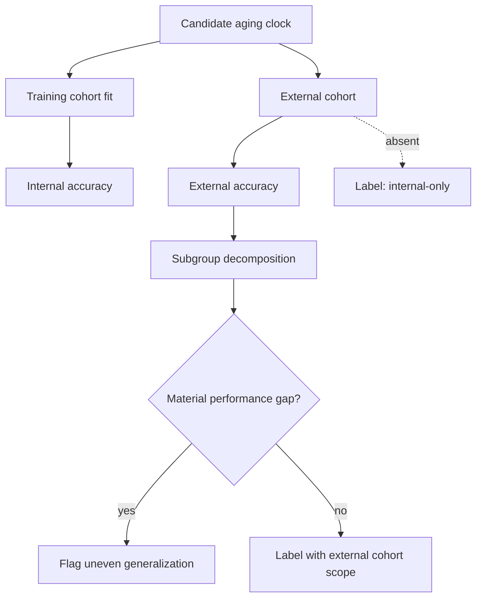

# A16 — Aging clock benchmarking and out-of-cohort generalization

**Question.** When a biological-age predictor ("aging clock") reports high accuracy on its training cohort, how should the platform assess whether that accuracy generalizes to a different population?

**Method.** Every aging-clock candidate should be evaluated against a clearly stated target: chronological-age prediction, mortality-risk association, disease-risk association, intervention responsiveness, or another pre-specified endpoint. External validation is required before a model is described as externally benchmarked. Accuracy is decomposed by subgroup and cohort context so that an aggregate score cannot hide uneven performance.

**Reproducibility checks.** Freeze the external cohort split before evaluation; publish per-subgroup error alongside the aggregate; re-run the benchmark on a newly released cohort each year and track drift over time.

## Why the target matters

Aging clocks are often discussed as if they measure one thing. In practice, they can be optimized for different targets. A model trained to predict chronological age may be technically accurate while saying little about intervention response. A model associated with mortality risk may not be well calibrated for younger adults. A model that changes after an intervention may be detecting inflammation, blood-cell composition, batch effects, or true biological change. OpenLongevity should therefore require every clock report to state the target, training data, feature type, and intended interpretation before presenting a score.

The benchmark should avoid the phrase "biological age" as a standalone claim unless the evidence supports a specific definition. A clock output can be called an estimated age-like score, an age-acceleration residual, or a risk-associated biomarker model depending on its construction. The language matters because users may otherwise treat a number as a direct statement about lifespan. Scientific documentation should make the score's origin and limits visible.

## Benchmark design

External validation means more than evaluating on a random split from the same dataset. The external cohort should differ by collection site, recruitment process, processing pipeline, calendar period, or population context. When no such cohort is available, the model can be reported as internally tested, cross-validated, or held-out within the source context, but it should not receive an external-generalization label. This distinction protects the platform from treating internal performance as evidence of broad applicability.

The benchmark card should record training cohort, tuning cohort if any, external cohort, sample size, feature modality, preprocessing pipeline, missing-feature handling, target endpoint, error metric, calibration metric where relevant, and subgroup metrics. For chronological-age prediction, common metrics such as mean absolute error and root mean squared error are useful, but they do not fully describe scientific value. A clock can have low error because the cohort age range is wide, while performing poorly in the age band of practical interest. The report should therefore show age distribution and subgroup sample sizes alongside the error.

Leakage is a central risk. If samples from the same participant, family, batch, site, or study wave appear in both training and testing, the apparent accuracy can be inflated. The protocol should require leakage checks at participant, cohort, and processing-batch levels. When public datasets are reused across multiple clocks, the documentation should also ask whether the external cohort may have influenced model design indirectly. Complete proof is difficult, but a structured disclosure is still better than silence.

## Generalization and fairness

Subgroup evaluation is not a ceremonial step. If a clock performs well on the majority subgroup and poorly on a smaller group, the aggregate error can appear acceptable while the tool is unreliable for people least represented in the data. The benchmark should decompose performance by sex, age band, ancestry descriptor where available and ethically appropriate, disease status, and major technical variables such as tissue type or assay platform. The report should also state when subgroup sample sizes are too small for stable inference.

Absence of a detected subgroup gap is not proof of fairness. It may reflect low power, noisy measurements, broad categories, or missing metadata. The correct label is closer to "no material gap detected under the available evaluation," not "equitable." The platform should record confidence intervals or uncertainty ranges for subgroup metrics and should flag cases where the data are insufficient to evaluate a subgroup. A mature benchmark says what it can test and what remains untested.

## Intervention interpretation

For longevity interventions, aging clocks create a temptation to treat score reduction as evidence of rejuvenation. OpenLongevity should resist that shortcut. A clock may move in response to lifestyle, medication, inflammation, cellular composition, or technical artifacts. A benchmark that evaluates chronological-age prediction does not automatically validate intervention sensitivity. If a clock is used in an intervention context, the documentation should require a separate evidence line: biological plausibility, measurement stability, short-term variability, endpoint relevance, and comparison with clinical or functional outcomes.

The platform should store intervention analyses separately from clock benchmark cards. A benchmark card asks whether the model performs as claimed on external data. An intervention card asks whether changes in the model output under a specific exposure are meaningful. Combining these into one badge would create a misleading single score. Keeping them separate gives reviewers space to say, for example, that a clock is technically reproducible but not yet interpretable as evidence of benefit for a particular intervention.

## Implementation path

The current repository includes a simple biological-age modeling example and documentation, not a validated clock benchmark suite. A professional implementation should begin with small reproducible fixtures that test metric calculation, cohort partitioning, subgroup reporting, and leakage rejection. The next stage should add benchmark manifests for public datasets, with hashes and preprocessing notes. Only after those stages should the platform expose clock comparison tables.

The acceptance standard is intentionally strict: a clock should not be ranked without its target, cohort scope, feature modality, metric, uncertainty, subgroup coverage, and external-validation status. A future OpenLongevity interface can still be clear and attractive, but the underlying report must remain auditable. This is the difference between a scientific benchmark and a leaderboard that rewards whichever model happens to look best on an easy split.
---

**Author.** Ciprian Ștefan Pleșca — independent Romanian researcher.

**License.** Licensed under the Apache License, Version 2.0. You may not use this file except in compliance with the License. You may obtain a copy at http://www.apache.org/licenses/LICENSE-2.0. Distributed on an "AS IS" BASIS, WITHOUT WARRANTIES OR CONDITIONS OF ANY KIND, either express or implied.

---

**Project author: CIPRIAN ȘTEFAN PLEȘCA — cercetător român independent.**
