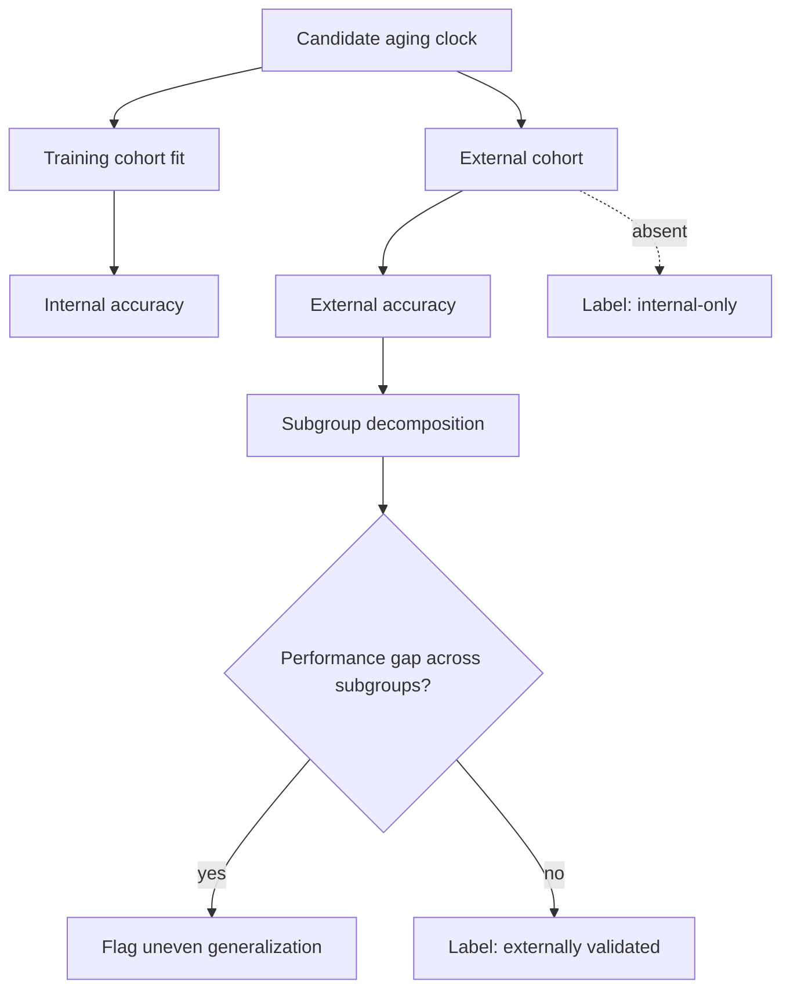

# A16 — Aging clock benchmarking and out-of-cohort generalization

**Question.** When a biological-age predictor ("aging clock") reports high accuracy on its training cohort, how should the platform assess whether that accuracy generalizes to a different population?

**Method.** Every clock is evaluated on at least one external cohort it was not trained or tuned on, using a fixed, pre-registered error metric. Accuracy is decomposed by subgroup (sex, ancestry, age band) to detect uneven performance masked by an aggregate score. Clocks lacking an external validation cohort are labeled "internally validated only" rather than presented alongside externally validated ones.

**Reproducibility checks.** Freeze the external cohort split before evaluation; publish per-subgroup error alongside the aggregate; re-run the benchmark on a newly released cohort each year and track drift over time.
---

**Author.** Ciprian Ștefan Pleșca — independent Romanian researcher.

**License.** Licensed under the Apache License, Version 2.0. You may not use this file except in compliance with the License. You may obtain a copy at http://www.apache.org/licenses/LICENSE-2.0. Distributed on an "AS IS" BASIS, WITHOUT WARRANTIES OR CONDITIONS OF ANY KIND, either express or implied.
