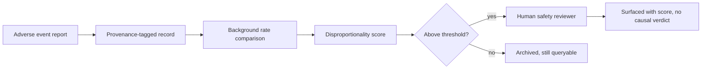

# A17 — Adverse event and safety signal surfacing

**Question.** How should the platform surface safety signals for a longevity intervention without either burying rare serious events in aggregate statistics or overstating an unreplicated single report?

**Method.** Adverse event reports are kept as discrete, provenance-tagged records rather than pre-collapsed into a summary rate. A signal-detection layer flags disproportionate reporting relative to a background rate, but every flagged signal is routed to human review before being displayed with any severity label. No automated system assigns a causal verdict to an adverse event; the platform surfaces the report and its disproportionality score, not a conclusion.

**Reproducibility checks.** Log every threshold crossing and the reviewer decision; replay historical adverse-event streams through the detector to confirm known signals are still flagged; confirm no code path auto-labels an event as "caused by" the intervention.
---

**Author.** Ciprian Ștefan Pleșca — independent Romanian researcher.

**License.** Licensed under the Apache License, Version 2.0. You may not use this file except in compliance with the License. You may obtain a copy at http://www.apache.org/licenses/LICENSE-2.0. Distributed on an "AS IS" BASIS, WITHOUT WARRANTIES OR CONDITIONS OF ANY KIND, either express or implied.

---

**Project author: CIPRIAN ȘTEFAN PLEȘCA — cercetător român independent.**
