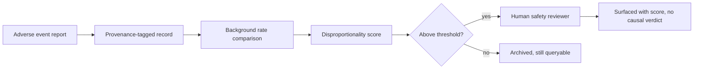

# A17 — Adverse event and safety signal surfacing

**Question.** How should the platform surface safety signals for a longevity intervention without either burying rare serious events in aggregate statistics or overstating an unreplicated single report?

**Method.** Adverse event reports are kept as discrete, provenance-tagged records rather than pre-collapsed into a summary rate. A signal-detection layer flags disproportionate reporting relative to a background rate, but every flagged signal is routed to human review before being displayed with any severity label. No automated system assigns a causal verdict to an adverse event; the platform surfaces the report and its disproportionality score, not a conclusion.

**Reproducibility checks.** Log every threshold crossing and the reviewer decision; replay historical adverse-event streams through the detector to confirm known signals are still flagged; confirm no code path auto-labels an event as "caused by" the intervention.

## Safety boundary

Safety evidence must be handled with a different temperament from benefit evidence. A platform may summarize potential benefit cautiously and still cause harm if it buries a rare serious adverse event behind an attractive mean effect. At the same time, a single unverified adverse event report can become misleading if displayed as causal proof. OpenLongevity should therefore treat safety signals as structured alerts that demand context, provenance, and human review.

The central distinction is between a report, a signal, and a causal conclusion. A report says that an event was observed or described in a source. A signal says that the event appears more frequent, more severe, or more patterned than expected under a stated comparison. A causal conclusion would say that the intervention produced the event. This document limits the platform to the first two categories unless a qualified external source already provides a reviewed causal assessment. OpenLongevity should preserve that source's wording and still label the provenance.

## Record design

Every adverse-event record should contain the intervention name, dose or exposure details where available, population context, event term, seriousness indicator, source type, denominator if known, comparator if known, report date, provenance URL or identifier, extraction method, and review status. The record should also state whether the source is a clinical trial, observational study, case report, regulator database, product label, or review article. A case report and a randomized trial safety table are both evidence, but they do not support the same inference.

Denominators are often missing. A spontaneous reporting database may contain many reports without knowing how many people were exposed. A clinical trial may provide denominators but be too small or too short to detect rare harms. A review may aggregate events from heterogeneous sources. The platform should not force these into one rate. Instead, it should show the type of denominator available and, when none exists, explicitly label the rate as not estimable from the source.

## Signal logic

Disproportionality scoring can help prioritize review, but it is not a diagnosis. Scores can be distorted by stimulated reporting, media attention, duplicate reports, reporting-country differences, disease severity, co-medication, or changes in surveillance over time. The detector should therefore produce a review queue, not a public severity label. If a threshold is crossed, the interface should say that the item requires review or has been reviewed, not that harm has been proven.

The threshold itself should be versioned. A signal-detection release must record the event vocabulary, background comparison, minimum count, disproportionality metric, duplicate handling, and threshold. Changing any of these can change which events are flagged. The changelog should make such changes visible because a researcher comparing releases needs to know whether a new safety signal emerged from new evidence or from a different detector.

## Human review

Human safety review should ask whether the event term is well mapped, whether duplicate reports are likely, whether temporality is plausible, whether the population is comparable to the intended population, whether the event is already known, and whether the source contains a denominator. The reviewer should also mark uncertainty. A reviewed signal may be labeled as under review, plausible signal, weak signal, insufficient context, duplicate-prone, or known labeled event, depending on the evidence model adopted later.

The platform should store reviewer identity, timestamp, decision, rationale, and any source links used during review. This is not bureaucratic decoration; it prevents silent reinterpretation. If a future reviewer disagrees, the system should retain both the previous decision and the new decision as versioned review events. Safety governance depends on memory.

## Display principle

The safest public display is plain and contextual. A signal card should show the event, source count, source types, seriousness if available, denominator status, review status, and a direct link to provenance. It should avoid dramatic color language unless severity has been established by a credible reviewed source. A rare fatal report and a mild transient laboratory abnormality should not share the same visual weight.

OpenLongevity should also support negative safety context: trials that monitored adverse events and did not observe a particular event should be queryable. Absence in a small trial is not proof of safety, but it is still part of the evidence map. A balanced safety module should show what was looked for, what was found, and what the available data could not detect.

Safety displays should also preserve time. An adverse event reported during exposure, after discontinuation, or months later carries different interpretive weight. The platform should record timing when available and avoid collapsing all events into a timeless count. Temporal proximity is not proof of causation, but loss of temporal information makes later review much weaker.

## Implementation maturity

The current repository does not yet implement a full pharmacovigilance system. This file defines the academic and product bar for future work. The first implementation should use fixture streams with known duplicates, known denominators, missing denominators, and synthetic threshold crossings. Tests should verify that no automated path converts a signal into a causal verdict. Later stages can add controlled vocabularies, reviewer workflows, and provenance dashboards. Until then, safety documentation should remain precise about scope: surfacing and structuring evidence is not the same as regulatory safety evaluation.
---

**Author.** Ciprian Ștefan Pleșca — independent Romanian researcher.

**License.** Licensed under the Apache License, Version 2.0. You may not use this file except in compliance with the License. You may obtain a copy at http://www.apache.org/licenses/LICENSE-2.0. Distributed on an "AS IS" BASIS, WITHOUT WARRANTIES OR CONDITIONS OF ANY KIND, either express or implied.

---

**Project author: CIPRIAN ȘTEFAN PLEȘCA — cercetător român independent.**
