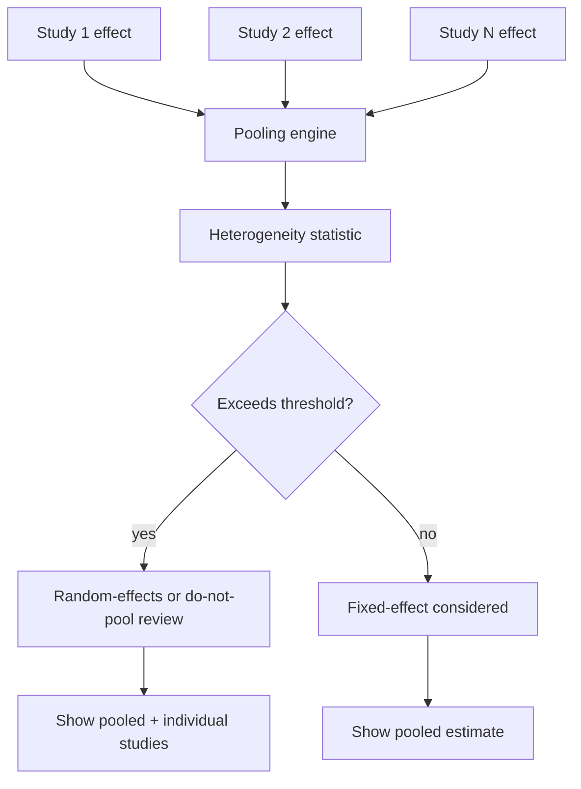

# A18 — Meta-analysis heterogeneity and pooled effect reporting

**Question.** When the platform pools effect estimates across multiple studies on the same aging-related outcome, how should it avoid presenting a single pooled number that hides substantial disagreement between studies?

**Method.** Pooling should always report heterogeneity, study-level estimates, uncertainty intervals, and the model choice. A threshold can guide interpretation, but it should not be the only reason for choosing a model. Study design, outcome comparability, population similarity, measurement timing, and risk of bias must also be visible before a pooled estimate is treated as meaningful.

**Reproducibility checks.** Publish the heterogeneity statistic and the model choice for every pooled result; re-pool after adding or excluding one study at a time (leave-one-out) and report how sensitive the pooled estimate is; never display a pooled number without its heterogeneity statistic.

## Interpretation boundary

Meta-analysis can make evidence look more certain than it is. A single pooled number has rhetorical force, especially in a domain like aging where readers want a clear answer about an intervention, biomarker, or mechanism. The OpenLongevity standard should make the pooled number secondary to the evidence structure that produced it. If the included studies differ too much, the honest output may be a structured narrative or a stratified table rather than one combined estimate.

Heterogeneity is not a nuisance to be hidden after the calculation. It is a scientific observation. Studies may disagree because populations differ, interventions differ, follow-up time differs, biomarkers were measured differently, or one or more studies have substantial bias. The platform should treat disagreement as information that can generate research questions. A high heterogeneity value should ask: which design features explain the spread, and is pooling still justified?

## Minimum data requirements

No study should enter a pooled estimate without an effect estimate, uncertainty estimate or sufficient data to derive one, outcome definition, population descriptor, intervention or exposure descriptor, comparator, follow-up interval, study design, and provenance. If these fields are incomplete, the study can remain in an evidence table but should be excluded from quantitative pooling until the missing elements are resolved. This distinction lets the platform be inclusive in evidence discovery while conservative in statistical synthesis.

The outcome scale must be aligned. A standardized mean difference, hazard ratio, odds ratio, mean change, and correlation coefficient are not interchangeable simply because they all concern aging. Transformations may be possible, but each transformation introduces assumptions. The documentation should require the transformation method, direction convention, and any imputation rule to be stored with the pooled result. Otherwise, a pooled estimate can become impossible to reproduce.

Study overlap also needs explicit handling. Two papers can analyze the same cohort, a later paper can extend an earlier follow-up, and a review can repackage data already present in primary studies. If overlapping evidence is counted twice, precision is overstated and the pooled result becomes more confident than the underlying data justify. OpenLongevity should record cohort identifiers, recruitment windows, and overlap notes whenever they can be determined, and unresolved overlap should be visible as a limitation.

## Model choice

A fixed-effect model estimates a common effect under assumptions that can be too strong for heterogeneous biomedical literature. A random-effects model allows study-level variation but does not automatically solve incomparability. If studies differ in ways that make the target effect undefined, a random-effects result can still be misleading. Therefore, OpenLongevity should allow a "do not pool" decision when studies are conceptually incompatible.

The report should show heterogeneity statistics such as I-squared or tau-squared where appropriate, but it should also show the number of studies and participants. Heterogeneity estimates are unstable with few studies. A low heterogeneity value from two small studies should not be celebrated as strong consistency. The platform should display uncertainty around heterogeneity or a warning that the statistic is imprecise when the study count is low.

## Sensitivity and bias

Leave-one-out analysis is a useful first sensitivity check because it shows whether a pooled result depends on a single study. It is not enough. The platform should also support sensitivity views by study design, risk-of-bias category, follow-up length, source type, and outcome definition. A pooled result that survives all studies but collapses when only randomized evidence is considered tells a different story from a result that remains stable across designs.

Publication bias and selective reporting are hard to solve computationally, but they should not be ignored. When a synthesis includes enough studies for small-study-effect diagnostics, the report should include the diagnostic and its limitation. When there are too few studies, the report should say that the diagnostic is not reliable. OpenLongevity's obligation is to make the evidentiary situation clear, not to manufacture certainty where the literature is thin.

Risk-of-bias information should travel with the pooled result. A synthesis dominated by unblinded, short, or selectively reported studies has a different meaning from one built on pre-registered randomized trials with complete outcome reporting. The platform should not hide that distinction behind the same visual treatment.

## Display and governance

Every pooled estimate should link to the study list that produced it. The user should be able to see which studies were included, which were excluded, and why. Exclusion reasons should be structured: incompatible outcome, insufficient data, duplicate cohort, retracted source, wrong population, or unresolved extraction issue. This creates a reproducible audit trail and helps future contributors improve the synthesis.

A forest-style listing should remain visible whenever quantitative synthesis is shown. The individual estimates are not supporting decoration; they are the evidence. The platform should also show the pooled estimate's release version and method version. If a correction changes an extracted standard error or a retraction removes a study, the pooled estimate should be regenerated and the changelog should identify the exact reason.

## Current maturity

The repository does not yet contain a full meta-analysis engine. This document defines the acceptance standard for one. The first credible implementation would parse fixture studies, compute a transparent pooled estimate, reject incompatible outcomes, produce a forest-data payload, and preserve an inclusion ledger. Only after those mechanics are tested should OpenLongevity expose pooled conclusions in public views. In the meantime, evidence summaries should remain careful and should not imply that the current platform has performed validated quantitative synthesis.
---

**Author.** Ciprian Ștefan Pleșca — independent Romanian researcher.

**License.** Licensed under the Apache License, Version 2.0. You may not use this file except in compliance with the License. You may obtain a copy at http://www.apache.org/licenses/LICENSE-2.0. Distributed on an "AS IS" BASIS, WITHOUT WARRANTIES OR CONDITIONS OF ANY KIND, either express or implied.

---

**Project author: CIPRIAN ȘTEFAN PLEȘCA — cercetător român independent.**
