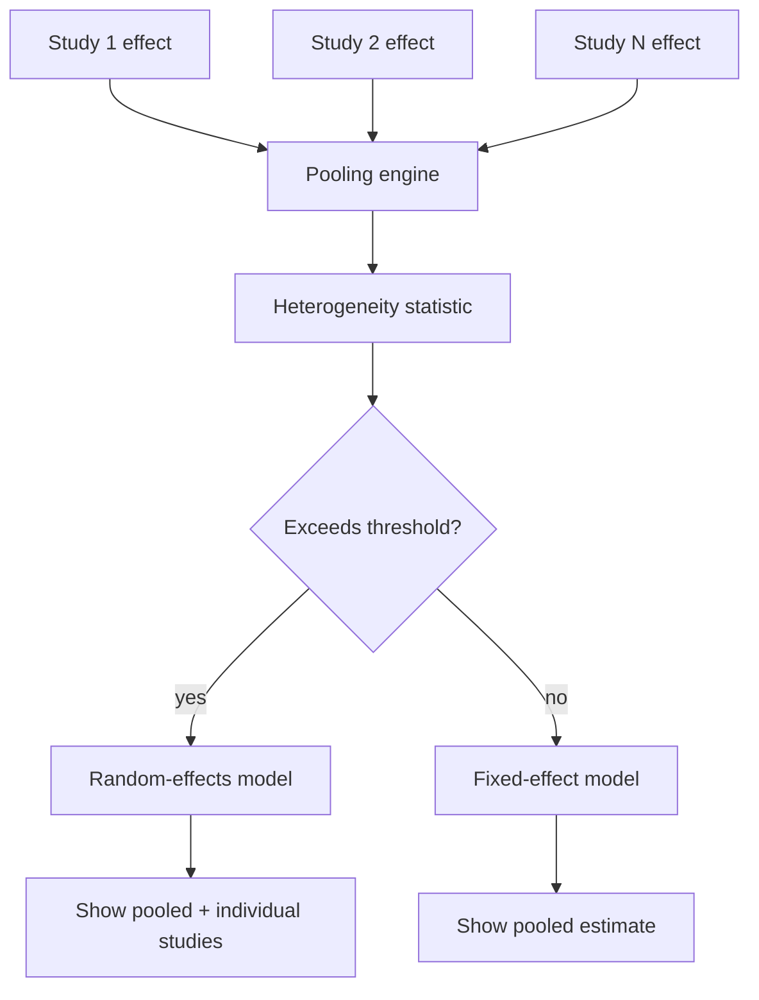

# A18 — Meta-analysis heterogeneity and pooled effect reporting

**Question.** When the platform pools effect estimates across multiple studies on the same aging-related outcome, how should it avoid presenting a single pooled number that hides substantial disagreement between studies?

**Method.** Pooling always reports a heterogeneity statistic alongside the pooled estimate, and a fixed heterogeneity threshold determines whether a random-effects or fixed-effect model is used. When heterogeneity exceeds the threshold, the platform additionally displays the individual study estimates in a forest-style listing rather than only the pooled number, so a reader can see the spread the pooling summarizes.

**Reproducibility checks.** Publish the heterogeneity statistic and the model choice for every pooled result; re-pool after adding or excluding one study at a time (leave-one-out) and report how sensitive the pooled estimate is; never display a pooled number without its heterogeneity statistic.
---

**Author.** Ciprian Ștefan Pleșca — independent Romanian researcher.

**License.** Licensed under the Apache License, Version 2.0. You may not use this file except in compliance with the License. You may obtain a copy at http://www.apache.org/licenses/LICENSE-2.0. Distributed on an "AS IS" BASIS, WITHOUT WARRANTIES OR CONDITIONS OF ANY KIND, either express or implied.
