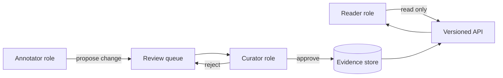

# A19 — Access control and researcher role model

**Question.** How should the platform separate read access to public evidence from write access to curated annotations, so that a compromised or careless account cannot silently alter the evidence base?

**Method.** Roles are separated into reader, annotator, and curator, each with a distinct capability set. Annotators can propose changes to curated records but cannot publish them directly; curators approve or reject proposals, and every approval is attached to the curator's identity and a timestamp. Readers, the default role, have no write path at all — the boundary is enforced at the API layer, not only in the user interface.

**Reproducibility checks.** Attempt a direct write from an annotator account against the API in a test environment and confirm it is rejected; audit that every accepted change in the evidence store has an attached curator identity and timestamp; re-verify role boundaries after every API version change.

## Security purpose

Access control in a scientific evidence platform is not only a software-security feature. It is part of research integrity. If an account can silently rewrite an evidence record, change a confidence label, remove a limitation, or approve its own annotation, the platform loses the auditability that makes it valuable. OpenLongevity should therefore treat role design as a scholarly control, comparable to provenance, citation, and versioning.

The default posture should be that public evidence is broadly readable while curated writes are narrow, reviewed, and logged. This matches the project's open-science ambition without confusing openness with uncontrolled mutation. Open data can be open to read and still protected from unreviewed edits. The platform should make that distinction visible in documentation, API contracts, and tests.

## Role definitions

The reader role is the baseline. A reader can query public records, view provenance, inspect release metadata, and download published artifacts where licensing allows. A reader cannot create annotations, alter review status, trigger ingestion, or modify release tags. This role should require the least trust and should be safe for public use.

The annotator role is a contributor role. An annotator can propose corrections, submit evidence notes, flag extraction errors, and suggest links between records. The annotator cannot publish those changes directly to the canonical store. The proposal should enter a queue with structured fields: target record, proposed change, reason, source, submitter, timestamp, and conflict status. This gives collaborators a meaningful path to contribute while preserving the review boundary.

The curator role is a publishing role. A curator can accept, reject, or request revision on proposals. A curator action must be attached to identity, timestamp, release context, and rationale. Curators should not be able to erase prior decisions; they can supersede them. This distinction matters when a later correction reveals that an accepted annotation was wrong. The history should show the platform learning, not pretending the earlier state never existed.

Administrative privileges should be separated from scientific curation. An infrastructure administrator may manage keys, deployments, and service health, but that should not automatically grant authority to approve scientific evidence. Likewise, a scientific curator should not automatically control infrastructure secrets. Separation reduces damage when one account is compromised and clarifies responsibility when an audit asks who approved what.

## API enforcement

Role boundaries must be enforced at the API and data layer, not only in the user interface. A hidden button is not a security control. Tests should call write endpoints directly with reader and annotator credentials and confirm rejection. Database-level constraints or service-level authorization checks should prevent unreviewed writes even if a future interface bug exposes a form.

Every write-capable endpoint should declare the required role in documentation and should emit an audit event on success or rejection. Rejections are useful evidence during security review because they show that controls are being exercised. The audit log should record principal, role, endpoint, target record, action, result, timestamp, and request identifier, while avoiding unnecessary storage of sensitive credentials or payloads.

## Review workflow

The review queue should support conflict detection. If two annotators propose different corrections to the same field, the curator should see both proposals rather than whichever arrived last. If a record has changed since the proposal was submitted, the queue should mark the proposal as stale and ask for re-evaluation. This prevents old corrections from being applied to a newer record with different content.

The workflow should also require reason codes. A curator rejecting a proposal because it lacks a source is different from rejecting it because the source is out of scope or because the proposed claim is already represented elsewhere. Structured reason codes help future contributors learn what standard is being applied. They also help maintainers audit whether curation decisions are consistent across topics.

## Threat model

The main threats are unauthorized write access, compromised curator accounts, self-approval, silent deletion, privilege creep, and accidental broad permissions during rapid development. The role model should respond with least privilege, multi-step review for canonical changes, immutable audit logs, periodic access review, and tests that fail when a role gains a new capability without explicit documentation.

For public collaboration, abuse resistance matters too. The system should rate-limit proposal submission, require provenance links, and support moderation of spam or malicious content. These controls should be proportionate: they should protect the platform without creating an opaque gatekeeping culture. OpenLongevity can be open and still insist that canonical evidence changes pass a documented standard.

## Current maturity

The repository currently contains public APIs and governance documentation, but it does not yet implement a complete multi-role curation system. This file defines the target behavior. A future release should begin with role fixtures and endpoint tests, then add proposal storage, then add curator decisions and audit logs. The acceptance bar is simple to state and demanding to implement: no canonical evidence mutation without an authorized role, a review decision, a timestamp, and a preserved history.
---

**Author.** Ciprian Ștefan Pleșca — independent Romanian researcher.

**License.** Licensed under the Apache License, Version 2.0. You may not use this file except in compliance with the License. You may obtain a copy at http://www.apache.org/licenses/LICENSE-2.0. Distributed on an "AS IS" BASIS, WITHOUT WARRANTIES OR CONDITIONS OF ANY KIND, either express or implied.

---

**Project author: CIPRIAN ȘTEFAN PLEȘCA — cercetător român independent.**
