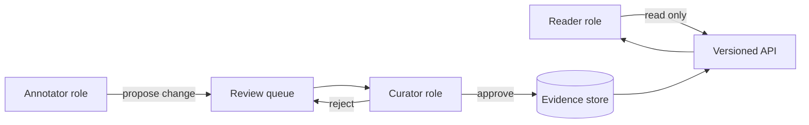

# A19 — Access control and researcher role model

**Question.** How should the platform separate read access to public evidence from write access to curated annotations, so that a compromised or careless account cannot silently alter the evidence base?

**Method.** Roles are separated into reader, annotator, and curator, each with a distinct capability set. Annotators can propose changes to curated records but cannot publish them directly; curators approve or reject proposals, and every approval is attached to the curator's identity and a timestamp. Readers, the default role, have no write path at all — the boundary is enforced at the API layer, not only in the user interface.

**Reproducibility checks.** Attempt a direct write from an annotator account against the API in a test environment and confirm it is rejected; audit that every accepted change in the evidence store has an attached curator identity and timestamp; re-verify role boundaries after every API version change.
---

**Author.** Ciprian Ștefan Pleșca — independent Romanian researcher.

**License.** Licensed under the Apache License, Version 2.0. You may not use this file except in compliance with the License. You may obtain a copy at http://www.apache.org/licenses/LICENSE-2.0. Distributed on an "AS IS" BASIS, WITHOUT WARRANTIES OR CONDITIONS OF ANY KIND, either express or implied.

---

**Project author: CIPRIAN ȘTEFAN PLEȘCA — cercetător român independent.**
